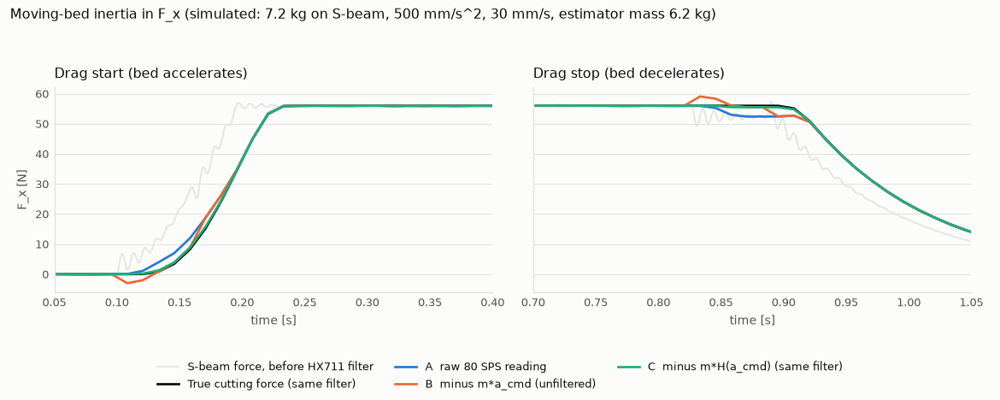

# V1-L 제어 설계 — 노트북 호스트 + GRBL + Nano 힘 보드

> 대상: 100만 원 이하 저가 구성 **L-A**(이동 베드 X에 팬 + 힘 플랫폼 + 컵, 고정 브리지에 Z와 θ, Y 레인은 수동 인덱스 핀, 스테퍼 3개). 기계 치수·구동계는 `_chief/work/mech/v1l_mech.md`, 전장은 `_chief/work/elec/v1l_elec.md`를 따른다(§1.1에서 맞춘 것과 다른 것을 정리).
> 계산: `v1l_control_sim.py` → `v1l_control_sim_output.md`(아래 표의 숫자는 모두 여기서 나온다). 호스트 코드: `host_skeleton.py`(mock 실행 확인).
> **모든 힘·강성·지연·가격은 ASSUMPTION이거나 다른 담당의 계산값, 또는 확인 전 데이터시트 값이다.** 실측은 아직 없다(E0 전). 확인해야 할 펌웨어 동작은 §12에 모았다.
> 기존 문서와의 관계: 상태의 의미·Z_SAFE 규칙·로그 개념은 `firmware/state_machine.md`, `docs/collision_and_safety.md`를 따른다. 바뀌는 것은 **1 kHz 자작 루프 → 노트북 상태기계 + GRBL 궤적 + Nano 하드웨어 감시**라는 구현 방식이다(ALT-6의 파이를 학생 노트북으로 바꾼 형태).

## 0. 요약

| 항목 | 결정·결과 |
|---|---|
| 모션 보드 | **GRBL 1.1h on Arduino Uno + CNC Shield V3**(전자 담당 옵션 A와 같음). θ는 Y 채널을 °로. 업그레이드 경로는 같은 프로토콜의 grblHAL |
| 힘 보드 | Arduino Nano + HX711 ×2(**80 SPS로 배선**). 노트북을 거치지 않고 GRBL의 **도어 입력(허가선)** 과 **프로브 입력**을 NPN으로 직접 구동, 두 입력 모두 **반전 극성(끊기면 정지)** |
| 과부하 정지 지연 (80 SPS, worst) | 노트북 경유 '!' 154 ms / **Nano → 도어 핀 90 ms** / Nano → 리셋 핀 39 ms(위치 상실) |
| 정지 거리 @ 30 mm/s (worst) | 5.5 / **3.6** / 1.2 mm → 경도 램프(4.4 N/mm)에서 추가 힘 24 / **16** / 5 N |
| 정지 한계 제안 | 드래그 30 mm/s(기계 담당과 같음), F_TARGET 82.5 N, 호스트 F_STOP 105 N, Nano F_STOP 120 N (F_DESIGN 150 N 가정) |
| 강체 충돌 | 힘 정지로는 못 막는다(L-A 경로 강성 230 N/mm면 허용 속도 1.4 mm/s). 상한은 X 스톨 추력 ~329 N → keep-out·전류 제한·기계식 스톱 |
| 터치오프 | Nano → GRBL 프로브 핀 + `G38.2`, 5 mm/s: 지연 편향 0.16 mm(보정 가능), 흩어짐 σ 0.02 mm. 재료 차이(0.03–0.31 mm)가 더 크다 |
| 깊이 제어 | 첫 깊이 = 스트로크 간 û, 레인 안 = 20 mm 구간 적응(L=1), Z 목표 = Z0 − d − (C_zz·F_z + C_zx·F_x) |
| 보상 후 잔여 오차 | 기계 담당 추정 강성(C_zz ≈ 0.002 mm/N)이면 보상 전에도 0.09–0.17 mm(≤ 2 %). 강성이 15배 낮은 경우(0.03 mm/N, F_x 100 N): 2.5 mm(23 %) → C ±20 %면 **0.55 mm(5 %)**, ±50 %면 **1.3 mm(12 %)** |
| 이동 베드 관성 | 7.2 kg × 0.5 m/s² = 3.6 N. u 추정·부피는 **등속 구간만**(오차 0.12 N), 과부하 판정은 전 구간 + 관성 여유 |
| 워치독 | 하트비트 100 ms, Nano T_WD 300 ms → 노트북이 멈춰도 드래그는 ≤ 11.4 mm 안에 도어 hold(모의 9.8 mm). Nano 과부하 판정은 계속 동작 |
| R7 | 호스트 `request_xy_move()` 게이트 + Nano의 Z-높이·X-창 스위치 인터록(펌웨어와 독립) + GRBL 소프트 리밋·Z 먼저 원점·$110 60 mm/s 상한 |
| mock | 4개 시나리오 모두 의도대로(§9). 정상 사이클 portion 팬 질량 차 114.2 g(모의 참값 114.3 g, 목표 115 g) |
| 다른 담당과 충돌 | 5건(§1.1): HX711 10 SPS 제안, 드래그 전용 완만한 램프, 이송 100 mm/s, Nano→GRBL 핀 극성·발판 접점, USB 전원만 쓰는 급전 |

---

## 1. 모델 — 무엇을 제어하나

```
            고정 브리지:  Z(NEMA17, TR8 리드 2, 자립) ── θ(NEMA17 + 1:27) ── 스템 ── 스쿱
                                                             │ 절삭력
   ┌──────────── 이동 베드 X (NEMA17, TR8 리드 4, 11.4 kg) ──┼────────────┐
   │  [컵 x=471]   [팬 + 단열 홀더]  ← 수직 단일점 로드셀(F_z) ▼            │
   │                  └─ X 부동판 + S-빔(F_x)로 베드에 구속 (위 질량 7.2 kg) │
   └──────────────────────────────────────────────────────────────────────┘
   Y 레인: 팬 홀더를 인덱스 핀 구멍(−38 / 0 / +38 mm)에 손으로 옮겨 꽂음
```

| 모델 | 식 | 근거 |
|---|---|---|
| 절삭력 | F_x = u·A(d), F_z = k_v·F_x (k_v = 0.5) | A02, A04. A(d)는 `calc/cartesian_model.swept_area`와 같은 식 |
| 1 portion 깊이 | 레인 270 mm에서 d = 14.7 mm, dV/V = 9.3 %/mm | `stroke_volume`, 같은 식 |
| 구조 처짐(스쿱 끝 수직) | δ_z = C_zz·F_z + C_zx·F_x | 기계 담당 추정 0.08 mm @ F_z 50 N(≈ 0.0016 mm/N, 셀 처짐이 대부분). 보수 쪽 0.01–0.05 mm/N도 계산 → §6.3 교정으로 확정 |
| X 경로 강성(스쿱 ↔ 팬) | L-A 231–287 N/mm, L-A-lite 71–102 N/mm | 기계 담당 계산값 |
| 힘 플랫폼(X) | S-빔 힘 = F_cut + m·a_bed + 진동 | m 7.2 kg, S-빔 50 kg ≈ 3.5 N/µm → f_n ≈ 111 Hz(기계 담당) |
| HX711 | 80 SPS, 정착 50 ms(전자 담당이 데이터시트 원문 확인). 필터 모양 ≈ sinc⁴, 군지연 ≈ 25 ms | 필터 모양·군지연은 가정(확인 필요) |
| GRBL | 사다리꼴 가감속(축마다 가속도 하나), 15블록 플래너, feed hold는 준비된 세그먼트(≤ ~50 ms) 소진 후 감속 | GRBL 1.1 구조 추정(확인 필요) |

제어 문제는 다섯 개다: ① 순서(상태기계) ② 표면 검출 ③ 버퍼링된 궤적에서의 깊이·힘 조절 ④ 과부하 정지 ⑤ R7 게이트. ①③⑤의 판단은 노트북이, ②④의 **시간이 급한 판단은 Nano가 하드웨어 핀으로** 한다.

### 1.1 기계·전자 담당 결과와의 정합

| 항목 | 기계·전자 | 제어 | 처리 |
|---|---|---|---|
| 보드 | 전자 옵션 A: Uno + CNC Shield V3 + DRV8825 ×3, GRBL, 마이크로스텝 ≤ 8 | 같음. X·Z는 1/4 권장(§2.3) | 일치 |
| 드래그 속도·정지 한계 | 기계: 30 mm/s, F_STOP 120 N 기준 토크 여유 2.25 | 30 mm/s, Nano F_STOP 120 N | 일치 |
| Z 자립 | 기계: TR8 리드 2 자립(정전 유지 시험 조건), 브레이크 삭제 | E-stop으로 모터 전원을 끊어도 Z가 서 있는 전제 | 일치(시험 조건 공유) |
| **① HX711 속도** | 기계 §3.1: 111 Hz 떨림 에일리어싱 → **10 SPS + 평균** | **80 SPS 유지.** 10 SPS면 정지 지연 352 ms(30 mm/s에서 추가 이동 11.5 mm), 터치오프 편향 1.25 mm @ 5 mm/s. sinc⁴형 필터면 80 SPS에서도 111 Hz가 −53 dB. 추정은 등속 구간 평균(0.12 N)으로 | **결정 필요.** 제어 안을 권함. T6에서 에일리어싱 확인, 나오면 기계식 감쇠(고무 패드) 추가 |
| **② 드래그 램프 0.2 m/s²** | 기계 §3.1: 드래그 램프 0.2, 이송 0.5 m/s² | GRBL은 축마다 가속도가 하나($120). 0.2로 낮추면 정지 거리 +1.4 mm(§4.2). **$120 = 500 mm/s²** 하나로 두고 관성은 등속 구간 마스크로 | 제어 안을 권함 |
| **③ 이송 속도** | 기계: 이송 ~100 mm/s | **60 mm/s($110 = 3600)**: 게이트 우회 버그 때 벽 앞에서 서는 속도(§8.3). 컵까지 426 mm 편도 +2.8 s | 사이클 시간과 교환. 창을 좁히면 올릴 수 있음 |
| **④ Nano → GRBL 핀** | 전자 §4.2: Nano D6→A5, D7→A1, 평소 Hi-Z·트리거 때 LOW(기본 극성), 발판 **NC** 접점 → A1 | 같은 핀을 쓰되 **NPN 오픈 컬렉터 + 반전 극성**: 도어·프로브 모두 "끌어내려야 허가/비접촉". 발판은 **NO**(밟으면 닫힘)로 NPN과 **직렬**. 선이 끊기거나 Nano가 꺼지면 멈춘다 | 전자 담당 배선 수정 요청(부품 +NPN 2개) |
| **⑤ 보드 급전** | 전자 §5: Uno·Nano는 노트북 USB 5 V | USB가 빠지면 두 보드가 꺼져 스텝이 즉시 끊김(위치 상실). Z가 자립이면 위험은 작다 → **USB 급전 유지 가능**. 동작을 예측 가능하게 하려면 VIN 12 V 강압(~3천 원) 선택 | 선택 사항으로 둠 |
| 로드셀 용량 | 기계: 단일점 30 kg + S-빔 50 kg + 기계식 스톱 / 전자 BOM: 20 kg ×2 | 제어 파라미터는 같음(F_STOP_HW 120 N < 셀 안전 과부하). 20 kg S-빔이면 X 스톨 추력 329 N에서 스톱 필수 | 기계·전자 간 결정 |
| Nano 핀 | 전자: MAX31855를 D10/D12/D13 | 스위치 입력을 A0–A3로 옮김(§3) | 반영 |

---

## 2. 모션 보드·펌웨어 선택

### 2.1 후보 비교

| 항목 | **GRBL 1.1h + Uno + CNC Shield V3** | grblHAL + 32비트 보드 | Marlin 2.1 + SKR Mini E3 V3 | Klipper + SKR Mini E3 V3 |
|---|---|---|---|---|
| 축 수 | 3 (X, Y, Z; N_AXIS 3 — 전자 담당 소스 확인) → X, θ(Y 채널), Z | 3–6, A/B/C 회전축 | X, Y, Z, E (보드 드라이버 4개) | X, Y, Z + extruder |
| θ를 회전축으로 | Y 채널을 °로($101 = step/°). mm와 섞이는 동시 이동은 **G93 역시간 모드**로 시간 지정 | A축 네이티브(°). 회전축 이송 처리 옵션은 확인 필요 | E축(압출 보호 해제 M302 필요) 또는 추가 축 옵션(확인 필요) | `manual_stepper`(G1과 동기 안 됨). 추가 G-code 축 지원 여부·버전 확인 필요 |
| feed hold | `!` 실시간 문자. 가감속 유지, **위치 유지**, `~`로 재개. 준비된 세그먼트 소진 후 감속(추정 ≤ 50 ms, 확인 필요) | 같은 명령 체계. 세그먼트 버퍼 크기는 빌드 설정 | EMERGENCY_PARSER로 M410(즉시 정지)·M108. 감속 있는 실시간 hold는 확인 필요 | 이미 MCU로 보낸 동작은 취소 못 함. 멈추려면 M112(셧다운) |
| soft reset | 0x18. 움직이는 중이면 ALARM 3(위치 상실), 정지 상태면 위치 유지(확인 필요) | 같음 | M112 → 재시작 필요 | M112 → FIRMWARE_RESTART, 재원점 |
| 하드웨어 입력 | A0 리셋, A1 feed hold(컴파일 옵션으로 **도어**), A2 사이클 시작, A5 **프로브** | 도어·E-stop·프로브 등 입력 많음 | 킬·센서 핀 | 버튼 입력은 호스트 경유 |
| 프로브 | G38.2–G38.5, 트리거 순간 위치를 `[PRB:…]`로 보고 | 같음 | G38(옵션), 프린터 프로브 | probe, HX711 `[load_cell]` 지원(전자 담당 문서 확인), 로드셀 프로브 기능 버전 확인 필요 |
| 스트리밍 | 응답 대기(`ok`) 또는 문자 계수. RX 128 B, 플래너 15블록(확인 필요) | 같은 방식, 버퍼 큼 | `ok` 응답, BUFSIZE | API 소켓/Moonraker |
| 호스트 | **아무 OS의 직렬 포트**(pyserial) | 같음 | 같음 | **리눅스 필수**(노트북 리눅스 또는 파이) |
| 학생 난이도 | 낮음. 설정은 `$` 명령, 컴파일 옵션 몇 개는 Arduino IDE | 중간. 웹 빌더로 생성·플래시 | 중간–높음. Configuration.h 수백 항목, PlatformIO | 중간–높음. 리눅스·printer.cfg·매크로. E-stop으로 VMOT를 끊으면 TMC UART 설정 초기화 문제(전자 담당) |
| 스텝 주파수 | ~30 kHz(전자 담당 README 확인, 실측 필요) → §2.3 | 수백 kHz급 | 충분 | 충분 |
| 가격대(추정, 확인 필요) | 2–4만 원(Uno 호환 + 쉴드 + 드라이버) | 3–6만 원 | 4–6만 원 | 4–6만 원 + 리눅스 호스트 |

### 2.2 추천: GRBL 1.1h on Uno + CNC Shield V3

1. **필요한 세 가지가 기본 기능이다.** 위치를 유지하는 감속 정지(`!`, 도어), 노트북 없이 걸리는 **레벨 감지 도어 입력**, 트리거 순간 위치를 기록하는 **프로브 입력**. Nano가 이 두 핀을 직접 구동하면 과부하 정지·터치오프·워치독이 노트북과 무관해진다(§4, §5, §8).
2. **노트북 OS를 가리지 않는다.** 직렬 포트만 있으면 된다. Klipper는 리눅스 호스트가 필요해 "학생 노트북" 조건과 맞지 않고, 보낸 동작을 감속 정지할 방법이 셧다운뿐이다.
3. **축 수가 정확히 맞다.** X, Z, θ 세 개. θ는 Y 채널을 °로 쓰고, 닫기처럼 시간이 중요한 동작은 `G93`으로 시간을 지정한다.
4. **가장 싸고 자료가 가장 많다.** 설정은 `$` 명령이라 학생이 바꾸기 쉽다.
5. **막히면 grblHAL로 옮긴다.** 같은 명령 체계라 `host_skeleton.py`는 그대로 쓴다. 옮길 조건: 스텝 주파수 부족, 모터 달린 Y가 필요해짐, 버퍼·입력 핀 부족.

약점: 8비트·~30 kHz, 작은 버퍼, θ를 Y로 쓰는 데서 오는 단위 혼합, 엔코더 없음(탈조를 모름 → 주기적 재원점, 팬 질량 차로 이상 감지), 컴파일 옵션을 바꾸려면 다시 빌드해야 함, CNC Shield V3 핀 표기와 GRBL 1.1 핀 배치 차이(§12).

### 2.3 GRBL 설정 (초안, ASSUMPTION — 구동계는 기계 담당 L-A)

| 설정 | 값 | 이유 |
|---|---|---|
| 컴파일: `ENABLE_SAFETY_DOOR_INPUT_PIN` | 켬 | A1을 도어 입력(레벨 감지, 닫히기 전 재개 불가)으로 |
| 컴파일: `INVERT_CONTROL_PIN_MASK`(도어 비트) | 켬 | 풀업(끊김·무전원) = 도어 열림 = 정지. Nano·발판이 **LOW로 끌어야 허가** |
| 컴파일: `HOMING_CYCLE_0/1/2` | Z → X → Y(θ) 각각 | Z를 먼저 올린다(R7), X와 θ는 따로 |
| 컴파일: `VARIABLE_SPINDLE` | 기본(켬)이면 Z 리밋 = D12 | 쉴드 표기(D11)와 다름 → 배선 시 확인(§12) |
| `$1` | 255 | 정지 중에도 드라이버 유지 |
| `$3` | X 반전 | 이동 베드: G-code X = 팬 기준 공구 위치 |
| `$6` | 1 | 프로브 반전: 풀업(끊김·무전원·미무장) = 트리거 → `G38.2` 시작 거부(ALARM 4) |
| `$10` | MPos + 버퍼 | 호스트가 기계 좌표와 `Bf`(남은 블록)를 본다 |
| `$20/$21/$22` | 1/1/1 | 소프트·하드 리밋, 원점 |
| `$100/$101/$102` | **200** step/mm, **119.3** step/°, **400** step/mm | X TR8 리드 4·1/4, θ 1:26.85·1/8, Z TR8 리드 2·1/4 |
| `$110/$111/$112` | **3600** mm/min, 9000 °/min, 1800 mm/min | X 60 mm/s 상한(§8.3), θ 150 °/s, Z 30 mm/s(기계 최대 40) |
| `$120/$121/$122` | 500 mm/s², 1000 °/s², 300 mm/s² | 정지 거리·관성 계산의 기준 |
| `$130/$131/$132` | 466 mm, 245°, 175 mm | 베드 행정(기계 담당), θ −150…+95, Z +100…−75 |
| 드라이버 전류 | θ: 기어박스 출력 ≤ 5 N·m, Z: 하강력 제한, X: 스톨 추력 ≤ 기계식 스톱 | 기계·전자 담당 F2·F4 |

스텝 주파수(`output` §1): X 리드 4는 1/8에서 100 mm/s면 40 kHz로 초과, 1/4면 20 kHz. Z 리드 2는 1/8·40 mm/s면 32 kHz로 초과, 1/4면 16 kHz. θ 1/8·150 °/s는 18 kHz. → **X·Z 1/4, θ 1/8**(DRV8825 점퍼로 설정).

---

## 3. 배선 블록도

```
 [학생 노트북]  host_skeleton.py (상태기계·R7 게이트·로그)
     │USB(직렬 115200)                        │USB(직렬 115200, 케이블 체인)
     ▼                                        ▼
 [Arduino Uno — GRBL 1.1h, 고정부]      [Arduino Nano — 힘 보드, 이동 베드 위]
  CNC Shield V3 + DRV8825 ×3              D2/D3 ─ HX711 #1 ─ 단일점 로드셀 (F_z, 질량)
   X 스텝/방향 ─▶ 드라이버 ─ 베드 모터      D4/D5 ─ HX711 #2 ─ S-빔 (F_x)        (RATE = 80 SPS)
   Y 스텝/방향 ─▶ 드라이버 ─ θ 모터         D10/D12/D13 ─ MAX31855 (전자 담당)
   Z 스텝/방향 ─▶ 드라이버 ─ Z 모터         A0 ◀─ Z-높이 스위치 (Z ≥ Z_SAFE − 1 mm에서 ON, Z 기둥 플래그)
   D9/D10/D12 ◀─ X·θ·Z 리밋                 A1 ◀─ X-창 스위치 (베드가 C 43–317 mm 안에서 ON, 프레임 플래그)
                                            A2 ◀─ 레인 핀 스위치 (핀이 꽂혀 있으면 ON)
                                            A3 ◀─ 발판 보조 접점 (기록용)
   A1 도어(반전) ◀──┬─ 발판 NO(밟으면 닫힘) ─┬─ NPN ◀─ Nano D7          ← 둘 다 닫혀야 허가
                    └ 내부 풀업               │
   A5 프로브(반전) ◀──────────────────────────┴─ NPN ◀─ Nano D6          ← 무장 + F_z < 3 N 동안만 ON
   A0 리셋 ◀── E-stop 보조 접점 (전자 담당: NO → GND)
     │ 공통 GND (PSU V− 스타 접지, 전자 담당 §5)
 [전원]  24 V ──[F2]──[E-stop NC → K1 코일, 자기유지 "모터 ON" 버튼]──▶ 드라이버 VMOT
         Uno·Nano: 노트북 USB 5 V (선택: 24→12 V 강압 → VIN)
```

- **NPN(또는 N-MOSFET) 오픈 컬렉터**로 핀을 끌어내린다. Nano 출력을 직접 연결하면, Nano 전원이 꺼졌을 때 보호 다이오드가 Uno의 풀업을 끌어내려 "허가"로 읽힐 수 있다.
- 허가선은 **발판(hold-to-run)과 Nano 트랜지스터의 직렬**이다. 어느 하나라도 열리면(발을 뗌, Nano 판정, 선 끊김, Nano 꺼짐) GRBL은 감속 정지하고, 닫힐 때까지 재개하지 않는다.
- Nano를 베드에 두면(전자 담당 배치) Z-높이 스위치 1가닥과 출력 2가닥(A1, A5) + GND가 케이블 체인을 지난다. 모두 디지털 신호다(아날로그 mV 신호는 베드 밖으로 나가지 않음).
- E-stop은 모터 전원을 끊고(정지 범주 0), 보조 접점으로 GRBL을 리셋해 재원점을 강제한다. 해제해도 "모터 ON" 버튼을 누르기 전에는 전원이 돌아오지 않는다. Z는 TR8 리드 2 자립이 전제다(기계 담당 정전 유지 시험).

제어 쪽 추가 부품(전자 BOM 외, 추정·확인 필요): NPN 2개 + 저항, 마이크로스위치 3개(Z-높이, X-창, 레인 핀), 플래그 2개 → **약 1만 원**. 선택: VIN 급전용 12 V 강압 ~3천 원.

---

## 4. 과부하 정지 — 지연 예산과 정지 한계

**선정 이유.** 노트북 경유 정지는 USB 두 번과 OS 스케줄링을 지나 worst 154 ms다. Nano가 같은 HX711 샘플로 **도어 핀**을 직접 끊으면 90 ms로 줄고, 노트북이 멈춰도 동작한다. 리셋 핀은 39 ms로 더 빠르지만 위치를 잃어 재원점이 필요하므로 과부하용이 아니라 E-stop 보조로만 쓴다. 호스트 판정은 더 낮은 임계로 두어 평소에는 먼저 걸리게 하고(로그·재시도), Nano 판정은 노트북과 무관한 두 번째 선이다.

### 4.1 지연 예산 (80 SPS, [ms])

| 요소 | A 호스트 '!' | B Nano → 도어 핀 | C Nano → 리셋 핀 |
|---|---|---|---|
| HX711 변환 대기(샘플 위상) | 0 – 6.2 – 12.5 | 같음 | 같음 |
| HX711 필터 군지연(정착 50 ms × 0.5, 가정) | 25 | 25 | 25 |
| Nano 읽기·비교 | 0.3 – 1.0 | 같음 | 같음 |
| Nano → 노트북 직렬 + USB 수신 | 3.1 – 18.1 | – | – |
| 파이썬 처리 + OS 스케줄링 | 0.5 – 30 | – | – |
| 노트북 → GRBL USB | 1 – 16 | – | – |
| GRBL 처리 + 세그먼트 소진 | 0.05 – 51 | 0.05 – 51 | 0.05 – 0.5 |
| **합계 min / nom / worst** | 30 / 82 / **154** | 25 / 72 / **90** | 25 / 32 / **39** |
| 10 SPS일 때 nom / worst | 301 / 416 | 291 / 352 | 251 / 302 |

HX711 모듈 상당수는 RATE 핀이 GND(10 SPS)에 묶여 나온다(전자 담당도 같은 지적). 10 SPS면 모든 경로가 300 ms를 넘으므로 **80 SPS 배선이 전제**다.

### 4.2 추가 이동 거리와 추가 힘 (감속 500 mm/s², worst)

| v [mm/s] | 경로 | 추가 이동 [mm] | ΔF 경도 램프 4.4 N/mm | ΔF 강체, 경로 B, k = 70 / 230 / 290 N/mm |
|---|---|---|---|---|
| 20 | A / **B** / C | 3.5 / **2.2** / 0.8 | 15 / **10** / 3 | 153 / 504 / 635 |
| 30 | A / **B** / C | 5.5 / **3.6** / 1.2 | 24 / **16** / 5 | 251 / 825 / 1040 |
| 40 | A / **B** / C | 7.7 / **5.2** / 1.6 | 34 / **23** / 7 | 363 / 1191 / 1502 |

감속도 민감도(경로 B, 30 mm/s): a = 200 / 250 / 500 / 1000 mm/s²에서 추가 이동 4.9 / 4.5 / 3.6 / 3.1 mm. GRBL은 드래그용 가속도를 따로 줄 수 없으므로 $120을 낮추면 정지 거리도 늘어난다.

### 4.3 정지 한계 제안 (F_DESIGN 150 N 가정)

| 파라미터 | 값 | 근거 |
|---|---|---|
| V_DRAG | 30 mm/s | 40 mm/s면 호스트 경로 F_trip 상한이 115 N으로 내려가고, 기계 담당 토크 여유도 1.69로 떨어진다 |
| F_TARGET | 82.5 N (0.55 × F_DESIGN) | 깊이 적응 목표(A37 비율) |
| F_STOP_HOST | 105 N (0.70) | 30 mm/s 호스트 worst: 105 + 24 = 129 N ≤ 150 |
| F_STOP_HW (Nano) | 120 N (0.80) | 30 mm/s Nano worst: 120 + 16 = 136 N ≤ 150. 표 상한 130 N보다 낮게. 기계 담당 토크 계산의 기준값과 같음 |
| 가속 구간 여유 | + m·a = 3.6 N | §7 |
| 이송·Z 이동 중 | 30 N + 3.6 N | 충돌 의심 |

**한계:** 강체(청크·팬 벽)에 걸리면 힘이 경로 강성 × 추가 이동으로 오른다. Nano 경로로 F_DESIGN을 지키는 속도는 k = 70 N/mm에서 4.6 mm/s, **L-A 계산값 230 N/mm에서 1.4 mm/s**에 불과하다. 실제 상한은 X 스톨 추력 ~329 N(기계 담당)이고, 그 전에 모터가 탈조해 멈춘다(위치 상실 → 재원점). 그래서 강체 충돌은 **keep-out(벽 여유)·속도 상한·드라이버 전류 제한·기계식 과부하 스톱(셀 보호)** 으로 막고, 힘 정지는 경도 변화·과깊이용으로 쓴다. mock에서도 600 kPa 덩어리를 만나자 판정한 첫 샘플이 이미 243 N이었다(§9). 힘 정지는 그 상태로 **더 가는 거리를 2.1 mm로 줄였을 뿐** 최대 힘을 막지는 못했다.

**튜닝:** T1(§10)로 세그먼트 소진 시간과 감속 거리를 재서 표의 가정값을 바꾸고, E0로 F_DESIGN·u가 정해지면 비율대로 다시 계산한다(`v1l_control_sim.py` 상수만 수정).

---

## 5. 표면 검출(터치오프)

**모델.** Z0 오차 = 임계 압입 δ_th(재료, 3 N에서 0.03–0.31 mm) + 구조 처짐 C_zz·3 N(0.005–0.09 mm) + 하강 속도 × 검출 지연. 앞의 두 항과 지연의 평균은 **고정 편향**이라 제품별로 보정한다(`DELTA_BIAS`). 남는 것은 샘플 위상에 따른 흩어짐이다.

**선정 이유.** Nano가 F_z ≥ 3 N이면 GRBL 프로브 핀을 바꾸고, `G38.2`는 **트리거 순간의 위치**를 `[PRB:…]`로 준다. 위치 기록에는 GRBL 세그먼트 소진·USB·파이썬 지연이 들어가지 않는다. 호스트 경로로 하면 정지 후 좌표에서 거꾸로 추정해야 하고 흩어짐이 9배 커진다.

| v_z [mm/s] | 경로 | 지연 편향 [mm] | 흩어짐 σ [mm] | 트리거 후 추가 압입 [mm] | 마지막 5 mm 시간 [s] |
|---|---|---|---|---|---|
| 2 | 프로브 핀, 80 SPS | 0.06 | 0.008 | 0.11 | 2.5 |
| **5** | **프로브 핀, 80 SPS** | **0.16** | **0.020** | 0.29 | **1.0** |
| 5 | 프로브 핀, 10 SPS | 1.25 | 0.146 | 0.29 | 1.0 |
| 10 | 프로브 핀, 80 SPS | 0.32 | 0.039 | 0.67 | 0.5 |
| 10 | 호스트 경로, 80 SPS | 0.82 | 0.36 | 0.67 | 0.5 |
| 2단(10 → 1 mm/s, 1 mm 후퇴) | 프로브 핀, 80 SPS | 0.03 | 0.004 | – | 2.7 |

- **채택:** 빠른 하강(20 mm/s)으로 Z_est + 5 mm까지 → 0.3 s 정착 → 영점 → `G38.2` 5 mm/s. σ 0.02 mm는 portion 0.2 %에 해당한다.
- 2단 접근은 10 SPS로 남거나 호스트 경로를 쓸 때, 또는 반복성 연구 시험에서만 쓴다. 80 SPS + 프로브 핀이면 시간만 2.7배 든다.
- 재료 편향 차이(0.28 mm)가 지연 흩어짐보다 크다 → `DELTA_BIAS`는 제품·온도별로 E0/T2에서 잰다. mock에서도 보정값 0.10 mm가 모의 재료(20 N/mm 압입 강성)와 맞지 않아 표면을 0.30 mm 낮게 잡았다(§9).
- 접촉이 없으면 `G38.2`가 ALARM 5로 끝난다 → NO_SURFACE. 프로브 핀은 반전 극성이라 Nano가 꺼져 있으면 `G38.2`가 시작하지 않는다(ALARM 4).
- Z는 리드 2 자립 나사라 최대 하강력이 ~500 N(기계 담당)이다. 터치오프가 실패하면 셀을 누를 수 있으므로 `G38.2` 거리를 Z_est − 15 mm로 제한하고, Z 전류 제한과 기계식 스톱을 둔다.

**튜닝:** T2(§10)로 5 mm/s에서 30회 σ를 재서 σ > 0.05 mm면 2 mm/s로 낮추고, 노이즈로 오검출이 있으면 임계를 3 → 5 N으로 올리고 δ_bias를 다시 잰다.

---

## 6. 깊이 제어 — 궤적을 버퍼링하는 펌웨어에서

**모델.** GRBL은 받은 블록을 플래너에 쌓아 두고 실행한다. 드래그 중 Z를 연속으로 바꾸는 1 kHz 루프(기존 `state_machine.md` §6)는 쓸 수 없다. 호스트가 조절할 수 있는 것은 **아직 보내지 않은 블록**뿐이다.

**선정 이유.** 세 가지를 역할을 나눠 쓴다.

| 방법 | 맡는 것 | 반응 |
|---|---|---|
| (b) 스트로크 간 적응 | **첫 깊이**: 직전 주문에서 잰 û로 d1 = min(d_portion, A⁻¹(F_TARGET/û)) | 주문 단위 |
| (a) 구간 적응 | **레인 안의 경도 변화**: 20 mm 구간 평균 F_x로 다음 구간 깊이 결정, 미리 넣는 구간 L = 1 | 2구간(40 mm) 늦음 |
| (c) 컴플라이언스 보상 | **구조 처짐**: Z_cmd = Z0 − d − (C_zz·F_z + C_zx·F_x) | 구간 단위 |

감독 없이 움직이는 거리의 상한도 L이 정한다: 노트북이 멈추면 GRBL은 이미 받은 (L+1)구간 = 40 mm까지만 간다(그 전에 Nano 워치독이 멈춘다, §8).

### 6.1 (a) 구간 적응 — 모의 결과

| 경도 | 제어 | F_max [N] | F > 1.1·F_TARGET 구간 | 부피/목표 | 비고 |
|---|---|---|---|---|---|
| 90 kPa + 단단한 띠 160(60 mm) | 고정 깊이 | 99.6 | 2 | 100 % | |
| 〃 | 구간 적응 L=0 | 99.6 | 1 | 97 % | 구간마다 정지, +0.78 s |
| 〃 | 구간 적응 L=1 | 99.6 | 2 | 97 % | 띠가 짧아 늦은 결정이 도움이 안 됨 |
| 균일 160 kPa | 구간 적응 L=1 | 99.6 | 2 | 86 % | 첫 구간은 모름 |
| 〃 | L=1 + 첫 깊이 û(+10 %) | **84.2** | 0 | 82 % | 두 번째 스트로크 필요 |
| 균일 250 kPa | 구간 적응(L 무관) | 155.6 | – | 17 % | **첫 구간에서 과부하 정지** |
| 〃 | L=1 + 첫 깊이 û(+10 %) | **84.2** | 0 | 54 % | 두 번째 스트로크 필요 |

→ 구간 적응만으로는 첫 구간을 못 막는다. **첫 깊이는 (b)**, 레인 안 변화만 (a)가 맡는다.

### 6.2 (b) 스트로크 간 적응 — 모의 결과

u가 8회 주문 동안 170 → 100 kPa로 무르는 경우(단열 홀더에서 데워짐, 가정). 부족하면 **따로 뜬 두 번째 공**으로 채운다(담은 채 재절입하지 않음).

| 전략 | 평균 부피 오차 | F_max | 평균 스트로크 수 |
|---|---|---|---|
| **u 추정(EMA λ = 0.5)** | 0.6 % | 69.8 N | **1.75** |
| 추정 없음(항상 250 kPa 가정) | 0.0 % | 56.1 N | 2.00 |
| 고정 깊이(힘 한계 무시) | 0.0 % | **105.8 N** | 1.00 |

u 추정은 힘을 목표 아래로 두면서 스트로크 수(사이클 시간)를 줄인다. 모의는 결정론적이라 부피 오차가 작게 나온다. 실제 흩어짐은 팬 질량 차 피드백(k_f)으로 본다.

### 6.3 (c) 컴플라이언스 보상

**C 교정 절차(T3, §10)** — 추를 스쿱 끝(rim 최저점 근처 클램프)에 매달아 수직 처짐을 다이얼 게이지(0.01 mm, 자석 받침은 **팬 홀더 위**)로 잰다. 0–1–2–3–5–7–10 kg 올리고 내리기를 3회. 기울기 = C_zz. 수평은 도르래 + 추(또는 푸시풀 게이지)로 −X 방향으로 당기며 수직 처짐을 재서 C_zx. 받침이 팬 홀더 위에 있으므로 C에는 헤드·Z축·플랫폼 셀 처짐이 모두 들어간다. 모의 데이터로 절차를 돌리면 C_zz 0.0300 ± 0.0002, C_zx는 도르래 마찰(5 % 가정) 때문에 −4.4 % 치우친다(`output` §4.3). 기계 담당 추정(0.08 mm @ 50 N)이 맞으면 10 kg에서 처짐이 ~0.16 mm라 0.01 mm 게이지로 기울기 불확실도가 수 %가 된다 → 20 kg까지 올리거나 0.001 mm 게이지를 빌린다.

추 교정의 통계 불확실도는 수 %지만, 실제 절삭 하중은 작용점(분포 하중)·온도·체결 상태가 교정과 달라 **±20 %, ±50 %** 로 잔여 오차를 본다. σ_F = 2 N(등속 구간 평균 힘 오차) 가정.

| C_zz [mm/N] | F_x [N] | 보상 전 오차 | ±20 % 후 | ±50 % 후 |
|---|---|---|---|---|
| 0.002 (기계 담당 추정) | 56 / 100 | 0.09 / 0.17 mm (1 / 2 %) | 0.02 / 0.04 mm (0.2 / 0.3 %) | 0.05 / 0.09 mm (0.5 / 0.8 %) |
| 0.01 | 56 / 100 | 0.47 / 0.83 mm (4 / 8 %) | 0.11 / 0.18 mm (1.0 / 1.7 %) | 0.25 / 0.43 mm (2.3 / 4.0 %) |
| **0.03** | 56 / 100 | 1.40 / 2.50 mm (13 / 23 %) | **0.33 / 0.55 mm (3.1 / 5.1 %)** | 0.75 / 1.30 mm (7.0 / 12.1 %) |
| 0.05 | 56 / 100 | 2.33 / 4.17 mm (22 / 39 %) | 0.55 / 0.92 mm (5.1 / 8.5 %) | 1.25 / 2.17 mm (11.6 / 20.1 %) |

(괄호는 portion 오차, 깊이 민감도 9.3 %/mm. C_zx = C_zz/3, F_z = 0.5 F_x 가정 — 기계 담당은 C_zx가 이보다 훨씬 작다고 계산.)

- 기계 담당 강성이 맞으면 보상은 portion 1–2 %짜리 미세 조정이다. 보상을 넣는 이유는 **체결부가 풀리거나 조립이 계산보다 무를 때**(0.01–0.05 mm/N) 코드 변경 없이 C 값만 바꿔 대응하기 위해서다.
- 보상하지 않으면 호스트는 명령 깊이로 부피를 적분해 **실제보다 많이 떴다고 믿고 일찍 멈춘다**(모의 C_zz 0.03: 호스트 추정 99 %, 실제 87 %). 보상 + 측정 깊이로 적분하면 둘이 96 %로 일치한다.
- 보상량은 직전 구간 힘으로 계산하므로 힘이 크게 바뀌는 구간 입구에서 C·ΔF만큼 한 구간 어긋난다.
- 편향 부분(C 오차의 평균)은 팬 질량 차 피드백 k_f(λ = 0.2)가 여러 스쿱에 걸쳐 흡수한다. 스쿱마다 흩어지는 부분만 남는다.
- 백래시는 보상하지 못한다. 기계 담당 계산: Z 너트 반전 시 ≤ 0.10 mm(F_z가 위로 43 N을 넘을 때), θ 백래시 1° → 0.31 mm(한쪽으로 붙어 반복 가능). 로그에서 F_z 부호가 드래그 중 바뀌는지 본다.

**튜닝 순서:** C 교정(T3) → 모사재에서 보상 켬/끔 비교(팬 질량 차) → F_TARGET을 E0 결과로 → DD_MAX(4 mm/구간)는 Z 경사가 11°를 넘지 않게 → λ_u는 u 로그의 흩어짐을 보고 0.3–0.7.

---

## 7. 이동 베드 관성

**모델.** S-빔 위 질량(팬 + 아이스크림 + 홀더 + 상판, 기계 담당 7.2 kg)이 X 부동판 위에서 S-빔으로 베드에 묶여 있으므로 S-빔 힘 = 절삭력 + m·a_bed + 진동. 500 mm/s²에서 m·a = 3.6 N, 1000 mm/s²면 7.2 N.

**모의(`output` §5, 참 7.2 kg, 보정에 쓰는 추정 6.2 kg, 30 mm/s, 56 N, S-빔 3.5 N/µm · 111 Hz):**

| 방식 | 최대 오차 [N] | RMS [N] |
|---|---|---|
| A 원신호 | 3.7 | 1.2 |
| B − m̂·a_cmd (지연 무시) | 3.6 | 0.9 |
| C − m̂·H(a_cmd) (같은 HX711 필터를 통과시킨 가속도) | 0.6 | 0.2 |
| D **등속 구간만** | **0.12** | 0.05 |



- B가 거의 효과가 없는 이유: HX711 필터가 힘을 ~25 ms 늦추므로, 명령 가속도를 그대로 빼면 시점이 어긋난다. 보정하려면 **가속도에도 같은 필터 모델**을 씌워야 한다(C). 기계 담당 안의 `F_meas − m_top·a_cmd`는 이 필터를 넣어야 효과가 있다.
- **채택:** u 추정·부피 적분·깊이 적응에는 D(가속 시작 후 3 mm, 감속 시작 전까지만 평균). 잃는 길이는 레인 양 끝 3.3 mm(1.2 %). 과부하 판정은 모든 샘플에서 하되 임계에 m·a_max(3.6 N)를 더한다.
- **에일리어싱(§1.1 ①):** 111 Hz 떨림은 80 SPS 나이퀴스트(40 Hz)보다 높지만, HX711 필터가 sinc⁴형이면 −53 dB로 줄어든다(강성이 낮아 42 Hz까지 내려오면 −17 dB). 모의에서도 등속 구간 오차는 0.12 N이었다. 필터 모양은 가정이므로 T6(빈 팬 가속, 등속 구간에서 느린 맥놀이가 보이는지)으로 확인한다. 10 SPS로 내리는 대가(정지 지연 +260 ms, 터치오프 편향 1.25 mm)가 더 크다.

---

## 8. 안전과 워치독 (R7 포함)

> 이 장은 식별한 위험과 대책, 측정할 값을 적는다. 장치가 안전하다고 주장하지 않는다. 시험 중 작업자 입회, 가드, hold-to-run은 V1-S와 같다.

### 8.1 계층

| 계층 | 무엇으로 | 막는 것 | 노트북이 멈추면 |
|---|---|---|---|
| 하드웨어 | E-stop → 모터 전원 차단(K1) + GRBL 리셋. 발판(hold-to-run) → 허가선. 기계식 과부하 스톱 | 사람 개입, 셀 과부하 | 그대로 동작 |
| Nano (독립 MCU) | 허가선 = 무장 ∧ 래치 없음 ∧ 하트비트 ∧ 발판 ∧ 레인 핀 ∧ (Z-높이 ∨ X-창). F ≥ 120 N 래치. 프로브 출력 | 과부하, 노트북 정지, R7 위반, 레인 핀 빠짐 | 그대로 동작 |
| GRBL | 소프트·하드 리밋, 원점 시 Z 먼저, $110 속도 상한, 도어 레벨 감지(닫히기 전 재개 불가) | 행정 밖, 게이트 우회 시 속도 | 버퍼의 블록까지 실행 |
| 호스트 | `request_xy_move()` 게이트, 계획 검사, 상태별 힘 한계, 통신 감시, 로그 | R7, 순서 오류, 과부하(먼저) | 없음 |

### 8.2 R7 — Z < Z_SAFE이면 수평 이동 금지

수평 모터는 이동 베드 X 하나다. Y는 사람 손이다.

- **호스트에서 강제:** 모든 수평 이동은 `request_xy_move()`를 지난다. TRAVEL은 **계획 Z(버퍼 끝의 Z)와 측정 Z가 모두** Z_SAFE 이상일 때만 보낸다(GRBL은 블록을 순서대로 실행하므로 Z 상승 블록이 끝나야 X가 움직이지만, 호스트는 더 보수적으로 동기화 후 측정값까지 본다). 예외는 DIVE/DRAG 상태에서 현재·목표가 모두 팬 레인 작업공간 안인 SCOOP 하나. 거부하면 `EV_XY_BLOCKED_LOW_Z`를 남기고 결함으로 간다.

```python
def request_xy_move(self, x, z=None, kind=TRAVEL, feed=None):
    z_low = min(self.plan["z"], self.fresh_status()["z"])     # 버퍼 끝 Z와 측정 Z 중 낮은 쪽
    ok = (kind == TRAVEL and z is None and z_low >= Z_SAFE) or \
         (kind == SCOOP and self.state in ("DIVE", "DRAG")
          and in_pan_workspace(x, z) and in_pan_workspace(self.plan["x"], self.plan["z"]))
    if not ok:
        log("EV_XY_BLOCKED_LOW_Z", ...); return False
    send(f"G1 X{x} ..."); ...
```

- **Y(수동):** SELECT_LANE은 Z를 Z_SAFE 위로 올린 뒤 **허가선을 끊고(E0)** 작업자에게 레인 핀을 옮기게 한다. 핀이 빠져 있으면 Nano가 허가선을 주지 않는다.
- **펌웨어 쪽 이중화:** GRBL 설정만으로는 "Z가 낮으면 X 금지" 같은 조건부 규칙을 만들 수 없다(소프트 리밋은 고정 상자). 그래서
  1. **Nano 인터록(채택):** Z-높이 스위치(Z 기둥 플래그, Z ≥ Z_SAFE − 1 mm에서 ON)와 X-창 스위치(베드 플래그, 레인 +2 mm까지 ON) 중 하나라도 켜져 있어야 허가. 둘 다 꺼지면 도어 hold + 래치. 명령 좌표가 아니라 **실제 위치**를 본다.
  2. GRBL `$110` 60 mm/s: 게이트를 우회한 이송도 이 속도를 못 넘는다 → 창 밖 추가 이동 6.7 mm(worst) < 벽 여유 8 mm(§8.3).
  3. GRBL 소프트 리밋: Z 최저(팬 바닥 + 10 + R), X 행정 466 mm.
  4. (선택) GRBL 소스 `mc_line()`에 "목표 Z < Z_SAFE이고 X가 창 밖이면 거부" 20줄 패치. 포크를 유지해야 해서 기본안에서는 쓰지 않는다(위치 확인 필요).
- **복구:** Z가 낮은 채 창 밖에 멈추면 인터록이 모든 축을 막는다. 작업자가 발판을 밟은 채 `U`(1회 우회)를 주고 Z만 올린다. Z-높이 스위치가 켜지면 우회가 자동으로 풀린다. Z 나사 손잡이로 손으로 올릴 수도 있다(기계 담당).

### 8.3 게이트 우회 시 정지 여유 (창 끝 = 레인 끝 + 2 mm, 벽 여유 10 mm)

| 이송 속도 | 창 밖 추가 이동(nom / worst) | 벽까지 남는 여유 |
|---|---|---|
| 40 mm/s | 3.2 / 3.6 mm | 4.8 / 4.4 mm |
| **60 mm/s** | **6.1 / 6.7 mm** | **1.9 / 1.3 mm** |
| 80 mm/s | 9.7 / 10.5 mm | 벽 접촉 |
| 100 mm/s | 14.1 / 15.1 mm | 벽 접촉 |

여유가 1–2 mm로 작다. T4(§10)에서 실제로 재고, 부족하면 이송을 40 mm/s로 낮추거나 창을 좁힌다. 기계 담당의 이송 100 mm/s는 이 이중화와 함께 쓸 수 없다(§1.1 ③).

### 8.4 노트북·USB 고장 모드와 워치독

| 상황 | GRBL | Nano | 결과 |
|---|---|---|---|
| 파이썬 예외·종료 | 버퍼의 블록 계속 실행(드래그 ≤ 40 mm) | 하트비트 없음 300 ms → 허가선 OFF | 드래그 30 mm/s에서 ≤ 11.4 mm 더 가고 도어 hold(모의 9.8 mm) |
| 노트북 멈춤·절전 | 같음 | 같음 | 같음. **Windows 절전·USB 선택적 절전 끄기** |
| USB 케이블 빠짐(USB 급전) | 보드 꺼짐 → 스텝 즉시 멈춤, 위치 상실 | 꺼짐 → NPN OFF | 즉시 정지. Z 자립 전제(기계 담당 정전 유지 시험). 재연결 후 재원점 |
| USB 케이블 빠짐(VIN 급전 선택 시) | 버퍼 실행 후 정지 | 하트비트 없음 → 허가선 OFF | 위 "파이썬 종료"와 같은 결과 |
| 포트 다시 열기 | DTR 자동 리셋(확인 필요) → 움직이는 중이면 ALARM, 부팅 후 원점 필요 | 리셋 → 부팅 기본값 = 허가 OFF | 재원점이 강제됨 |
| Nano 멈춤 | – | AVR 워치독(250 ms) 리셋 → 트랜지스터 OFF | 도어 열림, 프로브 트리거 상태 → 정지 |
| GRBL 멈춤 | 알 수 없음 | GRBL을 보지 못함 | 호스트 상태 응답 없음 → COMM_GRBL. **최후 수단은 E-stop·발판** |
| 모터 전원 차단(E-stop) | 리셋 → 재원점 | – | Z는 자립(시험 조건) |

- **Nano 워치독:** `E1`(무장) 이후 `H`가 T_WD = 300 ms 동안 없으면 래치. 래치는 작업자 확인 후 호스트가 보내는 `R`로만 푼다. 하트비트 100 ms는 OS 스케줄링 튐(30 ms 가정)의 약 3배, T_WD는 10배.
- **호스트 워치독:** GRBL 상태 응답 0.5 s, Nano 샘플 0.2 s가 끊기면 결함. 작업자 입력을 기다릴 때는 먼저 허가선을 끊는다(E0).
- **감독 없는 이동의 상한:** 드래그는 min(워치독 11.4 mm, 버퍼 40 mm). 이송은 Z ≥ Z_SAFE에서만 하므로 팬과 부딪히지 않고, 워치독이 24.7 mm 안에 멈춘다(60 mm/s).

---

## 9. 호스트 골격과 mock 실행 결과

```
python3 _chief/work/ctrl/host_skeleton.py --mock                        # 한 사이클
python3 _chief/work/ctrl/host_skeleton.py --mock --scenario overload    # 덩어리 → 정지 → 복구
python3 _chief/work/ctrl/host_skeleton.py --mock --scenario hang        # 노트북 1 s 멈춤
python3 _chief/work/ctrl/host_skeleton.py --mock --scenario gate        # R7 게이트 + 우회
python3 _chief/work/ctrl/host_skeleton.py --grbl COM3 --nano COM4       # 실제(pyserial 필요, 미검증)
```

- 상태: HOME → IDLE → SELECT_LANE(작업자 확인) → TOUCHOFF → DIVE → DRAG → CLOSE → LIFT → TO_CUP → EJECT → WEIGH → IDLE. 결함 시 FAULT: '!' → 정지 확인 → 허가 해제 → 0x18로 큐 비움 → 작업자 확인 → 래치 해제 → (필요하면 R7 1회 우회) → Z만 상승 또는 재원점.
- mock GRBL은 텍스트 프로토콜(`ok`, `<…|MPos|Bf|FS>`, `[PRB]`, `ALARM:n`), 15블록 플래너, 사다리꼴 가감속, feed hold(40 ms 소진 후 감속), 레벨 감지 도어, G38.2, G93, 소프트 리밋, 소프트 리셋을 흉내 낸다. mock Nano는 80 SPS·25 ms 지연·잡음, 프로브·허가선 로직, 1D 아이스크림 표면(절삭 이력), 구조 처짐(교정값 +10 %, 1차 지연), 플랫폼 관성(7.2 kg)을 흉내 낸다. **호스트 코드 경로는 실제 모드와 같다.** mock은 가정대로 흉내 낼 뿐이며 GRBL 실제 동작의 증거가 아니다.
- 로그: `logs/host_mock_<scenario>.csv`(열: t_ms, nano_ms, state, event, X, Z, theta, Fx, Fz, grbl, flags, lane_y, Z0, d_cmd, note). 모든 전이·송신 줄·거부·결함과 힘 20 Hz.

| 시나리오 | 결과 | 핵심 값 (모의) |
|---|---|---|
| normal | 사이클 완료, 모의 46.8 s | Z0 6.009 → 표면 −24.30 mm(모의 참값 −24.00, 편향 0.30 mm → δ_bias 보정 필요), 구간 13개, 깊이 12.85(û 160 kPa) → 14.67 mm, \|F_x\|max 57.0 N, 측정 u 91 kPa, **portion 팬 질량 차 114.2 g**(모의 참값 114.3 g, 목표 115 g), 게이트 거부 0 |
| overload | OVERLOAD_HOST → 복구 | 600 kPa 덩어리(x 170): 판정 샘플 243 N, hold 시작 x 169.73, 정지 x 171.79(2.1 mm). 호스트 '!'와 Nano 도어가 같은 샘플에서 걸림 |
| hang | WATCHDOG → 복구 | 1 s 멈춤: x ≈ 107.4에서 멈춘 뒤 258 ms 후(마지막 하트비트 + 300 ms) 도어 hold, x 117.18에서 정지(감독 없이 9.8 mm, worst 계산 11.4 mm) |
| gate | 거부 1회 + INTERLOCK_R7 → 1회 우회로 Z 상승 → 복구 | Z 5.7 mm에서 X→471 요청 거부. 게이트 우회 `G1 X471`: 창 끝 317.03에서 정지 시작, 322.95에서 정지(벽까지 2.05 mm, 침범 0, 계산 1.94 mm) |

---

## 10. 시험 절차

| # | 시험 | 방법 | 기록 | 통과 기준(초안) |
|---|---|---|---|---|
| T0 | HX711 속도·잡음 | RATE 핀 확인, 무부하 60 s 로그(모터 정지/구동) | SPS, σ_F | 80 SPS, 모터 구동 중 σ ≤ 0.2 N |
| T1 | **정지 거리** | 베드 옆에 기준 스위치 하나. 저속(1 mm/s)으로 작동 위치 x_s를 5회 잰다. 20/30/40 mm/s로 지나가며 (A) Nano가 스위치 에지를 호스트에 알리고 호스트가 '!' (B) Nano가 스위치 에지에서 도어 핀 OFF (C) 리셋 핀. 정지 후 MPos − x_s(리셋 경로는 다이얼·자로). 경로·속도마다 10회. 힘 경로 지연은 푸시풀 게이지 막대에 접점 스위치를 달아 "접촉 시각"과 HX711 임계 통과 시각을 Nano가 같이 기록 | s_stop 분포 → t_lat = (s − v²/2a)/v, HX711 지연 분포 | worst가 §4.2 표 이하. 넘으면 표·F_STOP을 다시 계산 |
| T2 | 터치오프 반복성 | 알루미늄 블록(강체), 모사재, 아이스크림에서 2/5/10 mm/s × 30회. 블록 높이는 다이얼로 기준 | Z0 σ, 평균 차 → δ_bias | 5 mm/s에서 σ ≤ 0.05 mm |
| T3 | **C 교정** | §6.3. 추 0–10(–20) kg 올림·내림 3회, 다이얼 0.01 mm(가능하면 0.001 mm, 받침은 팬 홀더 위). 수평은 도르래 또는 푸시풀 게이지. 스쿱을 −14 °C로 식힌 상태 1회 추가 | C_zz, C_zx ± 95 %, 선형성(R²), 히스테리시스 | R² ≥ 0.99, 히스테리시스 ≤ 0.05 mm. 불확실도는 ±20 %로 두고 잔여 오차 표 갱신 |
| T4 | R7 게이트·인터록 | (1) Z = Z_SAFE − 1 mm에서 이송 요청 20회 (2) 게이트 우회 스크립트로 `G1 X471`을 40/60 mm/s에서, 팬 벽 자리에 스펀지 블록 | 거부 수, 창 밖 추가 이동 | (1) 100 % 거부·로그 (2) 블록에 닿지 않음 |
| T5 | 워치독 | 아이스크림 없이 공중에서 드래그 동작 중 ① 파이썬 강제 종료 ② `kill -STOP`/디버거로 멈춤 ③ USB 뽑기 | 추가 이동, GRBL 상태 | ≤ 15 mm 안에 정지, 재개는 작업자 확인 후만 |
| T6 | 베드 관성·에일리어싱 | 빈 팬·찬 팬으로 a = 250/500/1000 mm/s² 이동, F_x 80 SPS 로그 | F = m·a 회귀 → M_PLAT, 등속 구간 잔차·맥놀이 | 등속 구간 평균 오차 ≤ 0.5 N, 느린 맥놀이 없음 |
| T7 | 발판·E-stop | 모든 상태에서 발판 떼기, E-stop, 발판 선 뽑기 | 정지 거리, 재기동 조건 | 선을 뽑아도 멈춤. 재개는 확인 후만. E-stop 후 재원점 강제 |

---

## 11. 튜닝 순서

1. T0 → HX711 80 SPS와 잡음 확인(임계 3 N의 여유).
2. GRBL `$100–$132`(구동계 확정 후) → T1로 세그먼트 소진·감속 거리 → `v1l_control_sim.py`의 `LAT["grbl_seg"]`, `A_X` 갱신 → F_STOP 다시 계산.
3. T6 → `M_PLAT`, 관성 여유, 에일리어싱 여부.
4. T3 → `C_ZZ`, `C_ZX`.
5. T2 → `DELTA_BIAS`(제품·온도별), `V_PROBE`.
6. E0(푸시풀 게이지) → u, F_DESIGN → F_TARGET/F_STOP 비율 재적용.
7. 모사재 → 아이스크림 순으로 λ_u, λ_k, DD_MAX, L.

---

## 12. 확인 필요 목록

| # | 항목 | 왜 중요한가 | 확인 방법 |
|---|---|---|---|
| 1 | HX711 내부 필터 모양·군지연(정착/2 가정). 출력 속도 10/80 SPS·정착 400/50 ms·잡음 50/90 nV는 **전자 담당이 원문 확인** | 지연 예산의 가장 큰 항, 에일리어싱 판단 | T1 힘 경로 지연 + T6 |
| 2 | 구매할 HX711 모듈의 RATE 핀 배선 | 10 SPS면 설계 전체가 틀어짐 | 모듈 회로 확인, 필요하면 패턴 수정 |
| 3 | GRBL 1.1 feed hold 후 감속 시작까지의 등속 구간(세그먼트 버퍼 6개 × ~10 ms 추정) | 정지 거리의 40–50 ms | 소스(stepper.c) + T1 |
| 4 | GRBL 도어 입력: 레벨 감지로 닫히기 전 재개 거부, 컴파일 옵션 이름(`ENABLE_SAFETY_DOOR_INPUT_PIN`, `INVERT_CONTROL_PIN_MASK`) | 허가선 설계의 전제 | config.h + 벤치 시험 |
| 5 | GRBL 프로브: `$6` 반전, 트리거 순간 위치 기록, 시작 시 트리거면 ALARM 4, 접촉 없으면 ALARM 5, 트리거 후 감속 | 터치오프 설계 | 벤치 시험 |
| 6 | 정지(Hold 완료) 상태에서 0x18 소프트 리셋이 위치를 유지하는지, 움직이는 중이면 ALARM 3인지 | 결함 복구 절차 | 벤치 시험 |
| 7 | `$1=255`에서 알람·리셋 중에도 드라이버가 켜져 있는지 | 정지 유지 | 벤치 시험 |
| 8 | 상태 보고 폴링 권장 상한(20 Hz 사용), `$10` 비트 의미, 플래너 15블록·RX 128 B | 호스트 폴링·버퍼 한계 | GRBL 위키 + 시험 |
| 9 | GRBL 1.1 on 328P 최대 스텝 주파수 ~30 kHz(전자 담당 README 확인) | 마이크로스텝 선택 | 오실로스코프 |
| 10 | CNC Shield V3 핀 표기 vs GRBL 1.1(VARIABLE_SPINDLE 기본 → Z 리밋 D12) | 리밋 오배선 | 쉴드 회로 + config |
| 11 | `HOMING_CYCLE_2` 지원, θ 원점 스위치 위치(정상 동작 범위 밖 +95°) | θ가 원점 스위치를 지나며 하드 리밋 알람 | config.h + 시험 |
| 12 | Uno/Nano의 DTR 자동 리셋(포트 열 때)과 OS별 동작 | 재연결 시 동작 | 시험 |
| 13 | USB-직렬 지연(CH340/16U2, OS) | 호스트 경로 지연 | T1 경로 A |
| 14 | grblHAL 지원 보드·회전축 이송 처리·세그먼트 버퍼 | 업그레이드 경로 | grblHAL 문서 |
| 15 | Klipper 로드셀 프로브 기능 버전·추가 G-code 축, Marlin 실시간 hold 명령 | 비교표의 다른 후보 | 각 문서 |
| 16 | Z 리드 2 자립(정전 유지 시험), 최대 하강력 ~500 N에 대한 Z 전류 제한 값 | E-stop·USB 전원 상실 시 헤드, 셀 보호 | 기계 담당 시험 |
| 17 | F_DESIGN(구조 설계 하중), X 경로 강성, 플랫폼 질량 | 정지 한계·관성 | 기계 담당 + T1/T6 |
| 18 | 제어 추가 부품 가격(NPN·스위치·플래그) | R8 | 견적 |
| 19 | 스쿱 −14 °C에서의 C 변화, Z 너트·θ 백래시 | 보상 잔여 오차 | T3 저온 1회 |
| 20 | §1.1의 5개 충돌 결정 | 배선·설정 확정 | 총괄 |

---

## 13. 파일

| 파일 | 내용 |
|---|---|
| `_chief/work/ctrl/v1l_control_sim.py` | 계산 스크립트(numpy, matplotlib 선택). 상수는 모두 `# ASSUMPTION` |
| `_chief/work/ctrl/v1l_control_sim_output.md` | 위 스크립트의 출력(이 문서의 모든 표) |
| `_chief/work/ctrl/fig_v1l_bed_inertia.png` | 이동 베드 관성 모의 그림 |
| `_chief/work/ctrl/host_skeleton.py` | 호스트 상태기계 + mock GRBL·Nano |
| `_chief/work/ctrl/logs/host_mock_*.csv` | mock 4개 시나리오 로그 |
