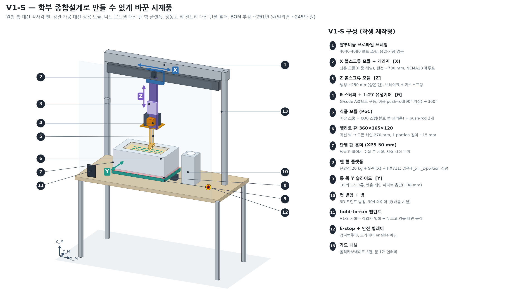
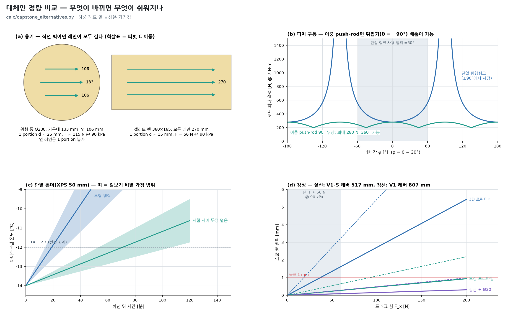

# 학부 종합설계에서 부딪힐 난관 — 해결책, 대체 메커니즘, V1-S로 현실화

> 지금 설계(Cartesian V1, `final_system_concept.md`)는 공학적으로는 맞지만 **학부 팀(4–5명, 2학기, 수백만 원, 학교 공작실)** 이 그대로 만들기에는 무리한 부분이 있다. 이 문서는 그 난관을 하나씩 짚고, 해결책과 대체 메커니즘을 비교한 뒤, 채택한 것을 모아 **V1-S(학생 제작형) 시제품**으로 구체화한다.
> 숫자: `calc/output/capstone_alternatives.md`, `calc/output/tub_lane_planner.md` §4. BOM: `BOM/capstone_v1s.csv`. 그림: `media/fig7_v1s_student_rig.png`, `media/fig8_alternatives_quantified.png`. **하중·재료·열 물성·가격은 모두 가정·추정값이다.**



## 0. 요약 — 무엇을 바꾸는가

| 바꾸는 것 | V1 (지금 설계) | V1-S (학생 제작형) | 주된 이유 |
|---|---|---|---|
| 용기 | 원형 통 Ø230 × 250 | **직사각 젤라토 팬 360 × 165 × 120** | 모든 레인 270 mm → 1 portion 깊이 ~15 mm, 힘 약 절반, 옆 레인 문제 해소 |
| 구조 | 강관 기둥·빔 가공 + HGR15 조립 | **알루미늄 프로파일 + 상용 볼스크류 모듈** | 용접·정밀가공 없이 조립. 레버 807 → 517 mm로 줄어 강성 충분 |
| Y축 | 갠트리의 외팔보 크로스슬라이드 | **팬 쪽 Y 슬라이드**(팬을 레인 위치로 옮김) | 외팔보 제거, 싸고 단순 |
| 힘·표면·정량 센서 | X·Z 볼너트 로드셀 + 컵 저울 | **팬 아래 힘 플랫폼 1개** | 상용 모듈 너트에 로드셀을 끼울 필요 없음. 접촉·F_x·F_z·portion을 한 곳에서 |
| θ 구동 | DC 기어드모터 + 평행링크 1개(±60°) | **스테퍼 + 유성기어 + 90° 위상 push-rod 2개(360°)** | 표준 펌웨어 A축, 뒤집기 배출 가능 |
| 제어 | 자작 1 kHz 궤적 생성기 | **Klipper/grblHAL(모션) + 라즈베리파이 Python(상태기계)** | 검증된 모션 펌웨어, 학생은 상위 로직만 |
| 냉각 | 냉동고 위에 갠트리 | **책상 위 단열 팬 홀더**(+ 보관용 냉동고) | 뚜껑 관리 시 수십 분 시험 가능 |
| 식품 모듈 | 304 TIG 용접·연마 | **볼트 체결 + 식품용 실리콘(PoC)** | 시험 아이스크림은 폐기 → 식품 등급 마감은 제품 단계로 |
| 안전 | 인클로저 + 인터록 + 베이 빔 | **hold-to-run + E-stop + 가드 3면** | 시험 중 작업자 입회. 완전 인클로저는 V1b 시연 때 |
| 예산(추정) | ~524만 원 | **~291만 원**(냉동고·파이·게이지를 빌리면 ~249만 원) | |

원형 통(배스킨라빈스형) 대응은 버리지 않는다. V1-S로 기계·제어를 먼저 검증하고, 원형 통은 §6의 확장 경로로 다룬다.

## 1. 난관 목록

| ID | 난관 | 학부 팀에 왜 어려운가 | 영향 | 1순위 해결 | 대체안 |
|---|---|---|---|---|---|
| D1 | **예산** | V1 BOM ~524만 원. 학부 설계 예산을 넘기 쉽다(학과마다 다름) | 제작 불가 | V1-S로 부품 재구성(~291만 원), 빌릴 수 있는 것 목록화 | 단계별 구매(E0 → V1-S 코어 → Y·컵) |
| D2 | **가공·용접** | 강관 면 가공, 레일 자리, 304 TIG·연마, 볼너트 로드셀 하우징 | 외주비·일정 지연 | 상용 볼스크류 모듈 + 프로파일 볼트 조립 | 학교 CNC로 판재만 가공 |
| D3 | **강성**(0.8 m 레버) | 3D 프린터식으로 만들면 200 N에서 스쿱 끝 10.9 mm | 깊이 부정확, 떨림 | 얕은 팬 → 짧은 스템·Z 행정 → 레버 517 mm, 긴 레인 → 힘 ~56 N | 설계 하중을 E0 결과로 재설정 |
| D4 | **원형 통 옆 레인 portion 부족** | 옆 레인 106 mm → 한 스쿱 89 g(−23 %) | portion 불량 | 직사각 팬 | 레인 ±20, 옆 레인 2 stroke(§6) |
| D5 | **배출 미해결** | 빗 걸기는 검증 안 됨, 과회전은 링크 범위 때문에 불가 | 사이클 실패 | 이중 push-rod로 360° → 뒤집기 + 흔들기 | 빗, 분할 볼, 상용 디셔 밴드 |
| D6 | **θ 링크 사점·범위** | 평행링크 ±90° 사점, ±60° 제한 | 배출·자세 제약 | 90° 위상 이중 push-rod | 외부 타이밍벨트(PoC 한정) |
| D7 | **실시간 제어 펌웨어** | X·Z·θ 보간 + 드래그 중 깊이 적응을 직접 짜야 함 | 일정의 최대 위험 | 공개 모션 펌웨어 + 호스트 상태기계, 스트로크 간·구간 적응 | 아두이노 + AccelStepper(단순 시퀀스만) |
| D8 | **센서 통합** | 너트 로드셀(축방향 분리 장착), 컵 저울, 베이 빔 | 기구 설계·배선 복잡 | 팬 힘 플랫폼 1개로 통합 | 스테퍼 스톨 검출(표면 검출용으로는 부정확) |
| D9 | **아이스크림 온도·녹음** | 상온에서 3분이면 온도가 변함, 재평형 24 h | 시험 횟수 부족, 재현성 저하 | 단열 홀더 + 뚜껑, 열전대로 온도 기록 | 냉동고 안에 기계를 넣는 V1 구조 |
| D10 | **디버깅용 재료** | 매번 아이스크림을 쓰면 비싸고 느림 | 디버깅 지연 | 오일 점토 등 모사재를 E0에서 u로 교정해 사용 | 무른 아이스크림(−10 °C)으로 먼저 |
| D11 | **안전 승인** | 학내 실험실 안전 규정, 자동 기계의 위험성 평가 | 시험 지연 | hold-to-run + E-stop + 가드, 저속 모드, 위험성평가서 | 완전 인클로저(V1b) |
| D12 | **위생 요구** | 304·Ra 0.8·무공동 마감은 학생 제작 한계 | 제작 지연 | "시식 없음(폐기)" 원칙으로 PoC 단계 완화, 제품 기준은 문서로 | 식품 모듈만 외주 |
| D13 | **일정·인원·조달** | 해외 부품 리드타임 2–4주, 4–5명, 2학기 | 통합 시험 시간 부족 | 게이트가 있는 30주 계획(§5), 긴 리드타임 부품 먼저 주문 | 범위 축소(Y·컵 스테이션 제외 데모) |
| D14 | **측정 장비** | 푸시풀 게이지·열전대·DAQ | E0를 못 함 | 학과·타 연구실에서 대여 | 주방 저울 + 레버 원리 간이 측정 |

## 2. 대체 메커니즘과 판정

### ALT-1 용기: 원형 통 → 직사각 젤라토 팬



| 용기·레인 | C 이동 | 1 portion 깊이 | F @ 90 kPa | F @ 160 kPa |
|---|---|---|---|---|
| 원형 통 Ø230, 가운데 | 133 mm | 24.8 mm | 115 N | 205 N |
| 원형 통 Ø230, 옆(±40) | 106 mm | **불가** | – | – |
| 젤라토 팬 360×165×120, 모든 레인(\|y\| ≤ 38) | 270 mm | 14.7 mm | **56 N** | 100 N |
| GN 1/3 팬 325×176×150 | 235 mm | 16.2 mm | 64 N | 114 N |

- **원리:** Cartesian 기계의 작업공간은 직사각형이다. 직선 벽 용기에서는 래스터 레인이 모두 같은 길이가 되어, CNC가 사각 포켓을 평삭하듯 층을 고르게 벗긴다.
- **효과:** 힘이 약 절반으로 줄어 D3(강성)이 함께 풀린다. 단단한 제품(160 kPa)에서도 힘 목표 110 N 안에서 한 번에 1 portion이 된다.
- **대가:** 배스킨라빈스형 원형 통을 그대로 쓰지 못한다. 대신 젤라토 매장과 후방 충전에서 쓰는 팬 형식에 맞는다. 팬 크기는 제품마다 다르므로 **구매 전 실측**한다.
- **판정: V1-S 채택.** 원형 통은 §6.

### ALT-2 구조: 강관 가공 → 상용 볼스크류 모듈 + 알루미늄 프로파일

| 구조 | V1 레버 807 mm, 110 N | **V1-S 레버 517 mm**, 50 / 80 / 110 N |
|---|---|---|
| 3D 프린터식(MGN12, 4040, 벨트) | 5.97 mm | 1.36 / 2.17 / 2.99 mm |
| 보강 프로파일(HGR15급, 4080, 이중 레일) | 1.20 mm | **0.23 / 0.38 / 0.52 mm** |
| 강관 + Ø30 스템 | 0.54 mm | 0.08 / 0.13 / 0.17 mm |

- 레버는 스템 길이와 Z 행정이 정한다. 팬이 얕으면(120 mm) 스템 200 mm, Z 행정 175 mm면 되고, Z 모듈의 하부 베어링을 C_max + 스템 + 헤드 위로만 올리면 된다.
- 상용 모듈의 모멘트 강성은 "보강 프로파일(HGR15급)" 가정과 같게 두었다. **카탈로그의 허용 모멘트·강성으로 확인**한다(구매 전 조건).
- X 구동은 여전히 볼스크류다. 벨트는 드래그 힘을 버티지 못한다(GT2 작업장력 ~28 N).
- **판정: 채택.** 3D 프린터식 레일(MGN12)은 쓰지 않는다.

### ALT-3 Y축: 갠트리 크로스슬라이드 → 팬 쪽 Y 슬라이드

- 헤드는 Y를 움직이지 않고, 팬(단열 홀더 + 힘 플랫폼)을 T8 리드스크류 슬라이드로 ±38 mm 옮겨 레인을 고른다.
- 갠트리에서 외팔보 Y 빔(~200 mm 돌출)이 없어져 하중 경로가 짧아진다. 리드스크류는 자기유지라 옆힘(0.3 F ≈ 17 N @ 56 N)을 잠금 없이 버틴다.
- 대가: 통이 여러 개인 제품에서는 통마다 슬라이드가 필요하다 → **V1-S(한 팬)에서만** 쓰고, 여러 통 시연(V1b)에서는 갠트리 Y로 돌아간다.
- **판정: V1-S 채택.**

### ALT-4 θ 구동과 배출: 90° 위상 이중 push-rod → 뒤집기 배출

| τ [N·m] | 단일 링크 φ = 0 / 60 / 75 / 85° | 이중(90° 위상), 어느 각도든 |
|---|---|---|
| 3.2 (드래그 유지) | 128 / 256 / 495 / 1,469 N | ≤ 128 N |
| 7.0 (닫기) | 280 / 560 / 1,082 / 3,213 N | ≤ 280 N |

- 기관차 연결봉처럼 크랭크를 90° 어긋나게 2개 두면, 한쪽이 사점일 때 다른 쪽이 토크를 전한다. 회전 범위 제한이 없어 θ = −90°(개구부 아래)까지 돌려 **뒤집기 + 흔들기로 공을 떨어뜨릴 수 있다.**
- 위상은 드래그 자세(θ = −30°)에서 **두 레버가 모두 위를 향하도록** 고른다. 레버 1 +120°, 레버 2 +30°(C 기준 각도). 그래야 레버·핀이 절삭 홈 밖의 아이스크림을 긁지 않는다. 닫기 끝(θ = +90°)에서는 레버 1이 C 아래로 내려가므로 핀이 홈 밖을 긁는지 V1-S에서 확인한다.
- 공차: 두 로드가 서로 버티지 않도록 **한쪽 하부 핀을 긴 구멍(±0.3 mm)** 으로 한다.
- 구동: NEMA17 + 1:27 유성기어(출력 ~9 N·m, 닫기 7 N·m 대비 여유)를 G-code A축으로.

| 배출 방식 | 추가 액추에이터 | 위생 | 불확실성 | V1-S 시험 순서 |
|---|---|---|---|---|
| **뒤집기 + 흔들기(ALT-4)** | 없음 | 좋음 | 부착력이 공 무게(~1 N)보다 크면 안 떨어짐 | 1 |
| 빗 걸기(기존) | 없음 | 좋음 | 빗이 공을 실제로 잡는지 | 2 |
| 헹굼 온수로 스쿱 데우기 + 뒤집기 | 없음 | 좋음 | 표면이 녹아 공 모양이 무너질 수 있음 | 1과 조합 |
| 상용 디셔(스윕 밴드) | +1(밴드 레버 구동) | 틈 증가 | θ 피벗이 볼 중심에서 벗어나 유지토크 증가 | 대체안(손으로 먼저 시험) |
| 분할 볼 | +1 | 힌지 틈 | 닫힌 상태 드래그 강성 | 마지막 대안 |

### ALT-5 센서: 너트 로드셀 + 컵 저울 → 팬 힘 플랫폼

- 단일점 로드셀 20 kg(수직)과 S-빔(X 방향)을 팬 아래에 둔다. HX711의 유효 분해능을 ~0.3 g로 가정하면 접촉 임계 3 N(306 g)은 충분히 보인다.
- **portion = 스쿱 전후 팬 질량 차**다. 공을 컵에 넣기 **전에** 질량을 알 수 있으므로 부족하면 한 번 더 뜰지 그 자리에서 정할 수 있다.
- 연구 데이터가 아이스크림이 실제로 받은 힘이 된다(Legacy의 SA6/C44 개념).
- 한계: 플랫폼 위 질량(~6 kg)이 드래그 때 흔들린다 → 판정은 정지 후. 다통(V1b)에서는 통마다 플랫폼이 필요하다.
- **판정: V1-S 채택.** 컵 쪽은 저울 없이 받침만 둔다.

### ALT-6 제어: 자작 실시간 궤적 → 공개 모션 펌웨어 + 호스트 상태기계

```
[Raspberry Pi — Python]  상태기계 · HMI · 로그 · 좌표표 · Z_SAFE 게이트 · 레인 선택
      │ G-code / API                      ▲ 힘(HX711 ×2), 온도
      ▼                                   │
[모션 보드 — Klipper 또는 grblHAL]  X · Z · A(θ) · Y 스텝, 가감속, 원점, 소프트 리밋
      │ step/dir                          
      ▼
[폐루프 스테퍼 드라이버]  →  E-stop · 가드 스위치 · hold-to-run 이 ENABLE을 하드웨어로 차단
```

| 기능 | V1 설계 | V1-S 구현 |
|---|---|---|
| X·Z·θ 동시 보간(dive 30°, 닫기) | 자작 1 kHz | G-code 직선 보간 `G1 X Z A` |
| 표면 검출 | Z 너트 로드셀 3 N | Z를 0.5 mm 단위로 내리며 팬 플랫폼 힘을 호스트가 확인(마지막 10 mm) |
| 깊이 적응 | 드래그 중 실시간 Z 수정 | **(a) 구간 적응**(20 mm 구간마다 다음 구간 Z 결정), **(b) 스트로크 간 적응**(첫 스트로크 평균 힘 → u 추정 → 다음 깊이) |
| 과부하 정지 | 50 ms | 호스트 감시 → 즉시 정지. 지연 100 ms면 80 mm/s에서 8 mm 더 감 → 드래그 속도를 40 mm/s로 낮추면 4 mm |
| Z_SAFE 게이트 | 펌웨어 `request_xy_move()` | 호스트가 G-code를 보내기 전에 검사 + 펌웨어 소프트 리밋 |
| 안전 | 하드웨어 STO | 같음(E-stop·가드·hold-to-run → 드라이버 ENABLE) |

- 팬이 길어 힘이 작으므로(~56 N) 실시간 적응이 꼭 필요하지 않다. **학생이 짜야 할 코드는 Python 상태기계뿐**이다.
- Klipper의 로드셀 프로빙·HX711 지원 여부와 버전은 **확인이 필요**하다 `[미검증]`. 지원되지 않으면 HX711을 파이 GPIO나 ESP32로 읽는다.
- **판정: 채택.**

### ALT-7 냉각: 냉동고 위 갠트리 → 단열 팬 홀더

| 조건 | 열유입 | +2 K까지(겉보기 비열 3–6 kJ/kg·K 가정) |
|---|---|---|
| XPS 50 mm 홀더, 뚜껑 열림 | 25.9 W | 14–29분 |
| 같은 홀더, 시험 사이 뚜껑(XPS 30 mm) | 7.0 W | 53–106분 |

- 팬을 냉동고(−14 °C 설정)에서 꺼내 홀더에 넣고 시험한다. 팬 표면 열전대로 −14 ± 1 °C를 벗어나면 냉동고로 되돌린다.
- 겉보기 비열(잠열 포함)은 확인된 값이 없어 범위로 두었다 `[미검증]`. **V1-S 첫 주에 온도 상승 곡선을 직접 잰다.**
- 드라이아이스는 쓰지 않는다(표면 과냉 → 온도 구배).
- **판정: 채택.** 냉동고는 보관·템퍼링용으로만(빌리기).

### ALT-8 디버깅 재료: 오일 점토 모사재

- 기구·펌웨어 디버깅(원점, 보간, 표면 검출, 레인 순서, 배출 동작)은 **아이스크림 없이** 한다.
- 모사재는 E0에서 u를 재서 아이스크림과 비슷한 온도·배합을 고른다. 후보: 오일 점토(상온, 재사용), 냉장한 점토(더 단단함). 이들의 u는 **아직 모른다**. 교정 전에는 "동작 확인용"으로만 쓰고 힘 판정에는 쓰지 않는다.
- **판정: 채택(디버깅 한정).**

### ALT-9 식품 모듈 제작: 용접·연마 → 볼트 체결 PoC

- 매장 스쿱(304)에 피벗 보스를 **볼트 체결 클램프**로 붙이고, 스템(304 Ø30×3)의 양끝은 볼트 캡과 식품용 실리콘으로 막는다.
- 전제: **V1-S 시험 아이스크림은 먹지 않고 폐기한다.** 식품 등급 마감(Ra 0.8, 무공동, 용접)은 제품 단계 요구로 `sanitation_architecture.md`에 남긴다.
- **판정: V1-S 채택.** 시연에서 시식하려면 V1b에서 식품 모듈만 외주 제작한다.

### 채택하지 않은 대안

| 대안 | 이유 |
|---|---|
| 벨트 X로 드래그 | 작업장력 부족(GT2 ~28 N) |
| 스테퍼 스톨 검출로 표면 검출 | 60 N급에서야 검출 → 압입 11 mm 수준(`z_axis_sizing.md`) |
| θ 모터를 피벗에 직접(방수 서보) | 식품영역에 모터·전선 |
| 비전 카메라 | 범위 밖(비전 없이 좌표·접촉·질량으로 해결) |
| 통 턴테이블로 레인 대체 | 지름 레인만 길고 중심이 먼저 파임(동심 구덩이) |

## 3. 적용: V1-S 구성

| 하위 시스템 | V1-S 사양 | 근거 |
|---|---|---|
| 프레임 | 알루미늄 프로파일 4040·4080, 책상 위 설치 | ALT-2 |
| X | 상용 볼스크류 모듈 ~700 mm + NEMA23 폐루프 | ALT-2 |
| Z | 상용 볼스크류 모듈 ~250 mm + NEMA17 폐루프 + 브레이크 + 가스스프링 | 레버 517 mm |
| θ | NEMA17 + 1:27 유성기어, 90° 위상 push-rod 2개, θ 360° | ALT-4 |
| Y | 팬 쪽 T8 슬라이드 ±38 mm | ALT-3 |
| 용기 | 젤라토 팬 360×165×120, 단열 홀더(XPS 50 mm) + 뚜껑 | ALT-1, ALT-7 |
| 센서 | 팬 힘 플랫폼(단일점 20 kg + S-빔) + HX711 ×2, 열전대 2 | ALT-5 |
| 제어 | Klipper/grblHAL 보드 + 라즈베리파이(Python 상태기계) | ALT-6 |
| 안전 | E-stop·안전 릴레이, hold-to-run 펜던트, 가드 3면 + 문 스위치 | D11 |
| 식품 모듈 | 매장 스쿱 + 볼트 체결 스템(PoC), 2벌 | ALT-9 |
| BOM | 31개 항목 **~291만 원**(빌리면 ~249만 원) | `BOM/capstone_v1s.csv` |

**V1 설계에서 그대로 쓰는 것:** 스쿠핑 원리(끌기-말기), 공격 자세 −30°, 표면 기준 → dive → drag → close 순서, 상태기계의 상태와 전이, 레인 층별 평삭, Z_SAFE 규칙, 하드웨어 안전 체인, 결정 게이트.

**V1 설계에서 바뀌는 문서:**
- `firmware/state_machine.md`의 실시간 루프는 호스트 + G-code 구조로 구현한다(ALT-6 표)
- 컵 저울 대신 팬 질량 차로 portion을 판정한다(`cup_dispensing_station.md`의 판정 규칙은 그대로)

## 4. 여전히 남는 위험 (V1-S 기준)

| 위험 | 확인 방법 | 안 되면 |
|---|---|---|
| 뒤집기로도 공이 안 떨어짐 | 50회 성공률, 스쿱 온도(헹굼 후 / 차가움) | 빗 → 상용 디셔 밴드 → 분할 볼 |
| 상용 모듈의 실제 강성이 가정보다 낮음 | 조립 후 추로 스쿱 끝 강성 측정(목표 ≥ 100 N/mm @ V1-S) | 모듈 등급 상향 또는 브레이스 추가 |
| 팬 크기·재고 | 구매 전 실측, 대체 GN 1/3 | GN 1/3(레인 235 mm, 64 N) |
| 팬에 옮겨 담으면 아이스크림이 다시 얼어 단단해짐 | 원래 포장 그대로 쓸 수 있는 직사각 업소용 포장 탐색 | 옮겨 담은 뒤 −14 °C 24 h 템퍼링 + u 재측정 |
| Klipper에서 호스트 힘 루프 지연 | 정지 거리 측정 | 드래그 속도 40 mm/s, 과부하 한계 하향 |
| 하부 레버·핀이 닫기 때 홈 밖을 긁음 | 닫기 토크·영상 | 레버 위상 조정, 레버를 스쿱 뒤쪽 보스로 |

## 5. 30주 계획과 게이트

| 주 | 트랙 A 기구·전장 | 트랙 B 제어·SW | 트랙 C 실험 | 게이트 |
|---|---|---|---|---|
| 1–3 | 부품 선정, **긴 리드타임 부품 주문**(모듈·스테퍼) | Klipper 설치, 파이 환경 | **E0**: 푸시풀 게이지로 팬·통 드래그 힘, 공격 자세 0° vs −30° | **C-Gate 0**: 설계 하중 확정 |
| 4–7 | 프레임·X·Z 조립, 단열 홀더 | 원점·소프트 리밋·G-code 보간 | 단열 홀더 온도 상승 측정 | 온도 창 ≥ 20분 |
| 8–11 | 헤드(이중 push-rod), 힘 플랫폼 | 상태기계 v1(표면 검출 → dive → drag → close) | 모사재 디버깅 | 모사재에서 100회 무사고 |
| 12–15 | 가드·E-stop·hold-to-run | 로그, 구간·스트로크 간 적응 | **실제 아이스크림 첫 스쿱** | **C-Gate 1–2**: 표면 σ ≤ 0.5 mm, portion ±5 % 비율, 배출 성공률 |
| 16 | — | — | 중간 발표(영상 + 데이터) | |
| 17–22 | Y 슬라이드, 컵 받침, 배출 대안 | 레인 선택·층 관리 | 온도 2 × 제품 2 × 레인 3 요인 시험 | 배출 ≥ 90 % |
| 23–27 | (선택) V1b: 두 번째 팬, 인클로저 | 연속 사이클, HMI | 연속 30 사이클 | **C-Gate 3** |
| 28–30 | 정리 | 문서화 | 보고서, 시연 | 최종 발표 |

**줄여야 할 때(우선순위대로 뺀다):** 두 번째 팬(V1b) → 컵 받침 자동 배출(수동 받기) → Y 슬라이드(가운데 레인만) → θ 360°(평행링크 1개로). 마지막까지 남기는 핵심은 **표면 검출 → dive → drag → close → 힘·질량 로그**다. 이것만으로도 "측정된 힘과 portion"이라는 결과가 나온다.

## 6. 원형 통(배스킨라빈스형)으로 확장하려면

| 방법 | 효과 | 대가 |
|---|---|---|
| 레인 간격 ±40 → ±20 | 옆 레인 127 mm → 106 g(u 90 kPa) | 층 폭 감소, 벽 쪽 링 증가 |
| 옆 레인 2 stroke(작은 공 2개로 나눠 배출 — 공을 담은 채 다시 절입하면 −30° 자세에서 공이 빠질 수 있음) | 부족분 보충 | 옆 레인 사이클 약 2배, 공 모양 |
| 스쿱 R 증대(더 큰 매장 스쿱) | A 증가 | 벽 여유 때문에 레인 더 짧아짐 → 실측 필요 |
| 힘 목표 재설정(E0 결과) | u가 작으면 깊이 증가 | 구조 하중 증가 |
| 저울 보정(부족분을 다음 스쿱에서 보충) | 평균 정량 | 개별 portion 편차 |

V1-S에서 얻은 u(E0), 강성, 배출 결과로 이 표의 선택을 정한다. 계산은 `calc/output/tub_lane_planner.md` §4.
