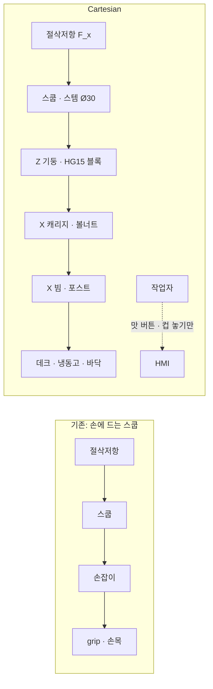

# 하드아이스크림 스쿠핑 — 문제에서 메커니즘까지

> **현재 기준안: Cartesian 자동 맛 선택 스쿠퍼(2026-09).** 작업자가 맛을 고르면 직교 3축이 헤드를 그 통으로 옮기고, 헤드는 스쿱 피치 하나만 따로 움직여 뜬 뒤, 고정된 컵 스테이션에서 배출·계량한다.
> 이전 기준안(사람이 헤드를 웰에 도킹하는 Legacy Architecture M)은 §4.9에 요약했고, 전문은 `docs/11`, `docs/12`와 이 문서의 이전 판(커밋 `32daeaa`)에 있다.
> 한 문서 요약본이다. 세부 근거와 계산은 괄호 안 문서에 있고, 권장안·위험·게이트는 [`final_system_concept.md`](final_system_concept.md)에 있다.
> 근거 강도 표시: **중** / **약** / `가정`(측정 전 값). 이번 조사는 원문 열람이 막힌 환경에서 검색 요약으로 했으므로 논문 수치는 원문 대조 전까지 인용하지 않는다(docs/02). **실측 데이터는 아직 0건이다.**

---

## 1. 문제정의

### 1.1 작업

하드아이스크림 매장 직원은 디핑 캐비닛의 통(tub)에서 스쿱으로 아이스크림을 반복해서 뜬다. 한국 배스킨라빈스 기준으로 싱글레귤러는 115 g, 파인트는 320 g이고, 매장은 1,700곳이 넘는다(research/products.md).

한 번의 스쿱은 다음 순서로 이루어진다.

```
배치 → 절입(dive) → 끌기(drag) → 공 닫기(closing) → 들어올림 → 배출 → 헹굼
                └──────────── 부하가 집중되는 구간 ────────────┘
```

### 1.2 무엇이 힘든가 — 역학으로 본 원인

| 원인 | 설명 | 식 |
|---|---|---|
| ① 절삭에 필요한 일 | 스쿱이 아이스크림을 깎는 일은 부피와 재료가 정한다. 온도가 낮고 배합이 단단할수록 u가 커진다 | W ≈ u·V |
| ② 손잡이 모멘트 | 볼 가장자리의 절삭력이 긴 손잡이를 통해 손목에 굽힘 모멘트를 만든다 | M ≈ F·ℓ |
| ③ 손잡이 축 토크 | 절삭선이 손잡이 축에서 벗어나 있어 생기는 비틀림을 **손바닥 마찰(grip)**로 버틴다 | F_grip ≳ T_roll / (μ·r_h) |
| ④ 자세 보상 | ②·③을 줄이려고 손목을 꺾어 힘 방향에 맞춘다 → 나쁜 자세 | – |
| ⑤ 공 닫기 | 부하가 걸린 상태에서 손목·전완을 돌린다 | – |
| ⑥ 반복 | 위 과정이 스쿱마다, 추가 스쿱(top-up)마다 반복된다 | 횟수 미측정 |

예시(`가정`): 절삭력 100 N, 축 오프셋 20 mm면 축 토크는 2 N·m다. 차갑고 젖은 금속 손잡이(μ ≈ 0.5, 반경 12 mm)라면 이 토크를 마찰로 버티는 데만 grip 330 N 규모가 필요하다. 이는 성인 최대악력과 같은 자릿수다(docs/07 §3).

### 1.3 근거

| 근거 | 내용 | 강도 |
|---|---|---|
| Dempsey et al., *Applied Ergonomics* 31 (2000) | 계측 스쿱으로 측정. 주 결함은 **스쿠핑의 나쁜 자세 + 높은 근력**. 온도가 낮을수록 **g당 누적 grip force** 증가 | 중 |
| 같은 연구의 보상청구 분석 | 스쿠핑은 청구의 약 13–15 %. **1위는 넘어짐** | 약–중 |
| Howard & Conrad (1992) | 스쿠퍼의 제2중수골 피로골절. 손잡이가 뼈를 받침점으로 누른 것으로 추정 | 약(사례 1건) |
| Shin (2019) | 한국 프랜차이즈 파트타이머의 손·팔·손목 부담 호소 | 약(질적, 원문 대조 예정) |
| IDFA 등 | 권장 디핑 온도 −12 ~ −14 °C, 경도는 빙결률에 지수적으로 증가 | 중 |

### 1.4 문제 진술

> 작업자는 스쿱의 절삭저항을 손으로 공급하고, 그 반력이 만드는 모멘트와 축 토크를 grip과 손목으로 버틴다. 이 부하는 온도가 낮을수록, 제품이 단단할수록, 반복이 많을수록 커진다.

줄이려는 것은 질병이 아니라 **측정 가능한 물리량**이다.

| 물리량 | 단위 |
|---|---|
| 작업자 손의 peak / 평균 힘 | N |
| grip | %MVC(최대악력 대비) |
| 손목 굴곡·편위·회내외 범위 | ° |
| 부하 상태의 손목 회전 횟수 | 회 |
| 사이클타임, 질량 편차(CV) | s, % |

**주장하지 않는 것:** 질환 예방 효과, 발생률, 최초·유일성, 절대적 안전.

### 1.5 자동화가 겨냥하는 두 번째 문제 — 작업자의 시간

손목 부하만이 문제라면, 반력을 프레임으로 보내는 헤드를 사람이 옮기는 것으로 충분하다(§4.9 Legacy M). 자동 맛 선택 구조가 따로 겨냥하는 것은 **작업자 시간**이다. 사람이 뜨는 동안에는 그 사람의 두 손이 스쿱에 묶인다. 기계가 맛 선택부터 컵 배출까지 하면, 작업자는 컵을 놓고 가져가는 몇 초만 쓰고 그 사이에 결제·토핑·포장을 할 수 있다.

| 추가 물리량 | 단위 | 상태 |
|---|---|---|
| 작업자 점유 시간 / 스쿱 | s | 사람 값 미측정(P0-1) |
| 기계 사이클 | s | 추정 11–23 s |
| portion 질량 편차 | g, % | 저울로 매 스쿱 기록 |

---


## 2. 기존 해결책·특허와 한계

### 2.1 기존 해결책

| 해결책 | 원리 | 줄이는 것 | 남는 것(한계) |
|---|---|---|---|
| **적정 온도 관리** | 캐비닛을 −12 ~ −14 °C로 유지 | 재료저항 u 전체 — **가장 큰 레버** | 같은 온도에서도 맛마다 경도가 다름. 반력을 grip으로 버티는 구조는 그대로 |
| 좋은 스쿱·인체공학 손잡이 | 날끝, 손잡이 형상 | 일부 자세, 쟁기질 저항 | 절삭 일, 반력 grip, 공 닫기 회전 |
| **Zeroll**(열전도 유체) | 손의 열로 볼 표면을 녹여 부착·마찰 감소 | 표면 마찰·부착분 | 절입·전단 저항. 식기세척기 금지(세척 제약) |
| **가열 스쿱** | 헤드 ~70 °C | 표면 마찰·부착분 | 절입력 대부분. 소비자용, 70 °C는 화상 임계 부근 |
| **동력 손 스쿱** | 손잡이 속 모터가 볼·날을 돌림 | 공 닫기 회전 | **모터 반토크가 손으로 돌아옴**, 절입은 여전히 손이 밀어야 함 |
| 진동 스쿱 | 삽입 방향 진동 | 일부 마찰(주장) | 반력, 손-팔 진동 노출 |
| 전용 디스펜서(특허) | 전용 카톤을 밀어 올리며 회전날로 절삭 | 전부 | 표준 통을 쓸 수 없음 |
| **로봇 팔 매장·연구**(Niska, Dice Cream, XYZ ARIS, Columbia·RIT 학생 로봇, Dexai) | 다자유도 팔이 통에서 뜨고 컵에 배출 | 전부 | 협동로봇 본체만 ~4,400만 원 `[SNIPPET]`, 제품 사례 ~40 s/주문 `[SNIPPET]`, 긴 팔 끝에서 큰 절삭력을 받을 때의 강성은 미확인 |

### 2.2 특허·선행문헌 (손 스쿱 45건 + 자동화 재검색 28건, 검색 요약 기준)

| 분류 | 대표 문헌 | 내용 | 의미 |
|---|---|---|---|
| 동력 손 스쿱 | US2109598 (1937), US2621614 (1952) | 전동 디퍼, 모터 손잡이 절입 보조 | 동력 스쿱은 90년 된 개념 |
| | **US4758150 (1986)** | 버튼으로 볼 안 sweeping band를 모터가 180° 회전. 후속 문헌이 "semiautomatic scoop"이라 부름 | "반자동 스쿱" 자체가 선행기술 |
| 진동·적응 | **KR20210015444A** | 감지 압력에 따라 진동 세기 변경, 무게 측정 | 부하 적응 동력 스쿱은 선행기술 |
| 로봇 통 스쿠핑 | **US20240245265A1**(Niska) | 로봇 팔이 통에서 스쿠핑, 스쿱 안쪽 wiper로 배출 | 로봇 통 스쿠핑·배출기는 선행기술 |
| | Columbia "Scoop"(비특허) | 직선 관절 1 + 회전 6, 통 열을 따라 맛 → 통 → 컵 | 맛→좌표→컵 흐름은 선행기술 |
| | **US11597084B2**(Dexai, 등록) | 자유공간에서는 낮은 토크 한계, 스쿠핑 중에는 상황별 높은 한계 | **상태별 힘 한계 → 실시 위험(FTO)** |
| | US11628566(Dexai 관련) | 표면 아래 깊이, 토크로 담긴 양 추정 | 표면 기준 깊이 개념은 개시됨 |
| 갠트리·계량 | **US11969878 / US12275130** | 여러 축 **갠트리**가 고정 재료 스테이션에 정렬·꺼냄·**계량**·투입(아이스크림 아님) | 구조 개념이 가장 가까움 |
| 자동 디스펜서 | US5385464, US7503252B2, US4009740A | 스쿱 충전도 감지·회전 배출 / 전용 카톤 + 회전날 / 리드스크류 캐리지가 콘 이송 | 자동 정량·스테이션 이송은 선행기술 |

전체 표: `research/patents.md` §1(손 스쿱), §5(자동화 재검색) · 해석: `docs/updated_prior_art.md`

### 2.3 공통 한계 — 네 가지

1. **수공구는 일을 없애지 못한다.** W ≈ u·V는 도구와 무관하다. 도구는 힘의 경로와 표면 마찰만 바꾼다.
2. **손에 드는 동력 공구는 반력을 없애지 못한다.** 모터가 스쿱을 돌리면 같은 크기의 반토크가 손잡이로 돌아온다. 동적인 손목 회전이 정적인 grip 유지로 바뀔 뿐이다.
3. **자동화된 것은 모두 다자유도 로봇 팔이다.** 이 작업은 정해진 통, 수직 접근, 큰 절삭력, 짧은 궤적이 특징인데, 팔은 필요 이상의 자유도와 가격을 떠안고 긴 팔 끝에서 큰 힘을 받아야 한다.
4. **팔 기반 자동화도 통 안의 상태를 비전이나 경험적 궤적에 맡긴다.** 표면이 어디인지, 통의 어느 부분을 이미 팠는지, 컵에 실제로 몇 g이 담겼는지를 닫힌 루프로 다루는 방법은 검색 요약에서 찾지 못했다.

**빈칸:** 팔 없이 **직교 갠트리**로 여러 표준 통의 하드 아이스크림을 뜨는 구조는 찾지 못했다. 다만 구성요소 대부분은 따로 개시되어 있다. 따라서 차별점은 구조 자체보다 **조합과 제어 방법**(통마다 접촉 표면 기준, 절삭 이력 지도로 레인 선택, 컵 무게로 다음 스쿱 보정)에 있다. 검색 요약 기준이며 부존재를 증명한 것은 아니다.

---

## 3. 한계를 해결할 공학적 아이디어

| 한계 | 아이디어 | 핵심 원리 |
|---|---|---|
| 2 반력이 손으로 돌아옴 | **아이디어 1 — 반력은 기계 구조가, 작업자는 버튼만** | 반력 경로를 손 → 갠트리 구조로. 강성으로 설계한다 |
| 3 로봇 팔은 과한 자유도 | **아이디어 2 — 전역 3축 재사용 + 로컬 1축** | 과업 3 DOF(x, z, θ) 중 x·z를 위치결정 축이 겸한다 → 액추에이터 4 |
| 4 통 안 상태를 모름 | **아이디어 3 — 비전 없는 통 상태 관리** | 접촉 표면 기준 + 절삭 이력 지도 + 레인 평삭 + 저울 피드백 |
| 1 일은 못 줄임, 맛·온도 편차 | **아이디어 4 — 깊이 적응 + 부피 적분** | peak 힘과 stroke 수를 교환 |
| 자동화가 과할 수 있음 | **아이디어 5 — 측정으로 자동화 수준을 고른다** | 같은 헤드로 Cartesian과 Legacy M을 모두 지원 |

### 아이디어 1 — 반력은 기계 구조가 받는다



- 손이 반력을 받지 않으므로 모멘트, 축 토크(→ grip), 자세 보상이 모두 사라진다.
- 대신 반력이 **~0.8 m 레버**로 갠트리에 모멘트를 준다(200 N × 0.807 m ≈ 161 N·m). 레일 용량은 충분하지만(블록당 0.54 kN vs 정격 17 kN) **강성**이 문제다. 3D 프린터식 구조는 200 N에서 스쿱 끝이 8–11 mm 밀리고, 강관 기둥·빔 + HG15 + 볼스크류 + Ø30 스템이면 ~1.0 mm다(`gantry_load_path.md`).
- 설계 규칙: **드래그 방향 = 빔 축**(빔이 비틀리지 않게), 로드셀은 볼너트에 두어 모멘트 경로 밖에서 축방향 힘만 잰다.

### 아이디어 2 — 전역 축을 스쿠핑에 재사용한다

스쿠핑 과업이 요구하는 운동은 스트로크 평면 안의 3개(끌기 x, 깊이 z, 피치 θ)다. 통 사이를 옮기려면 어차피 X·Y·Z가 필요하므로, **x와 z는 위치결정 축이 겸하고** 헤드에는 θ 하나만 둔다.

| 구분 | 축 | 역할 |
|---|---|---|
| 전역 위치결정 DOF 3 | X_M, Y_M, Z_M | 통 간 이동, 표면 접근, 컵 이동 **+ X는 드래그, Z는 깊이** |
| 로컬 스쿠핑 DOF 1 | θ_s | 공격 자세, 공 닫기, 배출 자세 |
| 합계 | **모터 4** | "5축 로봇"이 아니다 |

헤드 안에 짧은 x축을 따로 두는 안(모터 5 + 잠금)은 기각했다. 로컬 축은 **구동계**만 하중 경로에서 빼고 **구조**(기둥·블록·빔·스템)는 그대로 남기며, 볼스크류 X에서 구동계 기여는 0.01 mm뿐이다(`architecture_comparison.md` §1).

**스쿠핑 원리도 처음부터 다시 비교했다.** 대칭 클램셸(턱 2개), 수직 압입(디셔), 반구 회전, 회전 코어와 비교했더니, 통 안에서 층을 벗기며 **바닥까지 내려갈 수 있는 원리는 끌기-말기뿐**이었다. 5 mm 격자로 통을 모사한 결과는 다음과 같다(`calc/output/scoop_mechanism_compare.md`, 기하만 비교).

| 원리 | 통 하나에서 완성한 portion | 이유 |
|---|---|---|
| **끌기-말기(채택)** | **30개, 통 부피의 59 %**(바닥까지) | 남는 것은 스쿱이 닿지 않는 벽 쪽 링 |
| 대칭 클램셸 | 4–8개, 8–16 %(맨 위 층에서 멈춤) | 열린 턱이 들어갈 빈 공간이 필요한데, 분화구 사이 봉우리가 막음 |
| 수직 압입 | – | 컵 안 재료를 압축해야 해 1.2–3.8 kN(`가정` 압입압력) |
| 회전 코어 | – | 결과물이 원통(공 모양 아님) |

### 아이디어 3 — 비전 없이 통 상태를 관리한다

통 위치가 고정되어 있으므로 카메라 대신 **기계 좌표와 접촉**으로 푼다.

| 문제 | 방법 | 수치(`가정`) |
|---|---|---|
| 표면이 어디인가 | Z 볼너트 로드셀로 **터치오프**: 마지막 10 mm를 10 mm/s, ΔF ≥ 3 N | 날이 눌리는 깊이 0.03–0.31 mm → portion 오차 0.2–2 %. 모터 전류(≥ 30 N)로는 수 mm 눌려 못 씀 |
| 어디를 뜰 것인가 | 스쿱마다 깎은 모양을 기록한 **절삭 이력 지도**(10 mm 격자) → 표면이 가장 높은 레인 | 레인 y = −40 / 0 / +40, 층별 평삭(한 자리만 파는 구덩이 방지) |
| 벽·바닥 충돌 | keep-out: 피벗이 통 반경 − R − 10 mm 원 안, 바닥 위 10 mm | 레인 길이 90–140 mm → 1 portion에 깊이 24–29 mm |
| 실제로 몇 g인가 | 컵 웰 아래 1 kg 로드셀 → 맛별 보정계수 k_f(지수이동평균) → 다음 스쿱 목표 부피 | 밀도·압축·지도 오차의 편향을 흡수 |
| 사람이 통을 건드림 | 터치오프 값과 지도 예측의 차이 > 8 mm → 3점 재프로브 | 사람이 판 구덩이, 이물, 맛 뒤바뀜은 **못 잡는다** → 운영 규칙 |

### 아이디어 4 — 깊이 적응 + 부피 적분

같은 부피를 뜰 때 필요한 일은 u·V로 거의 고정이다. 그러나 **peak 힘과 stroke 길이(또는 stroke 수)는 교환할 수 있다.**

```
F ≈ u · A(d)          깊게 자르면 힘 ↑
V = ∫ A dx            얕게 자르면 한 번에 담기는 양 ↓
W = F · L ≈ u · V     (일은 그대로)
```

- X 볼너트 로드셀로 드래그 힘 F_x를 **직접** 잰다. F_x > 110 N이면 Z를 올려 깊이를 줄이고, 부피 적분이 목표에 닿거나 레인 끝이면 닫는다. 160 N이 50 ms 지속되면 정지 → Z 상승.
- 이 논리는 Legacy 헤드용으로 먼저 시뮬레이션했다(`가정` 재료값 27개 조건, `calc/load_adaptive_sim.py`). 150 N 초과 발생이 고정 경로 18/27, 속도 적응 16/27, **깊이 적응 9/27**이었다.
- 과부하 임계는 **하드웨어 한계의 0.8배 이하**로 둔다(185 N으로 뒀더니 힘 추정이 10 % 낮게 읽힐 때 한 번도 작동하지 않았다).
- 재료가 아주 단단하면(u = 250 kPa `가정`) 110 N에서 깊이가 ~12 mm로 얕아져, 1 portion을 작은 공 2–3개로 나눠 담는다. 파손이 아니라 사이클 증가로 나타나게 한 것이다.

### 아이디어 5 — 자동화 수준을 측정으로 고른다

| 조건 | 선택 |
|---|---|
| 손목 부하만 줄이면 됨, 맛이 많고 자주 바뀜, 피크 처리량 중요 | **Legacy M**(반력 접지 헤드 + 사람이 위치): 모터 2, 기존 캐비닛에 설치 |
| 작업자 손이 사이클 동안 비어야 함(1인 근무·병렬 업무), 고정 맛 세트, 저울 정량, 파인트 사전 충전 | **Cartesian**: 모터 4, 자체 냉동 데크 |

두 구조는 **같은 스쿠핑 헤드와 식품 모듈, 같은 깊이 적응 제어**를 쓴다. 첫 시제품(V1a, 한 통짜리 X-Z-θ 장치)은 두 방향 모두에 쓰이는 핵심을 시험한다.

---

## 4. 구조와 메커니즘 (Cartesian, 아키텍처 1)

### 4.1 평면도 (V1, 좌표는 `가정` 예시)

```
                 Y_M ↑ (V1: 짧은 크로스슬라이드 ±80 mm = 레인 이동)
   ┌──────────────────────── 고정 X 빔 (강관 100×50×4, 스팬 ~1,450 mm) ────────────────────────┐
   │  X 볼스크류 SFU2010 ═══════════════════════════════════════════════════ [NEMA23 폐루프]    │
   │        [X 캐리지 + Y 크로스슬라이드 + Z 기둥 + 스쿠핑 헤드]  ──▶ X_M (드래그 방향 = 빔 축)   │
   └──────────────────────────────────────────────────────────────────────────────────────────┘
  ┌───────┐ ┌──────────────── 체스트 냉동고 위 데크(304, 단열) ────────────────┐ ┌────────────┐
  │ RINSE │ │   ( TUB1 )          ( TUB2 )          ( TUB3 )                   │ │ CUP        │
  │ X 120 │ │   X 340             X 600             X 860        (모두 Y 0)    │ │ X 1120     │
  └───────┘ └──────────────────────────────────────────────────────────────────┘ │ 매립 웰+저울 │
  HOME (0, 0, Z top)                              인클로저 · 인터록 도어 · 컵 베이 2빔 ┘ └────────────┘
```

### 4.2 측면도 (가장 깊은 스쿱 자세, 컵 올림 기준 높이)

```
  데크 위 높이
  +1115 ┐ Z 기둥 상단
   +730 ├──[Z 상부 블록]──┐  X 캐리지 / Y 크로스슬라이드 판
   +580 ├──[Z 하부 블록]──┘  ← 반력 모멘트가 갠트리로 넘어가는 곳 (레버 ~807 mm)
        │  Z 기둥 (강관 60×60×4)  ← Z 볼너트 로드셀: 표면 검출 · F_z
        │  counterbalance(자중 × 1.05) + 스프링 브레이크 → 정전 시 천천히 위로
   +195 ├──[스쿠핑 헤드: θ 기어드모터 · 레버 · 클램프 · 드립 우산]
        │  스템 Ø30×3 (양끝 밀봉) ∥ push-rod Ø8 (밖에 노출) = 평행링크
     0  ┼─ ─ ─ ─ 데크 = 통 테두리 ─ ─ ─ ─
   −205 ┼  C (스쿱 피벗 = 볼 중심), 가장 깊은 위치
   −250 ┴  통 바닥
```

### 4.3 스쿱 동작과 기구학

```
 진행방향 +X →      ① 접근·터치오프     ② dive            ③ drag              ④ close            ⑤ lift
                    θ = −30°            X·Z 30° 보간       X 80 mm/s,          X 정지,            Z_SAFE까지
                    (개구부 앞-아래)                        F_x > 110 N이면 Z↑  θ −30° → +90°
      C·  ↘ lip        C·                C·────────▶        C·(공)              ▲
  ─ ─ ─·─ ─ ─ ─     ─ ─ ╲ ─ ─ ─       ─ ─ ╲ ─ curl ─     ─ ─ ↗ ─ ─ ─ ─       │
  ▓▓▓▓▓▓▓▓▓▓▓▓▓     ▓▓▓▓▓·lip▓▓▓     ▓▓▓▓▓·──────▓▓▓     ▓▓▓▓▓▓▓▓▓▓▓▓▓      ▓▓ 홈 ▓▓
```

```
rim 최저점 깊이      d = R·cos θ_s − h          (h = 피벗 C의 표면 위 높이)
절삭단면             A(θ_s, d) = 반축 R, R·cos θ_s 인 타원 중 표면 아래 면적
부피                 V = ∫ A dx  (+ 닫을 때 앞쪽 구면 캡)
```

| 깊이 d(θ_s = −30°) | 절삭단면 A | 절삭 폭 | 힘 @ u 90 / 160 kPa(`가정`) |
|---|---|---|---|
| 20 mm | 959 mm² | 66 mm | 86 / 153 N |
| 25 mm | 1,297 mm² | 69 mm | 117 / 207 N |
| 28 mm | 1,505 mm² | 70 mm | 135 / 241 N |

공격 자세를 −30°로 두면 볼 바깥면이 절삭 터널 밖으로 나가지 않아 볼 뒷면이 표면을 밀지 않는다. **힘이 0° 자세보다 작은지는 모른다** → 첫 실측(E0 확장)에서 0° vs −30°를 잰다.

### 4.4 구동계와 부품 (하중은 `가정` 50–200 N)

| 축 | 구동 | 가이드 | 모터 | 비고 |
|---|---|---|---|---|
| X_M 1,150 mm | SFU2010 볼스크류 | HGR15 × 2 | NEMA23 폐루프 | 임계속도 한계 ~320 mm/s → 이송 250 mm/s. 200 N 드래그에 0.37 N·m(모터의 ~35 %). 벨트(GT2)는 작업장력 ~28 N이라 드래그 불가 |
| Y_M ±80 mm | SFU1605 크로스슬라이드 | HGR15 × 2 | NEMA17 폐루프 | 레인 이동(제품은 이동 브리지 + HTD 벨트) |
| Z_M 400 mm | SFU1610 | HGR15 × 2 | NEMA17 폐루프 + 브레이크 ≥ 0.25 N·m | counterbalance 덕분에 소형 모터(0.2 N·m) |
| θ_s −30…+90° | 유성 기어드모터 + 평행링크 | 피벗 핀 | 24 V ≥ 8 N·m, 엔코더, 전류센스 | 링크 사점 때문에 ±60°만 사용 → 과회전 배출 불가 |

| 부품 | 사양 | 근거 |
|---|---|---|
| 스템 | 304 Ø30×3, 양끝 용접 밀봉 | Ø25×3은 200 N에서 63 MPa·0.9 mm로 부족, Ø30×3은 41 MPa |
| push-rod | 304 Ø8, 스템 밖 노출 | 좌굴 4.26 kN, ±60°에서 안전율 ≥ 7 |
| 로드셀 | X 너트 50 kg, Z 너트 20 kg, 컵 1 kg | 모두 축방향만(볼조인트) |
| 배출 | 컵 위에서 θ = −30°로 기울이고 고정 **빗**에 공을 걸어 X로 스쿱만 빼냄 | 추가 액추에이터 없음. **미해결 기능** → V1a에서 50회 성공률로 결정, 예비안은 분할 볼 |
| 시제품 비용 | V1 BOM 44항목 ~524만 원(냉동고를 빌리면 ~479만 원) | `BOM/cartesian_prototype_v1.csv` |

### 4.5 한 스쿱의 순서와 시간 (`가정`)

| 단계 | 동작 | 시간 [s] |
|---|---|---|
| 맛 선택·컵 놓기 | 작업자 | (3.0) |
| XY → 레인 시작점 | **Z ≥ Z_SAFE**(60 mm)에서만 | 2.33 |
| Z 하강 → 터치오프 | 150 mm/s → 10 mm/s, 3 N | 2.26 |
| dive → drag → close | X·Z 보간 → X 드래그 → θ 닫기 | 3.67 |
| Z 상승 → XY → 컵 | – | 3.68 |
| 배출 → 후퇴 → 계량 | 빗 걸기, 저울 안정 1 s | 2.60 |
| **기계 합계** | | **14.5 (범위 11.1–22.7)** |

시간의 대부분은 이동이다(최악 조건에서 XY 36 %, Z 25 %, 실제 스쿠핑 19 %). 기계는 숙련자보다 **느릴 수 있다**. 가치는 속도가 아니라 **작업자 점유 시간**(~3 s/스쿱)에 있다.

### 4.6 제어와 안전

- **상태기계:** BOOT → HOMING(**Z 먼저 위로**) → IDLE → 맛 선택 → 좌표 조회 → 컵 확인 → XY 이동 → Z 접근 → 표면 검출 → DIVE → DRAG → CLOSE → Z 상승 → 컵 이동 → 배출 → 계량 → IDLE. 결함: OVERLOAD, STALL, POSITION_ERROR, NO_TUB, NO_CUP, HAND_IN_BAY(`control_state_machine.md`, `firmware/state_machine.md`).
- **Z_SAFE 규칙:** `if Z < Z_SAFE: XY MOVE 금지`. 예외는 현재 통 안 드래그와 컵 베이 안 배출 이동 두 가지뿐이다. 계획 단계 검사와 실시간 게이트(`request_xy_move()`)를 둘 다 둔다. 이것은 기계·제품 보호용이다.
- **사람 보호는 분리로 한다.** 모든 축의 최대 힘(X 1,131 N, Z ~254 N)이 ISO/TS 15066의 손 한계 140 N을 넘으므로 힘 제한만으로 안전하다고 주장하지 않는다. 인클로저 + 인터록 도어 + E-stop → STO. **컵 베이 2빔은 전 축 STO**에 하드와이어한다. 헤드가 들어오는 슬롯을 통해 베이 안의 손이 기계 안에 닿을 수 있기 때문이다. 대가로 V1에서는 기계가 움직이는 동안 다음 컵을 놓을 수 없다.
- 자동 재기동 금지, 정전 시 Z는 브레이크 + counterbalance로 떨어지지 않는다(`collision_and_safety.md`).

### 4.7 위생

- **문제:** X 빔이 열린 통들 위를 지나간다. 그대로면 갠트리 전체가 food zone이 된다.
- **해결:** 갠트리와 통 사이에 **연속 드립 차단층**을 둔다. X 빔 전장 고정 트레이, Y 이동 트레이, Z 기둥 벨로즈, 헤드 드립 우산으로 구성한다. 차단층 위는 non-food zone(FDM 허용, NSF H1 그리스)이다(`sanitation_architecture.md`).
- 식품 모듈(스쿱 + 스템 + push-rod + 핀)은 퀵핀 2개로 **공구 없이** 통째로 분리한다. 304 스테인리스, Ra ≤ 0.8 µm, 내부 모서리 R ≥ 3.2 mm로 하고, push-rod는 밖으로 노출해 숨은 공동을 없앤다.
- 맛이 바뀌면 자동 헹굼. 알레르겐 맛은 **전용 식품 모듈**이 장착되지 않으면 상태기계가 거부한다.

### 4.8 작업자가 하는 일 / 기계가 하는 일

| 작업자 | 기계 |
|---|---|
| 맛 버튼, 컵 놓기·가져가기(~3 s) | 좌표 이동, 표면 검출, 절입·끌기·닫기, **반력 전부** |
| 통 교체(도어 열고 E-stop 상태), 벽 쪽 링 정리 | 레인 선택·절삭 이력 지도 갱신 |
| 식품 모듈 교체·세척(4시간마다, 알레르겐 전환 시) | 배출, 계량, 맛별 보정, 헹굼 |
| 파인트 눌러담기(잔여 부하) | 과부하 시 정지·후퇴, 결함 표시 |

### 4.9 Legacy M(이전 기준안)과의 관계

| 항목 | Legacy M | Cartesian |
|---|---|---|
| 위치 결정 | 작업자가 헤드를 웰에 도킹 | X·Y 자동, 맛 → 좌표 |
| 반력 접지 | 웰 도킹 래치 | 갠트리 구조(강성 설계가 핵심 과제) |
| 끌기 / 깊이 | 헤드 내부 x 볼스크류 / z 잠금 + θ | 전역 X / 전역 Z |
| 모터 | 2 | 4 |
| 설치 | 기존 캐비닛 | 자체 냉동 데크 + 인클로저 |
| 유지되는 것 | 식품 모듈, 외부 push-rod, 깊이 적응 제어, 분리 원칙, 가정 하중 50–200 N | 같음 |

### 4.10 아직 모르는 것 — 먼저 잴 것

| 모르는 값 | 왜 중요한가 | 실험 |
|---|---|---|
| **스쿱 절삭력 F(깊이, 온도, 공격 자세)** | 구조 강성, Z 하강력, θ 토크, 스템이 모두 F에 비례한다. 설계 하중 200 N을 넘으면 얕은 다중 stroke로 바뀐다 | 기계 없이 푸시풀 게이지로(`P0-3` §7): θ 0°/−30°, d 20/25/28 mm, 저울로 F_z → **C-Gate 0** |
| 배출이 되는가 | 가장 덜 풀린 기능 | V1a 50회(C-Gate 1) |
| 표면 검출 반복성, portion 편차 | 비전 없는 방식의 성립 여부 | V1a 30회(C-Gate 2) |
| 사람의 스쿱 시간과 매장 피크 수요 | 자동 XY가 가치 있는 운영인지 | P0-1 매장 관찰(C-Gate 4) |
| US11597084B2 청구항 | 상태별 힘 한계의 실시 위험 | 원문 확인 |

→ 권장안·위험 Top 5·결정 게이트: [`final_system_concept.md`](final_system_concept.md) · 구조 비교: [`architecture_comparison.md`](architecture_comparison.md) · 선행기술: [`updated_prior_art.md`](updated_prior_art.md)
