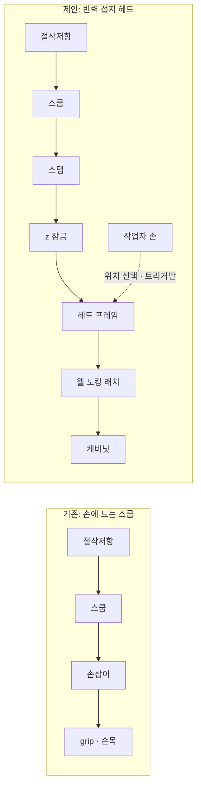

# 하드아이스크림 스쿠핑 — 문제에서 메커니즘까지

> ⚠️ **Legacy Architecture M — 수동 위치지정(2026-09 이전 기준안).** 현재 기준 아키텍처는 **Cartesian 자동 맛 선택 구조**다 → [`system_architecture_cartesian.md`](system_architecture_cartesian.md), [`final_system_concept.md`](final_system_concept.md), 비교는 [`architecture_comparison.md`](architecture_comparison.md).
> 이 브리프의 §1–§3(문제, 기존 해결책·특허와 한계, 공학적 아이디어)은 유효하다. §4(구조와 메커니즘)는 Legacy M이다. Cartesian 구조는 `system_architecture_cartesian.md`.


> 한 문서 요약본. 세부 근거와 계산은 괄호 안 문서에 있다.
> 근거 강도 표시: **중** / **약** / `가정`(측정 전 값). 이번 조사는 원문 열람이 막힌 환경에서 검색 요약으로 했으므로 논문 수치는 원문 대조 전까지 인용하지 않는다(docs/02).

---

## 1. 문제정의

### 1.1 작업

하드아이스크림 매장 직원은 디핑 캐비닛의 통(tub)에서 스쿱으로 아이스크림을 반복해서 뜬다. 한국 배스킨라빈스 기준으로 싱글레귤러는 115 g, 파인트는 320 g이고, 매장은 1,700곳이 넘는다(research/products.md).

한 번의 스쿱은 다음 순서로 이루어진다.

```
배치 → 절입(dive) → 끌기(drag) → 공 닫기(closing) → 들어올림 → 배출 → 헹굼
                └──────────── 부하가 집중되는 구간 ────────────┘
```

### 1.2 무엇이 힘든가 — 역학으로 본 원인

| 원인 | 설명 | 식 |
|---|---|---|
| ① 절삭에 필요한 일 | 스쿱이 아이스크림을 깎는 일은 부피와 재료가 정한다. 온도가 낮고 배합이 단단할수록 u가 커진다 | W ≈ u·V |
| ② 손잡이 모멘트 | 볼 가장자리의 절삭력이 긴 손잡이를 통해 손목에 굽힘 모멘트를 만든다 | M ≈ F·ℓ |
| ③ 손잡이 축 토크 | 절삭선이 손잡이 축에서 벗어나 있어 생기는 비틀림을 **손바닥 마찰(grip)**로 버틴다 | F_grip ≳ T_roll / (μ·r_h) |
| ④ 자세 보상 | ②·③을 줄이려고 손목을 꺾어 힘 방향에 맞춘다 → 나쁜 자세 | – |
| ⑤ 공 닫기 | 부하가 걸린 상태에서 손목·전완을 돌린다 | – |
| ⑥ 반복 | 위 과정이 스쿱마다, 추가 스쿱(top-up)마다 반복된다 | 횟수 미측정 |

예시(`가정`): 절삭력 100 N, 축 오프셋 20 mm면 축 토크는 2 N·m다. 차갑고 젖은 금속 손잡이(μ ≈ 0.5, 반경 12 mm)라면 이 토크를 마찰로 버티는 데만 grip 330 N 규모가 필요하다. 이는 성인 최대악력과 같은 자릿수다(docs/07 §3).

### 1.3 근거

| 근거 | 내용 | 강도 |
|---|---|---|
| Dempsey et al., *Applied Ergonomics* 31 (2000) | 계측 스쿱으로 측정. 주 결함은 **스쿠핑의 나쁜 자세 + 높은 근력**. 온도가 낮을수록 **g당 누적 grip force** 증가 | 중 |
| 같은 연구의 보상청구 분석 | 스쿠핑은 청구의 약 13–15 %. **1위는 넘어짐** | 약–중 |
| Howard & Conrad (1992) | 스쿠퍼의 제2중수골 피로골절. 손잡이가 뼈를 받침점으로 누른 것으로 추정 | 약(사례 1건) |
| Shin (2019) | 한국 프랜차이즈 파트타이머의 손·팔·손목 부담 호소 | 약(질적, 원문 대조 예정) |
| IDFA 등 | 권장 디핑 온도 −12 ~ −14 °C, 경도는 빙결률에 지수적으로 증가 | 중 |

### 1.4 문제 진술

> 작업자는 스쿱의 절삭저항을 손으로 공급하고, 그 반력이 만드는 모멘트와 축 토크를 grip과 손목으로 버틴다. 이 부하는 온도가 낮을수록, 제품이 단단할수록, 반복이 많을수록 커진다.

줄이려는 것은 질병이 아니라 **측정 가능한 물리량**이다.

| 물리량 | 단위 |
|---|---|
| 작업자 손의 peak / 평균 힘 | N |
| grip | %MVC(최대악력 대비) |
| 손목 굴곡·편위·회내외 범위 | ° |
| 부하 상태의 손목 회전 횟수 | 회 |
| 사이클타임, 질량 편차(CV) | s, % |

**주장하지 않는 것:** 손목질환 예방, 발생률, "세계 최초", "완벽히 안전".

---

## 2. 기존 해결책·특허와 한계

### 2.1 기존 해결책

| 해결책 | 원리 | 줄이는 것 | 남는 것(한계) |
|---|---|---|---|
| **적정 온도 관리** | 캐비닛을 −12 ~ −14 °C로 유지 | 재료저항 u 전체 — **가장 큰 레버** | 같은 온도에서도 맛마다 경도가 다름. 반력을 grip으로 버티는 구조는 그대로 |
| 좋은 스쿱·인체공학 손잡이 | 날끝, 손잡이 형상 | 일부 자세, 쟁기질 저항 | 절삭 일, 반력 grip, 공 닫기 회전 |
| **Zeroll**(열전도 유체) | 손의 열로 볼 표면을 녹여 부착·마찰 감소 | 표면 마찰·부착분 | 절입·전단 저항. 식기세척기 금지(세척 제약) |
| **가열 스쿱** | 헤드 ~70 °C | 표면 마찰·부착분 | 절입력 대부분. 소비자용, 70 °C는 화상 임계 부근 |
| dipper well(헹굼) | 스쿱을 물에 보관 | 교차오염, 부착 | 스쿠핑 힘 전부 |
| **동력 손 스쿱** | 손잡이 속 모터가 볼·날을 돌림 | 공 닫기 회전 | **모터 반토크가 손으로 돌아옴**, 절입은 여전히 손이 밀어야 함 |
| 진동 스쿱 | 삽입 방향 진동 | 일부 마찰(주장) | 반력, 손-팔 진동 노출 |
| **로봇팔**(XYZ ARIS 등) | 비전 + 다자유도 팔 | 전부 | 2천만 원대, 약 1분/개, 보충·세척 |
| 전용 디스펜서(특허) | 전용 카톤을 밀어 올리며 회전날로 절삭 | 전부 | 표준 통을 쓸 수 없음 |

### 2.2 특허 (45건 스크리닝, 요약 기준)

| 분류 | 대표 특허 | 내용 | 의미 |
|---|---|---|---|
| 동력 손 스쿱 | US2109598 (1937) | 원격 모터 + flexible shaft 전동 디퍼 | 동력 스쿱은 90년 된 개념 |
| | US2621614 (1952) | 모터 손잡이, 딱딱한 아이스크림 절입 보조 | "절입을 모터로 보조"는 신규성 없음 |
| | **US4758150 (1986)** | 버튼으로 볼 안의 sweeping band를 모터가 180° 회전. 후속 문헌이 "semiautomatic scoop"이라 부름 | **"반자동 스쿱" 자체가 선행기술** |
| | US6840754 (2005) | 회전 호가 파고들고 claw가 나와 구를 닫음 | 동력 공 성형 |
| 진동·적응 | KR100450044B1 | 모터 → 삽입 방향 진동 | 진동 보조 |
| | **KR20210015444A** | **감지 압력에 따라 진동 세기 변경**, 무게 측정 | "부하 적응 동력 스쿱"은 선행기술 |
| 가열 | US5000672 외 10건 이상 | 성형 날에 니크롬선 | 가열 날은 신규성 없음 |
| 로봇·기계 | **US20240245265A1** | 로봇팔이 **통에서** 스쿠핑, 내부 wiper 배출 | 로봇 통 스쿠핑은 선행기술 |
| | **US12343859B2 (XYZ, 2025 등록)** | 로봇팔이 캡슐형 아이스크림을 **경도에 따라** 추출 | 존속 중 — 청구항 확인 필요 |
| | US7503252B2 | 전용 카톤 수직 feed + 회전 원판날 + 회전수 정량 | "선형 + 회전 + 정량"에 가장 가까움 |

### 2.3 공통 한계 — 세 가지

1. **수공구는 일을 없애지 못한다.** W ≈ u·V는 도구와 무관하다. 도구는 힘의 경로와 표면 마찰만 바꾼다. 그 일을 공급하고 반력을 버티는 주체는 여전히 손이다.
2. **손에 드는 동력 공구는 반력을 없애지 못한다.** 모터가 스쿱을 돌리면 같은 크기의 반토크가 손잡이로 돌아온다(작용-반작용). 동적인 손목 회전이 정적인 grip 유지로 바뀔 뿐이다. 1937년부터 특허가 반복됐지만 모터로 움직이는 스쿱은 시판품을 찾지 못했다(시장 실패 이유는 추론).
3. **자동화는 사람을 완전히 빼는 방향뿐이다.** 그래서 다자유도, 전용 용기, 느린 속도, 높은 가격을 함께 떠안는다.

**빈칸:** 사람이 위치를 정하고, 반력은 프레임이 받고, 기계는 스쿠핑 stroke만 저자유도로 수행하는 구조는 찾지 못했다. 다만 검색 요약 기준이며, 부존재를 증명한 것은 아니다.

---

## 3. 한계를 해결할 공학적 아이디어

| 한계 | 아이디어 | 핵심 원리 |
|---|---|---|
| ② 반력이 손으로 돌아옴 | **아이디어 1 — 반력 접지** | 반력 경로를 손 → 프레임으로 바꾼다 |
| ③ 자동화 = 다자유도 로봇 | **아이디어 2 — 과업 자유도 축약** | 사람 팔 7 DOF → 과업 3 DOF → 구동 2 DOF |
| ① 일은 못 줄임 + 맛·온도 편차 | **아이디어 3 — 깊이 적응 + 부피 적분** | peak 힘과 stroke 길이를 교환한다 |
| 동력화가 과잉일 수 있음 | **아이디어 4 — 같은 헤드, 측정으로 자동화 수준 선택** | 동력 A / 1모터 B / 무동력 C |

### 아이디어 1 — 반력 접지 (Reaction Grounding)

손공구에서는 절삭 반력이 스쿱 → 손잡이 → **grip·손목**으로 흐른다. 이 경로를 바꾼다.



- 손은 반력을 받지 않으므로 ②(모멘트), ③(축 토크 → grip), ④(자세 보상)가 사라진다.
- 이것이 손공구 선행기술(US4758150 등)과의 결정적 차이다.
- 이 효과만 따로 재기 위해 "접지했지만 사람이 당기는" 모드(M2)를 실험에 넣었다.

### 아이디어 2 — 과업 자유도 축약

사람 팔의 관절 자유도는 약 7개(어깨 3, 팔꿈치 1, 전완 1, 손목 2)다. 그중 스쿠핑 과업이 실제로 요구하는 운동은 **스트로크 평면 안의 3개**뿐이다.

| 운동 | 분류 | 처리 |
|---|---|---|
| 끌기 방향 위치 x | 기능적 | **모터** |
| 스쿱 pitch θ(절입 각도, 공 닫기) | 기능적 | **모터** |
| 높이 z | 기능적이지만 스트로크 중에는 고정 가능 | **표면 기준으로 잠금(수동)** |
| 통 위 위치 X, Y | 판단 | **사람** |
| 손잡이 roll, 전완 회내외, 편위 | 사람 몸 구조 때문의 보상 운동(가설) | 불필요 |

→ **구동 2자유도(x, θ)**로 충분하다. 1자유도(θ를 x의 캠으로 묶기)도 가능하지만, 압력각 한계 때문에 공 닫기를 54–73 mm에 걸쳐 굴리며 해야 하고 깊이 적응을 포기해야 한다(calc/cam_feasibility.py).

### 아이디어 3 — 깊이 적응 + 부피 적분 제어

같은 부피를 뜰 때 필요한 일은 u·V로 거의 고정이다. 그러나 **peak 힘과 stroke 길이는 교환할 수 있다.**

```
F ≈ u · A(d)          깊게 자르면 힘 ↑, stroke ↓
L ≈ V / A(d)          얕게 자르면 힘 ↓, stroke ↑
W = F · L ≈ u · V     (일은 그대로)
```

| 단계 | 제어 |
|---|---|
| 1 | 모터 전류로 절삭력을 추정한다: F ≈ 2π·η·K_t·(I − I₀)/p |
| 2 | 추정 힘이 목표를 넘으면 θ를 올려 **깊이를 줄인다** |
| 3 | 잘린 부피 V = ∫A dx를 적분하면서, 목표 부피가 찰 때까지 **stroke를 연장**한다 |
| 4 | 그래도 넘치면 후퇴·재시도하고, 너무 단단하면 "템퍼링 필요"를 표시한다 |

시뮬레이션 결과(`가정` 재료값, 27개 조건, calc/load_adaptive_sim.py):

| 전략 | 150 N 초과 발생 | 해석 |
|---|---|---|
| 고정 경로·고정 속도 | 18 / 27 | – |
| 속도 적응(1모터 캠이 할 수 있는 전부) | 16 / 27 | 속도를 줄여도 힘이 거의 줄지 않는다(재료 속도민감도가 작다면) |
| **깊이 적응 + 부피 적분** | **9 / 27** | 대가는 단단한 제품에서 부피가 모자라는 것(두 번째 stroke 필요) |

추가로 찾은 설계 규칙이 있다. 과부하 판정 임계는 **하드웨어 한계의 0.8배 이하**로 둬야 한다. 185 N으로 뒀더니, 전류 추정이 10 % 낮게 읽히는 경우 판정이 한 번도 작동하지 않았다.

### 아이디어 4 — 자동화 수준을 측정으로 고른다

세 후보가 **같은 식품 모듈과 프레임**을 공유하고, 스쿱 절삭력 실측값으로 하나를 고른다.

| 후보 | 구성 | 채택 조건 |
|---|---|---|
| **A**(주 설계안) | 모터 2(x, θ) + 깊이 적응 | 절삭력 60–200 N |
| **B** | 모터 1 + θ(x) 캠 | 재료 속도민감도가 크고, 굴리며 닫기로도 공이 될 때 |
| **C** | 무동력. 사람이 손잡이로 당기고 캠이 θ를 만듦 | 절삭력 < 60 N (가장 싸고 안전, 점수 91 vs A 77) |

---

## 4. 구조와 메커니즘 (A안)

### 4.1 측면도

```
 끌기 방향 +x →

   ═════════════[ 캐리지 ]══════════════   ← x축: SFU1610 볼스크류 + 24 V DC 60 W (헤드 프레임 위)
                   ┃      ┃
     θ 기어드모터 ─⊙ 레버  ┃
                   ┃      ┃   스템(304 튜브, 양끝 밀봉) ∥ push-rod Ø8(밖에 노출)
                   ┃      ┃   = 평행사변형 링크(상·하 레버 25 mm)
                   ┃      ┃
                   ┗━━━━━━⊙ C  (스쿱 피벗 = 볼 중심)
                          ◖── rim(날)
    ─ ─ ─ ─ ─ ─ ─ ─ ─ ─ ─ ┼ ─ ─ ─ ─ ─   아이스크림 표면
                          │ h  (z 잠금으로 고정)
               ▓▓▓▓▓▓▓▓▓▓▓▓▓▓▓▓▓▓▓▓
```

### 4.2 평면도 — 헤드가 웰에 도킹된 모습

```
   ┌──────────── 헤드 프레임 = 웰 개구부 덮개(가드) ────────────┐
   │  ◉ 도킹 핀          [x 모터]════ 볼스크류 ════[캐리지]     │
   │                                         ┃ 스템             │
   │  ◉ 도킹 핀          [θ 모터]   [손잡이 + hold-to-run]     │
   └──────────────── 래치(설계하중 ≥ 0.5 kN) ───────────────────┘
                 캐비닛 상판의 웰 둘레 도킹 플레이트
```

### 4.3 기구학

rim 최저점의 깊이는 pitch θ와 피벗 높이 h로 정해진다.

```
d = R · cos θ − h            (θ = 0에서 최대 깊이 d_max = R − h)
A(θ, h) = 반축 R, R·cos θ인 타원 중 표면 아래 면적   (끌기 1 mm당 잘리는 단면)
V = ∫ A dx
```

| 단계 | x | θ | 결과 |
|---|---|---|---|
| 배치 | 0 | θ₀ = acos(h/R) | rim이 표면에 닿아 기준 설정 → z 잠금 |
| dive | 0 → 30 mm | θ₀ → 0 | 날이 비스듬히 들어감 |
| drag | 30 → ~180 mm | 0 (부하가 크면 ↑) | 잘린 층이 볼 안에서 말림(curl) |
| close | 정지 | 0 → 90–120° | rim이 앞쪽 구면을 끊어 공 완성 |
| lift / eject | – | 유지 → 과회전 | 볼이 끌기 홈에서 수직으로 빠짐 |

기준값(`가정`): R = 35 mm, h = 13 mm → d_max = 22 mm, A ≈ 1,036 mm², 115 g에 stroke 약 182 mm.

### 4.4 구동계와 부품 (하중은 `가정` 50–200 N)

| 부품 | 사양 | 근거 |
|---|---|---|
| x 구동 | SFU1610 + 24 V DC 60 W, 0.354 N·m @ 600 rpm. **전류제한으로 200 N 상한**, 전원이 끊겨도 손으로 밀 수 있음(backdrivable) | T = F·p/(2πη) |
| θ 구동 | 유성 기어드모터 ≥ 8 N·m @ ≥ 30 rpm, 전류제한 10 N·m | closing F·R = 7 N·m × 1.5 |
| push-rod | 304 Ø8, 좌굴 안전율 약 15 | 280 N, 오일러 좌굴 |
| 스템 | 제품 Ø25×3(150 N에서 공칭응력 약 49 MPa, 피로 목표 50 MPa) | 2×10⁶ 사이클 |
| 도킹 래치 | ≥ 0.5 kN (전복 모멘트 22–60 N·m) | 헤드 자중만으로는 전복을 못 막음 |
| z 잠금 | 캠 레버 클램프, 유지력 ≥ 170 N | F_z = 0.5·F × 1.5 |

전체 계산: calc/output/engineering_calcs.md

### 4.5 제어와 안전

- **상태기계:** IDLE → TARE(무부하 전류 재측정) → ARM(표면 접촉 기준) → DIVE → DRAG(깊이 적응 + 부피 적분) → CLOSE → HOLD → EJECT → HOME. 과부하 시 RETRACT 또는 ABORT.
- **안전은 하드웨어로 한다.** E-stop, hold-to-run, 도킹·가드 인터록을 드라이버 ENABLE에 직렬로 하드와이어하고, 전류제한은 드라이버에서 건다.
- **1차 방호는 분리다.** 200 N 상한은 ISO/TS 15066의 손 한계 140 N을 넘으므로, 힘 제한만으로 안전하다고 주장하지 않는다. 도킹된 프레임이 웰을 덮고, 한 손은 손잡이를 쥐고 있어야 한다.

### 4.6 위생

- 식품 모듈(스쿱 + 스템 + push-rod + 핀)은 퀵핀 2개로 **공구 없이** 통째로 분리한다.
- 식품영역은 304 스테인리스, 표면조도 Ra ≤ 0.8 µm, 내부 모서리 R ≥ 3.2 mm로 한다.
- FMEA에서 "튜브 **안** push-rod"가 세척할 수 없는 숨은 공동임을 찾아, push-rod를 **밖으로 노출**하고 튜브 양끝을 밀봉했다.
- 견과류 맛 교차오염을 막기 위해 **알레르겐 전용 모듈**을 1벌 더 둔다.

### 4.7 작업자가 하는 일 / 기계가 하는 일

| 작업자 | 기계 |
|---|---|
| 맛·위치 판단, 헤드를 웰에 도킹 | 표면 접촉 기준 설정 |
| 트리거 누르고 유지 | 절입·끌기 힘, 공 닫기 토크, **그 반력 전부** |
| 헤드를 들어 컵 위로(밸런서 보조) | 공 유지 |
| 배출 버튼, 맛 바꿀 때 헹굼 | 깊이 적응, 부피 적분, 과부하 후퇴 |
| 파인트 눌러담기(잔여 부하) | – |

### 4.8 아직 모르는 것 — 먼저 잴 것

| 모르는 값 | 왜 중요한가 | 실험 |
|---|---|---|
| **스쿱 절삭력 F(깊이, 온도)** | 모터·안전 한계·자동화 수준(A/B/C)이 모두 여기에 달림. 문헌 추정끼리 5–15배 차이 | P0-3 drag force test (experiments/protocols/P0-3_drag_force_test.md) |
| 재료 속도민감도, 굴리며 닫기로도 공이 되는지 | A vs B | V1 rig E3, E4 |
| 최선 수공구 + 적정 온도에서 남는 부하 | 기계가 필요한지 자체(G0) | P0-2 수동 baseline |

→ 결정 게이트와 실험 설계: docs/01 §7, docs/17 · 최종 제안서: docs/23
