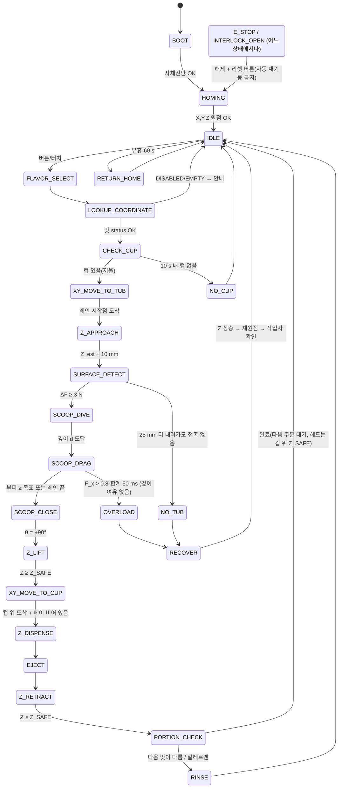

# Control State Machine

> 구현 수준의 전이표·타이머·가드는 `firmware/state_machine.md`. 이 문서는 상태의 의미와 안전 조건을 정한다.
> 원칙: 안전 기능(E-stop, 도어 인터록, 컵 베이 센서 → 구동 enable)은 **하드웨어**, 상태기계는 그 위의 순서 제어.

## 1. 전역 가드 (모든 상태에서 매 주기 검사)

| 가드 | 조건 | 위반 시 |
|---|---|---|
| G_SAFE_Z | **XY 이동 명령은 Z_M ≥ Z_SAFE일 때만 발행.** 예외: 현재 통의 safe workspace 안 드래그, 컵 베이 안 배출 이동 | 명령 거부 → POSITION_ERROR |
| G_INTERLOCK | 도어 닫힘, E-stop 해제, 드라이버 enable | E_STOP / INTERLOCK_OPEN |
| G_HOMED | 원점복귀 완료, 폐루프 위치오차 < 허용치 | POSITION_ERROR → 재원점 |
| G_BAY | Z < Z_SAFE로 컵 베이에 들어가기 전 광전 센서 "비어 있음" | 대기(최대 10 s) → NO_CUP/HAND 경고 |
| G_FORCE | 이송 중 X·Z 로드셀이 예상 밖 힘(> 30 N) | 즉시 정지 → OVERLOAD(충돌 의심) |

## 2. 상태도 (Diagram 8)

## 3. 상태표

| 상태 | 진입 조건 | 동작 | 종료 조건 | 결함 조건 |
|---|---|---|---|---|
| BOOT | 전원 | 드라이버·센서 자체진단, 설정(좌표표) 체크섬 확인 | 진단 OK | 센서 무응답, 체크섬 오류 → FAULT |
| HOMING | BOOT 완료 또는 결함 복구 | **Z 먼저 위로**, 이어 X, Y 원점 | 3축 원점 + 위치오차 0 | 스위치 미검출(행정 초과) → POSITION_ERROR |
| IDLE | 원점 OK | 대기, 온도·상태 표시 | 맛 선택 | 인터록 열림 |
| FLAVOR_SELECT | 버튼/터치 | 맛 입력, 크기(싱글/더블/파인트…) 입력 | 입력 확정 | – |
| LOOKUP_COORDINATE | 맛 확정 | 조회표 → 통 중심, 레인(표면이 가장 높은 레인), Z_est, 스쿱 파라미터 | 계산 완료 | status = EMPTY/DISABLED → 안내 후 IDLE |
| CHECK_CUP | 좌표 확정 | 저울 > 컵 무게 임계(예: 3 g) & 안정 | 컵 있음 | 10 s 초과 → NO_CUP |
| XY_MOVE_TO_TUB | 컵 확인, **Z ≥ Z_SAFE** | X·Y 동시 이동(250 mm/s) → 레인 시작점, θ = −30° | 도착, 위치오차 < 0.2 mm | 이동 중 예상 밖 힘 → OVERLOAD, 위치오차 → POSITION_ERROR |
| Z_APPROACH | XY 도착 | Z 빠른 하강 → Z_est + 10 mm | 목표 높이 | 하강 중 힘 발생(예상보다 높은 표면) → 즉시 SURFACE_DETECT로 |
| SURFACE_DETECT | 목표 높이 | 10 mm/s 등속, 로드셀 tare, ΔF ≥ 3 N 20 ms | 접촉 → Z0 기록 | Z_est − 25 mm까지 무접촉 → NO_TUB |
| SCOOP_DIVE | Z0 | X·Z 보간 경로(30°)로 깊이 d까지, θ 유지 | 깊이 도달 | F_x·F_z 과부하 → Z 상승 후 OVERLOAD |
| SCOOP_DRAG | 깊이 d | X 전진(80 mm/s), F_x > 목표면 Z 상승(깊이 적응), 부피 적분 | V ≥ V_target × k 또는 레인 끝 | F_x > 0.8·한계 50 ms 이고 깊이 여유 없음 → OVERLOAD, X 정지 300 ms → STALL |
| SCOOP_CLOSE | 드래그 종료 | X 정지, θ −30° → +90°(0.8 s) | θ 도달 | θ 전류 한계 지속 → STALL |
| Z_LIFT | 닫기 완료 | Z 상승(150 mm/s) | **Z ≥ Z_SAFE** | 상승 중 과부하(걸림) → STALL |
| XY_MOVE_TO_CUP | Z ≥ Z_SAFE | X·Y 동시 이동 → 컵 위 | 도착 | – |
| Z_DISPENSE | 컵 위 + **베이 광전 센서 비어 있음** | Z 하강(50 mm/s) → Z_C + R + 15 | 도착 | 하강 중 베이 센서 차단 → 즉시 정지·상승(HAND) |
| EJECT | 배출 높이 | θ → −30°, 흔들기, X 후퇴로 빗 걸기(방식은 V1 시험으로 확정) | 완료 | 저울 증가 없음 → EJECT_FAIL 경고 |
| Z_RETRACT | 배출 완료 | Z ≥ Z_SAFE | 도달 | – |
| PORTION_CHECK | 헤드가 베이를 떠남 | 저울 안정(1 s) → 질량 기록, 판정, 맛별 k 갱신, 절삭 이력 지도 갱신 | 기록 완료 | 범위 밖 → 경고·로그(V1은 자동 top-up 안 함) |
| RINSE | 다음 맛이 다름·알레르겐·주기 | 헹굼 스테이션 담금 + 흔들기 | 완료 | – |
| RETURN_HOME | 유휴 | HOME으로 | 도착 | – |
| CALIBRATION | 관리자 키 | 저속 조그, 좌표 등록 | 저장 | – |

## 4. 결함 상태

| 결함 | 원인 예 | 즉시 동작 | 복구 |
|---|---|---|---|
| OVERLOAD | 너무 단단함, 청크, 충돌 | X 정지 → **Z 상승**(스쿱을 빼냄) | 작업자 확인 → 재시도(깊이 ↓) 또는 "템퍼링 필요" 표시 |
| STALL | 이송 불가, θ 걸림 | 구동 정지, Z 브레이크 | Z 상승 가능하면 상승 → 재원점 |
| POSITION_ERROR | 폐루프 위치오차, 스위치 이상 | 전 축 정지 | 재원점 필수 |
| NO_CUP | 컵 없음 | 대기·안내 | 컵 놓으면 계속 |
| NO_TUB | 표면 미검출 | Z 상승 | 맛 status = EMPTY/점검 |
| INTERLOCK_OPEN | 도어 열림 | 하드웨어 STO, Z 브레이크 | 도어 닫고 리셋 → HOMING |
| E_STOP | 버튼 | 정지범주 0, Z 브레이크 | 해제 + 리셋 → HOMING(자동 재기동 금지) |

## 5. 좌표 보간과 실시간 루프

- 1 kHz 제어 루프: X·Z·θ 목표 위치를 스쿱 로컬 궤적(x_s, z_s, θ_s)에서 기계 좌표로 변환해 스텝 발생, 로드셀 500 Hz 이상.
- 드래그 중 깊이 적응은 **Z 목표를 실시간 수정**하는 방식이다. 미리 계획된 G-code 버퍼(grbl류)로는 어렵기 때문에 궤적 생성기를 직접 구현한다(Teensy 4.1 등).
- 모든 로그: 시간, 상태, X/Y/Z/θ 위치, F_x, F_z, θ 전류, 부피 적분, 저울 질량.
