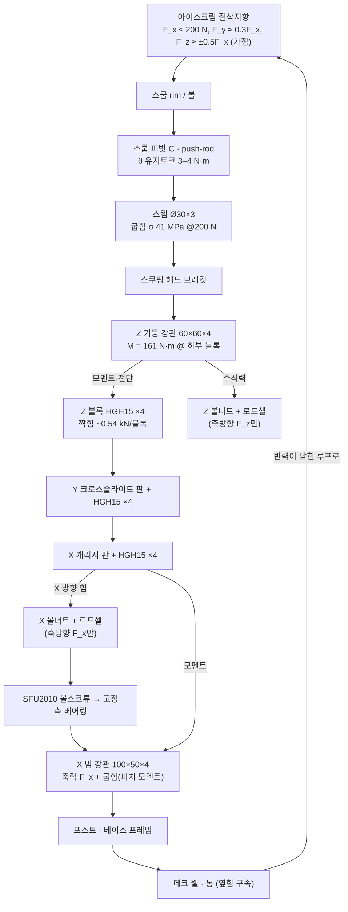

# Gantry Load Path — 절삭 반력은 어디로 흐르나

> "3D 프린터처럼 움직인다"는 위치결정 방식의 비유일 뿐이다. 이 기계는 3D 프린터가 겪지 않는 절삭 하중을 데크 아래 깊은 곳에서 받는다.
> 계산: `calc/scoop_load_path.py` → `calc/output/scoop_load_path.md`. 절삭력·일부 단면/강성값은 **ASSUMPTION**(research/components.md에 출처 표시).

## 1. 하중 경로 (Diagram 7)

**닫힌 구조 루프:** 스쿱 → 갠트리 → 프레임 → 데크 → 통 → 아이스크림 → 스쿱. 공작기계와 같다. 공구와 공작물 사이의 **상대 변위**가 깊이·궤적 정확도를 정한다. 그래서 통 웰(데크)과 갠트리 포스트는 **같은 베이스**에 묶는다.

## 2. 요소별 하중과 변위 (기계형 구성 S30, F_x = 200 N, 가장 깊은 스쿱, 레버 807 mm)

| 요소 | 주 하중 | 크기 | 드래그 방향 변위 기여 | 비고 |
|---|---|---|---|---|
| 스템 Ø30×3 | 굽힘(캔틸레버 322 mm) | σ = 41 MPa | **0.49 mm** | Ø25×3이면 0.90 mm·63 MPa(피로 목표 50 MPa 초과) |
| 스쿱 피벗·push-rod | θ 유지토크 → rod 축력 | 128–256 N(레버각 0–60°) | 무시 | 좌굴 여유 ≥ 7 |
| Z 기둥 강관 60×60×4 | 굽힘 + 전단 | M = 161 N·m, σ = 10 MPa | 0.32 mm | 4040 알루미늄이면 4.2 mm |
| Z 블록 HGH15 ×4 | 피치 모멘트 → 짝힘 | ~0.54 kN/블록 (C0 16.97 kN) | 0.06 mm(블록 강성 가정) | MGN12(간격 60)면 1.2 mm |
| Y 크로스슬라이드 블록 | 같은 모멘트, 드래그 힘이 레일 가로방향 | ~0.54 kN/블록 | ~0.06 mm | 블록 간격 ≥ 120 mm |
| X 블록 HGH15 ×4 | 피치 모멘트 | ~0.54 kN/블록 | 0.06 mm | – |
| X 볼스크류 | 축력 = F_x + 마찰 | ~220 N | 0.01 mm | GT2 벨트면 3.0 mm(작업장력 28 N로 강도부터 불가) |
| X 빔 강관 100×50×4 | 축력 F_x + 캐리지 위치의 피치 모멘트 | 빔 끝 짝힘 111 N | 0.05 mm | 드래그를 빔 축과 맞췄기 때문에 비틀림 없음 |
| 포스트·베이스 | 빔 끝 반력 | 200 N 수평 + 111 N 짝힘 | (계산 안 함) | 포스트 대각 브레이스 필수 |
| 데크 웰 | 통 옆힘 | 200 N | – | 종이 통이 웰에서 밀리지 않게 |
| **합계(스쿱 끝)** | | | **0.99 mm → 강성 ~200 N/mm** | 목표 달성(가정 기준) |

옆방향(F_y = 60 N): 빔 비틀림 + 가로 굽힘 0.20 mm(강관 빔). 3D 프린터식 구성은 9.4 mm.

## 3. 구성별 결과 요약

| 구성 | 드래그 방향 @ 200 N | 옆방향 @ 60 N | 판정 |
|---|---|---|---|
| L 3D 프린터식 (MGN12, 4040, 4080, GT2) | 10.9 mm | 9.4 mm | **탈락** |
| M 보강 프로파일 (HGR15, 4080 기둥, 8080 빔, HTD) | 2.2 mm | 1.4 mm | 탈락(목표 1 mm), 절삭력이 작게 측정되면 재검토 |
| S 기계형 + Ø25 스템 | 1.4 mm | 0.2 mm | 스템이 약점 |
| **S30 기계형 + Ø30 스템** | **0.99 mm** | **0.2 mm** | **채택** |
| S30 + 도킹(아키텍처 3) | 0.49 mm | 0.15 mm | 참고 — 갠트리를 루프에서 뺌 |

## 4. 설계 규칙

1. **드래그 방향 = 빔 축.** 빔 비틀림을 만들지 않는다.
2. **모멘트는 블록 짝힘으로 받는다.** 블록 간격 ≥ 120–150 mm, 블록 하나에 모멘트를 몰지 않는다(MGN12 M0 36 N·m < 161 N·m).
3. **로드셀은 볼너트에 축방향으로만** 둔다. 모멘트 경로에 로드셀을 두지 않는다.
4. 가장 깊은 스쿱에서 레버가 가장 길다 → **통 바닥 근처 운전이 최악 조건**이다. 필요하면 수위가 낮을 때 힘 목표를 낮춘다(깊이 적응).
5. 컵 스테이션을 매립하면 Z_SAFE가 80 mm 낮아지고, 레버가 807 → 727 mm로 줄어 변위가 ~25 % 줄어든다.
6. 조립 후 **스쿱 끝 강성을 추로 직접 측정**한다(목표 ≥ 200 N/mm). 블록·벨트 강성은 가정값이다.
