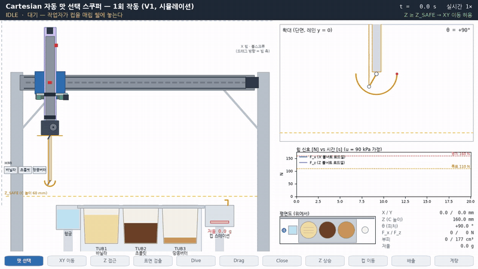
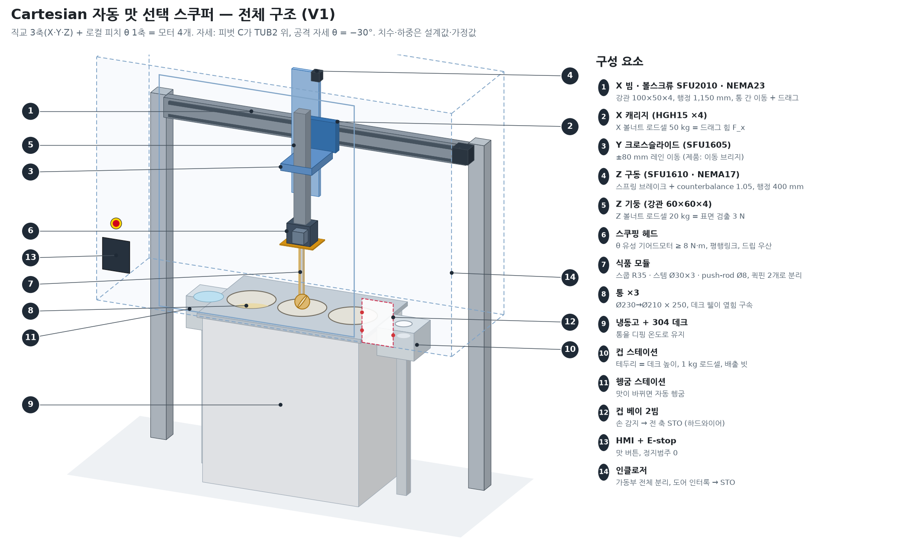
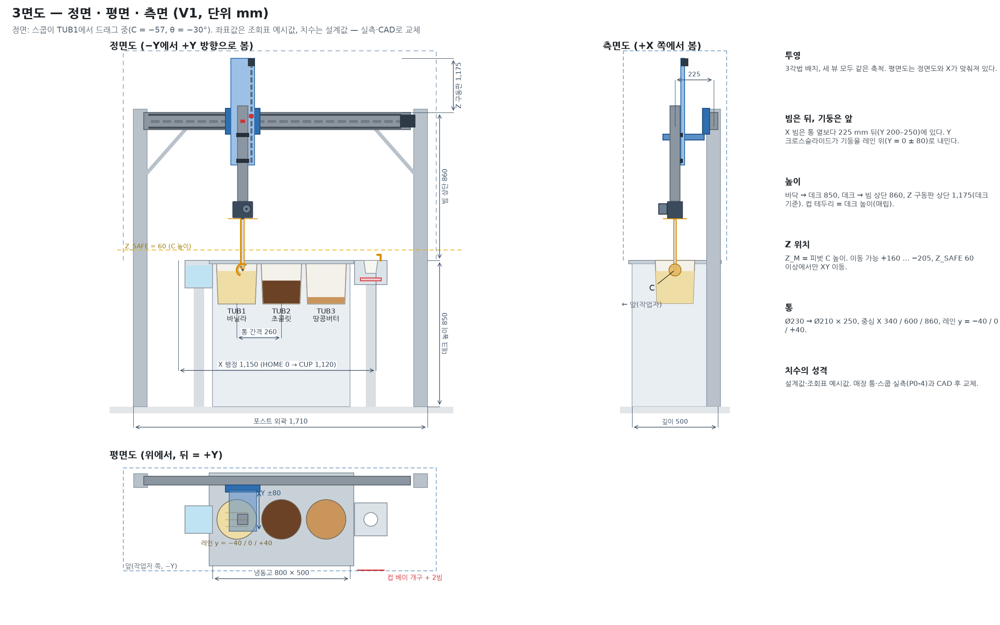
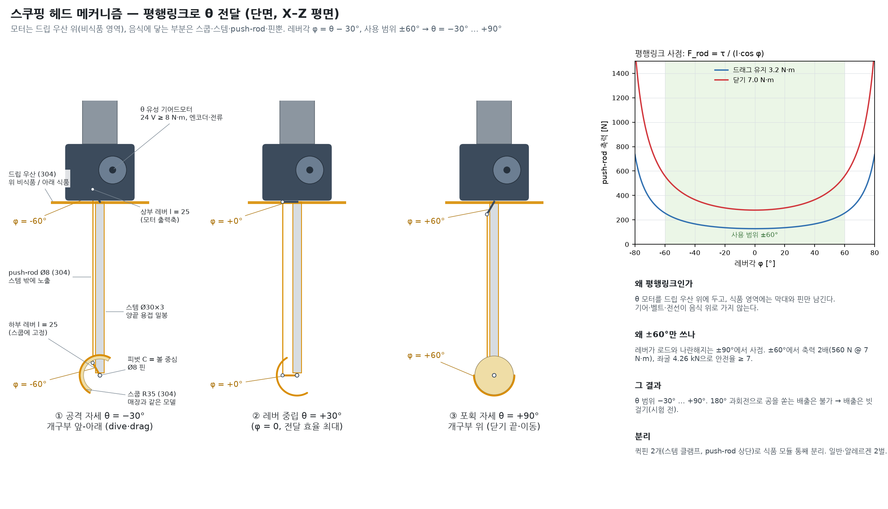
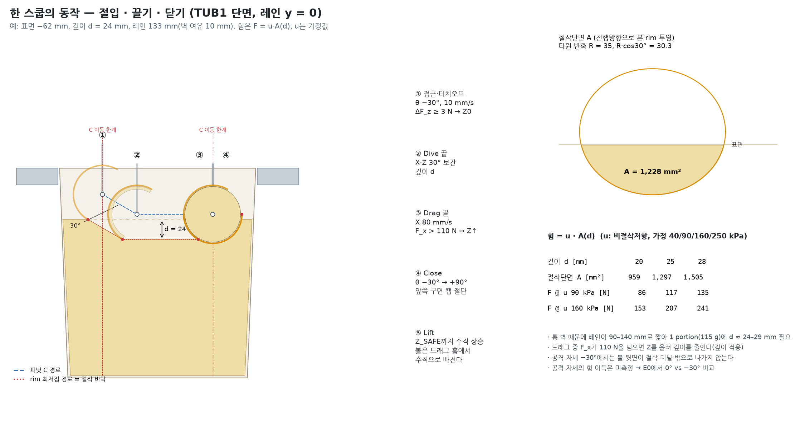
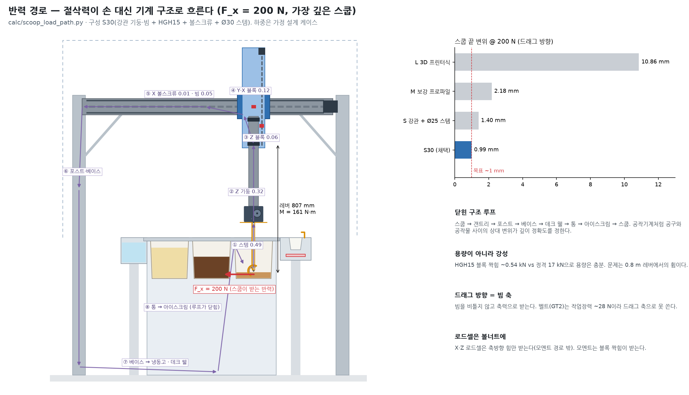

# 전체 구조도 · 메커니즘 설명 · 작동 동영상

> Cartesian 자동 맛 선택 스쿠퍼 V1을 그림과 영상으로 설명한다. 그림과 영상은 `media/`의 스크립트가 설계값(`calc/cartesian_model.py`, 각 설계 문서)으로 그린다. **치수는 설계값, 하중·재료값은 가정값이며, 영상은 실측이 아니라 시뮬레이션이다.**
> 결정의 근거와 위험은 [`final_system_concept.md`](final_system_concept.md), 한 문서 요약은 [`concept_brief.md`](concept_brief.md).

## 0. 작동 동영상 — 바닐라 싱글 1회 (20 s, 실시간 1×)



고화질 MP4(1280×720, 30 fps): [`media/operation.mp4`](../media/operation.mp4)

| 화면 영역 | 보여 주는 것 |
|---|---|
| 왼쪽 큰 그림 | 정면도. 갠트리·헤드가 움직이고 TUB1의 아이스크림 단면이 실제로 깎인다. 노란 점선은 Z_SAFE |
| 오른쪽 위 | 스쿱 확대 단면(레인 y = 0). 빨간 점 = rim 최저점(절삭 바닥) |
| 오른쪽 가운데 | X·Z 볼너트 로드셀 힘 신호. 주황 점선 = 드래그 힘 목표 110 N, 빨간 점선 = 정지 160 N |
| 오른쪽 아래 | 평면도(스쿠핑 뒤 절삭 이력 지도에 깎은 띠가 표시됨)와 X·Y·Z·θ·힘·부피·저울 값 |
| 맨 위 띠 | 현재 상태(상태기계 이름)와 Z_SAFE 규칙이 지금 XY 이동을 허용하는지 |
| 맨 아래 띠 | 11단계 진행 표시 |

**시뮬레이션 타임라인** (`media/make_operation_video.py`, 속도·가속도는 설계값)

| 상태 | 시작 [s] | 시간 [s] | 무엇을 하나 |
|---|---|---|---|
| IDLE → FLAVOR_SELECT → CHECK_CUP | 0.0 | 2.0 | 컵 놓기(저울 5 g), 바닐라 버튼, 조회표(TUB1, 레인 y = 0, 표면 추정 −62 mm), 베이 빔 확인 |
| XY_MOVE_TO_TUB | 2.0 | 1.37 | Z = 160(≥ Z_SAFE)에서 X 0 → 274 mm, 이동하면서 θ +90° → −30° |
| Z_APPROACH | 3.37 | 1.37 | 150 mm/s로 표면 추정 10 mm 위까지 |
| SURFACE_DETECT | 4.73 | 1.27 | 10 mm/s, ΔF_z ≥ 3 N → Z0 = −33.2 mm(실제 표면이 지도보다 1.5 mm 낮게 설정됨) |
| SCOOP_DIVE | 6.00 | 1.33 | 30° 경사로 깊이 26 mm까지 |
| SCOOP_DRAG | 7.33 | 1.10 | 80 mm/s. F_x가 110 N을 넘어 **깊이 적응으로 23.9 mm까지 얕아짐**, 레인 끝(406 mm)에서 정지 |
| SCOOP_CLOSE | 8.43 | 0.80 | θ −30° → +90°, 앞쪽 구면 캡 절단 |
| Z_LIFT | 9.23 | 0.93 | Z_SAFE(60)까지 수직 상승 → 절삭 이력 지도 갱신 |
| XY_MOVE_TO_CUP | 10.17 | 3.13 | X 406 → 1,120 mm |
| BAY_CHECK → Z_DISPENSE | 13.30 | 0.53 | 베이 빔 확인, C 50 mm까지 하강 |
| EJECT | 13.83 | 1.50 | θ −30°, 흔들기 ±5° 10 Hz, X −40 mm 후퇴, 공 낙하 (**개략 표시**) |
| Z_RETRACT → PORTION_CHECK | 15.33 | 1.33 | Z_SAFE 복귀, 저울 안정 1 s → 판정 |
| **기계 사이클** | | **14.7** | `calc/output/cycle_time_estimate.md`의 기준 14.5 s와 일치 |

**영상에서 드러난 것(가정값 기준):**
1. **한 스쿱이 목표보다 조금 적다.** u = 90 kPa에서 힘 목표 110 N을 지키면 깊이가 23.9 mm로 제한되어, 레인 132 mm를 다 써도 168 cm³ ≈ **109 g(−5.2 %)** 이다. 허용범위(−5 %/+10 %, 가정) 경계 밖이라 상태기계는 "부족 → 경고·로그"로 끝낸다(V1은 자동 보충 없음). `tub_lane_planner.md`가 "90 kPa에서 d 24.3 mm, 112 N"이라고 한 것과 같은 결론이다. **E0에서 u를 잰 뒤 F_TARGET, 레인 길이, 스쿱 크기 중 무엇을 바꿀지 정해야 한다.**
2. **Dive 끝에서 힘이 가장 크다(123 N).** 상태기계는 드래그 중에만 깊이를 적응시키므로, dive는 계획 깊이(26 mm)까지 그대로 들어간다. 정지 한계 160 N 아래지만, **dive 목표 깊이를 "힘 목표에 해당하는 깊이"로 제한**하는 편이 낫다. 맛별로 드래그에서 측정한 u = F_x / A(d)를 저장하면 다음 스쿱의 dive 깊이를 미리 정할 수 있다(추가 센서 불필요).
3. 시간의 대부분은 이동이다. XY 이동 4.5 s, Z 이동·검출 약 3.6 s, 실제 스쿠핑(dive·drag·close) 3.2 s.

---

## 1. 전체 구조



기계는 네 층으로 나뉜다.

| 층 | 구성 | 역할 |
|---|---|---|
| 전역 위치결정(3축) | ① X 빔·볼스크류, ② X 캐리지, ③ Y 크로스슬라이드, ④·⑤ Z 구동·기둥 | 맛 → 통 좌표 이동, 표면 접근, 컵 이동. **X는 드래그, Z는 깊이도 맡는다** |
| 로컬 스쿠핑(1축) | ⑥ 스쿠핑 헤드(θ 모터, 평행링크), ⑦ 식품 모듈 | 공격 자세 유지, 공 닫기, 배출 자세 |
| 스테이션 | ⑧ 통 ×3, ⑨ 냉동고·데크, ⑩ 컵 스테이션(매립 웰·저울·빗), ⑪ 헹굼 | 고정 좌표. 카메라 없이 좌표표로 찾는다 |
| 안전·조작 | ⑫ 컵 베이 2빔, ⑬ HMI·E-stop, ⑭ 인클로저·인터록 도어 | 사람은 컵 베이로만 접근. 모든 축 최대 힘이 손 한계 140 N을 넘으므로 **분리**가 1차 방호 |



- **빔은 뒤, 기둥은 앞.** X 빔은 통 열보다 225 mm 뒤(Y 200–250)에 있고, Y 크로스슬라이드가 기둥을 레인 위로 내민다. 그래서 빔과 레일은 열린 통 바로 위에 있지 않다(위생, `sanitation_architecture.md`).
- 주요 치수: 포스트 외곽 1,710, 데크 높이 850(바닥 기준), 빔 상단 860(데크 기준), X 행정 1,150, 통 간격 260, Z 이동 +160 … −205(C 높이).

## 2. 축과 역할

| 축 | 구동 | 행정 | 사이클에서 하는 일 | 센서 |
|---|---|---|---|---|
| X_M | SFU2010 볼스크류 + NEMA23 폐루프 | 1,150 mm | 통 간 이동 250 mm/s, **드래그 80 mm/s**, 배출 때 빗 걸기 후퇴 | X 볼너트 로드셀(F_x) |
| Y_M | SFU1605 + NEMA17 폐루프 | ±80 mm | 레인 선택(y = −40 / 0 / +40) | – |
| Z_M | SFU1610 + NEMA17 폐루프 + 브레이크 + counterbalance 1.05 | 400 mm | 접근 150 mm/s, **터치오프 10 mm/s**, dive·깊이 적응, 들어올림 | Z 볼너트 로드셀(표면 3 N, F_z) |
| θ_s | 24 V 유성 기어드모터 + 평행링크 | −30° … +90° | 공격 자세, 닫기 0.8 s, 배출 자세·흔들기 | 엔코더, 모터 전류 |

Z_M은 항상 **스쿱 피벗 C의 높이**다. 스쿱의 모든 점은 C에서 R = 35 mm 안에 있으므로, `Z ≥ Z_SAFE(60)`이면 스쿱 최저점이 데크·컵보다 25 mm 위에 있다. 그래서 **XY 이동은 Z ≥ Z_SAFE에서만** 허용하고, 예외는 "현재 통 안 드래그"와 "컵 베이 안 배출 이동" 두 가지뿐이다.

## 3. 스쿠핑 헤드 메커니즘



- **평행링크로 θ를 전달한다.** θ 모터는 드립 우산 위(비식품 영역)에 있고, 상부 레버 → push-rod → 하부 레버(스쿱에 고정)로 스쿱을 피벗 C(볼 중심)에 대해 돌린다. 식품 영역에는 막대와 핀만 남고 기어·벨트·전선이 음식 위로 가지 않는다.
- **레버각 φ = θ − 30°.** φ = 0(θ = +30°)에서 전달 효율이 가장 좋고, 레버가 로드와 나란해지는 φ = ±90°가 사점이다. push-rod 축력은 F = τ / (l·cos φ)로 커지므로 **±60°만 쓴다**(닫기 7 N·m에서 560 N, 좌굴 4.26 kN 대비 안전율 ≥ 7).
- 그 결과 θ는 −30° … +90°다. 스쿱을 180° 돌려 공을 쏟는 배출은 이 링크로는 불가능하고, 배출은 컵 위에서 기울이고 흔들며 빗에 거는 방식을 먼저 시험한다(`scooping_head_mechanism.md` §8, 미해결).
- 식품 모듈(스쿱 R35 + 스템 Ø30×3 + push-rod Ø8 + 핀)은 퀵핀 2개로 공구 없이 통째로 빠진다. 스템 양끝은 용접 밀봉하고 push-rod는 밖에 노출해 숨은 공동을 없앴다.

## 4. 한 스쿱의 동작



| 단계 | 동작 | 물리 |
|---|---|---|
| ① 접근·터치오프 | θ −30°로 표면 10 mm 위까지 온 뒤 10 mm/s로 내려가 Z 로드셀 ΔF ≥ 3 N에서 정지 | 3 N에서 날이 눌리는 깊이는 0.03–0.31 mm(가정 압입압력) → 깊이 기준 오차 ≤ 0.3 mm |
| ② Dive | X·Z를 30° 경사로 동시 보간해 깊이 d까지 | 공격 자세 −30°에서 rim 최저점은 C보다 R·cos30° = 30.3 mm 아래, 17.5 mm 뒤에 있다 |
| ③ Drag | X 80 mm/s. 부피 적분이 목표에 닿거나 레인 끝이면 정지 | 절삭력 F = u·A(d). A는 반축 35 / 30.3 타원 중 표면 아래 면적. F_x > 110 N이면 Z를 올려 d를 줄인다 |
| ④ Close | X 정지, θ −30° → +90° | rim이 C를 중심으로 돌며 앞쪽 구면 캡을 끊어 공을 완성 |
| ⑤ Lift | Z_SAFE까지 수직 상승 | 볼 바닥이 드래그로 판 홈 안에 있어 수직으로 빠진다 |

통 벽 여유(10 mm) 때문에 레인이 90–140 mm로 짧아, 1 portion(115 g)에 깊이 24–29 mm가 필요하다. 그래서 힘이 레거시 가정보다 커지고, §0에서 본 것처럼 힘 목표와 portion이 맞부딪친다.

## 5. 반력 경로



- 손으로 뜰 때 grip·손목이 받던 반력을 **기계 구조**가 받는다. 경로는 스쿱 → 스템 → Z 기둥 → Z 블록 → Y·X 블록 → X 볼스크류·빔 → 포스트·베이스 → 냉동고·데크 웰 → 통 → 아이스크림이다. 루프가 닫혀 있다.
- 가장 깊은 스쿱에서 드래그 힘 작용점과 Z 하부 블록 사이 레버가 807 mm라, 200 N이면 161 N·m가 걸린다. 블록 용량은 충분하지만(짝힘 ~0.54 kN vs 정격 17 kN) **휨**이 문제다.
- 스쿱 끝 변위 @ 200 N: 3D 프린터식 10.9 mm, 보강 프로파일 2.2 mm, 강관 + Ø25 스템 1.4 mm, **강관 + Ø30 스템(채택) 0.99 mm**. 가장 큰 기여는 스템(0.49)과 Z 기둥(0.32)이다.
- 설계 규칙: 드래그 방향 = 빔 축(비틀림 없음), 로드셀은 볼너트에 축방향으로만(모멘트 경로 밖), 조립 후 스쿱 끝 강성을 추로 직접 잰다.

## 6. 그림·영상 다시 만들기

```bash
pip install numpy matplotlib koreanize-matplotlib imageio-ffmpeg
python3 media/make_figures.py          # fig1–fig5 (PNG)
python3 media/make_operation_video.py  # operation.mp4 + operation.gif (약 2–3분)
```

실측값이 나오면 `calc/cartesian_model.py`(치수·질량·하중)와 `media/make_operation_video.py` 상단(u, F_TARGET, 표면 높이)을 바꾸고 다시 실행한다.

## 7. 가정과 한계

- **치수**는 V1 설계값과 조회표 예시값이다. 매장 통·스쿱 실측(P0-4)과 CAD로 바꾼다.
- **절삭력**은 u = 90 kPa(가정 "중간") 한 경우만 영상에 넣었다. 실제 u는 E0에서 처음 잰다.
- **절삭 형상**은 레인 중심 단면(2D)만 계산했다. 스쿱의 3D 절삭과 chip의 말림·압축은 표현하지 않았다.
- **배출**은 개략 표시다. 빗 걸기가 실제로 공을 떼어 내는지는 V1a 시험(50회 성공률)으로 정한다.
- 영상의 저울 값은 **모델 예측값**(부피 × 가정 밀도 0.65 g/cm³)이다. 실제 저울 값과 예측의 차이가 맛별 보정계수 k_f가 학습할 대상이다.
