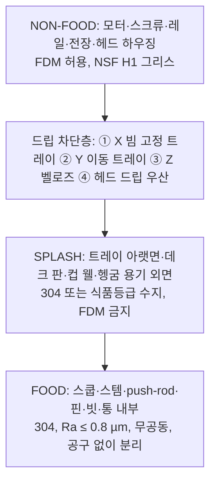

# Sanitation Architecture

> 영역 정의는 NSF/ANSI 2 `[SNIPPET]` 를 따른다. **Food zone** = 식품 직접접촉 면 + 식품·응축수가 닿았다가 식품으로 떨어지거나 튈 수 있는 면. Splash zone과 Non-food zone은 따로 구분한다(`research/standards.md`).
> Cartesian 구조의 위생 문제는 한 문장으로 줄일 수 있다. **"열린 통 위를 가동 기계가 지나간다."**

## 1. 문제: 갠트리가 열린 통 위에 있다

- X 빔은 TUB1–3 위를 가로지른다. 헤드가 TUB3을 뜨는 동안에도 빔 아래에는 TUB1·TUB2가 열려 있다.
- 볼스크류·레일의 그리스, 마모 가루, 먼지, 결로는 모두 아래로 떨어진다.
- NSF 정의대로면 **열린 통 위에서 무언가 떨어질 수 있는 면은 food zone**이다. 그대로 두면 갠트리 전체가 food zone이 되어 304 SS·Ra 0.8 µm·무공동을 요구받는다. 이는 비현실적이다.

**설계 원칙:** 갠트리를 food zone으로 만들지 않는다. 대신 **갠트리와 통 사이에 연속된 드립 차단층**을 두어, 차단층 위를 non-food zone으로 만든다.

## 2. 영역 분리 (Diagram 9 — 측면)

```
 높이
  ▲
  │  ┌────────────────── NON-FOOD ZONE ─────────────────────────────────────────┐
  │  │ 모터, 볼스크류(벨로즈), 레일, 케이블 체인, 전장, 헤드 하우징(FDM 허용)          │
  │  │ 윤활: NSF H1 그리스(우발 접촉 허용 등급)                                     │
  │  └──────────────────────────────────────────────────────────────────────────┘
  │  ════════ ① X 빔 고정 드립 트레이(304, 빔 전장, 분리형) ════════════════════════   ← 드립 차단층
  │  ════ ② Y 크로스슬라이드 이동 트레이 ════   ══ ③ Z 기둥 벨로즈(하단 밀봉) ══
  │  ─ ─ ─ ─ ─ ─ ─ ─ ─ ─ ─ ─ ─ ─ ─ ─ ─ ─ ─ ─ ─ ─ ─ ─ ─ ─ ─ ─ ─ ─ ─ ─ ─ ─ ─ ─ ─
  │  ┌──────────────── SPLASH ZONE ───────────────────┐
  │  │ ④ 헤드 드립 우산(304 판, 스템 위)                 │  ← 헤드 하우징과 식품 모듈의 경계
  │  │ 드립 트레이 아랫면, 데크 판(304), 컵 웰, 헹굼 용기 외면 │
  │  └────────────────────────────────────────────────┘
  │  ┌──────────────── FOOD ZONE ─────────────────────┐
  │  │ 스쿱, 스템(Ø30×3 양끝 밀봉), push-rod(노출), 핀     │  ← 공구 없이 통째 분리(볼락 퀵핀 2개)
  │  │ 통 내부, 빗(comb), 헹굼물                          │
  │  └────────────────────────────────────────────────┘
  │   ▓▓▓▓ 통 (데크 웰 안) ▓▓▓▓
```



**차단층 조건:** 위에서 수직으로 떨어지는 물체가 어느 XY 위치에서도 통 개구부에 닿지 않아야 한다. 트레이 폭 ≥ 빔 폭 + 20 mm, 가장자리 5 mm 턱(물방울 흘러넘침 방지). 헤드 이동 중에는 ②·④가 같이 움직인다.

## 3. 영역별 재료·규칙

| 영역 | 부품 | 재료 | 규칙 |
|---|---|---|---|
| Food | 스쿱 | 304(매장 모델) | 손잡이 제거, 피벗 보스 TIG 후 연마 |
| Food | 스템 | 304 Ø30×3, 양끝 용접 밀봉 | 숨은 공동 없음 |
| Food | push-rod, 핀 | 304 Ø8 | 스템 **밖**에 노출(Legacy FMEA #12), 나사 없음 |
| Food | 빗(comb) | 304 | 컵 스테이션에서 분리 가능 |
| Food | 헹굼 용기 | 304 | 흐르는 물 또는 ≥ 57 °C(제품 단계) |
| Splash | 드립 트레이, 우산, 데크 판, 컵 웰 | 304 | 분리형, 내부 모서리 R ≥ 3.2 mm `[SNIPPET]` |
| Splash | 벨로즈 | 식품등급 PU/실리콘 | 외면 세척 가능 |
| Non-food | 헤드 하우징, 브래킷 | FDM 허용 | 반드시 드립 우산 위 |
| Non-food | 알루미늄 프로파일 | 아노다이징 Al | 식품·splash zone 사용 금지(알칼리 세제 손상) `[SNIPPET]` |
| 전 영역 | 윤활 | **NSF H1** 그리스 | 우발 접촉을 가정 |

## 4. 교차오염과 알레르겐

| 경로 | 대책 |
|---|---|
| 맛 A → 맛 B (스쿱 잔여물) | 맛이 바뀌면 RINSE 상태(헹굼 담금 + 흔들기, ~4 s) |
| 알레르겐 맛 | **전용 식품 모듈** 요구(`allergen: true` → 모듈 ID 불일치 시 거부, `coordinate_map_example.md` §2) + 헹굼 |
| 통 위 낙하물 | 드립 차단층 |
| 헹굼물 오염 | 흐르는 물(V1은 주기 교체), 수온 기록 |
| 작업자 손 | 컵 베이만 접근. 통 교체는 도어 열고 E-stop 상태에서 |

## 5. 세척 SOP (V1 초안)

| 주기 | 작업 | 시간 목표 |
|---|---|---|
| 맛 변경 | 자동 헹굼(RINSE) | ~4 s |
| 4시간마다, 알레르겐 전환 시 | E-stop → 도어 열기 → 퀵핀 2개 → 식품 모듈 분리 → 세척·헹굼·소독 → 예비 모듈 장착 | 분리 ≤ 30 s(E7에서 측정) |
| 매일 | 드립 트레이 ①② 분리 세척, 우산·벨로즈 외면, 데크 판, 컵 웰, 빗, 헹굼 용기 | – |
| 매주 | 레일·스크류 H1 그리스 점검(벨로즈 안), 트레이 아래 잔여물 확인 | – |

4시간 주기는 사용 중 기구 세척에 관한 Food Code 관행을 따른 가정이며, 국내 적용 기준은 확인이 필요하다 `[UNCERTAIN]`.

## 6. Cartesian이 위생에서 불리한 점과 유리한 점

| 불리 | 유리 |
|---|---|
| 열린 통 위를 가동부가 지나감 → 차단층이 필수이고 차단층도 세척 대상 | 사람 손이 스쿱·통에 닿지 않음(베이 제외) |
| 가동부·표면적이 로봇 팔보다 넓게 퍼져 있음 | 식품 모듈이 작고 공구 없이 분리됨 |
| 통 교체 때 도어를 열어야 함 | 헹굼·알레르겐 규칙을 상태기계가 강제함 |

로봇 팔과의 위생 비교는 `architecture_comparison.md` §3.
