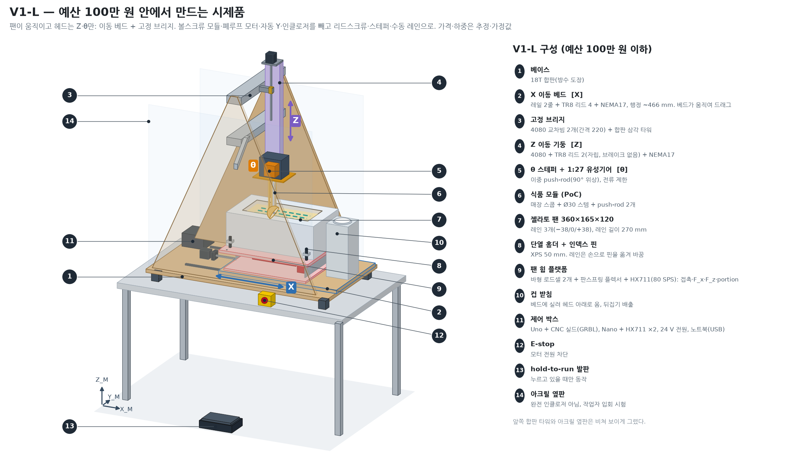

# V1-L — 예산 100만 원 안에서 만드는 시제품

> 조건: "예산을 아무리 크게 잡아도 100만 원"(요구사항 R8, `_chief/PROJECT.md`). 학생 제작형 V1-S(`capstone_challenges_and_alternatives.md`, 추정 ~291만 원)를 이 예산에 맞게 다시 설계했다.
> 근거 문서(담당별 원본): 기계 `_chief/work/mech/v1l_mech.md`, 전자·가격 `_chief/work/elec/v1l_elec.md`, 제어 `_chief/work/ctrl/v1l_control.md`, 시험 `_chief/work/test/v1l_test_plan.md`, 심사 `_chief/work/redteam_v1l.md`. BOM: `BOM/v1l_under_1m.csv`. 그림: `media/fig9_v1l_budget_rig.png`.
> **하중·강성·마찰·열 물성·가격은 모두 가정 또는 추정이다.** 가격의 58 %는 추정이고, 나머지 42 %도 검색 결과 요약("snippet")에서 본 값이라 구매 전에 상품 페이지에서 다시 확인해야 한다. 실측값은 아직 하나도 없다(E0 전).



## 0. 결론

1. **캡스톤 목표는 줄이지 않는다.** 줄이는 것은 자동화 범위와 부품 등급이다. "표면 검출 → dive → drag → close → 뒤집기 배출"을 자동으로 하고, 힘(F_x, F_z)·portion 질량·온도를 기록한다는 핵심은 그대로다(§1).
2. **구조: 이동 베드 + 합판 고정 브리지.** 팬·단열 홀더·힘 플랫폼·컵을 X 베드에 싣고 베드가 움직여 드래그한다. 헤드는 고정 브리지에 Z와 θ만 있다. 브리지·베이스·베드는 18T 합판 1장으로 만들고, 금속 프로파일은 Z 이동 기둥(4080 × 0.55 m)만 남긴다. Y 레인은 손으로 핀을 옮긴다.
3. **예산: 권장 조합 총액 98.3만 원**(구매+배송 88.3만 + 예비비 10만). 단 전제가 있다.
   - 학교 자원: 3D 프린터 필라멘트 지급, 공작실에서 합판 재단, 공작실에서 알루미늄 판 가공.
   - 4080 판매처 견적, 주문 묶음(판매처 수 줄이기).
   - 전제 없이 사면 기준 총액 **108.9만 원**으로 넘는다(§7).
   - 여유 1.7만 원은 추정 오차 안에 있다. **화물·절단 견적이 나오면 다시 판정한다.**
4. **계산상 성능(가정)**: 스쿱 끝 X 변위 0.52 / 0.92 mm @ 56 / 100 N(체결부 중간 가정). 체결부가 무르면 1.51 mm @ 100 N이라, 조립 후 교정 시험을 통과해야 쓴다(§5).
5. **심사**: Red Team 1차 REVISE(소모품 부족, 여유 부족·누락 품목, 끼임점, 선로 단락 등 17건) → 기계·제어·시험·전자 재작업 → 2차 심사 결과는 `_chief/RISKS.md`에 남긴다.

## 1. 캡스톤 수준을 줄여야 하나 — 남기는 것과 빼는 것

| 구분 | V1-L에서 | 대가 |
|---|---|---|
| **남김(핵심 결과)** | 표면 검출(G38.2 터치오프) → dive(−30°) → drag → close → 컵 위로 이동 → 뒤집기 배출, 힘 F_x·F_z와 portion(팬 질량 차), 온도 로그 | – |
| **남김(안전)** | E-stop(모터 전원 차단), hold-to-run 발판, Z < Z_SAFE 수평 이동 금지(R7) 3중, 워치독, 선로 단락 검출 | – |
| 자동 Y → **수동 레인 인덱스** | E-stop → 핀 이동 → 레인 스위치 3개 확인 → 재원점 | 층마다 사람이 2회 옮긴다 |
| 볼스크류 모듈·폐루프 모터 → **TR8 리드스크류 + 개루프 스테퍼** | 매 사이클 원점 확인, 힘 플랫폼으로 이상 감지 | 탈조를 직접 감지하지 못한다 |
| Z 브레이크·가스스프링 → **TR8 리드 2(자립)** | 정전 유지 시험이 조건 | Z 속도 ~40 mm/s |
| 인클로저·가드 3면 → **합판 측판 + 아크릴 정면 창 + hold-to-run** | 작업자 입회 시험만 | 무인 연속 운전 없음 |
| 라즈베리파이 → **학생 노트북** | Python 상태기계 | – |
| 식품 모듈 2벌·예비 스쿱 → **1벌** | 시식 없음·폐기 전제 | 알레르겐 전용 모듈 없음 |
| E0 90 스트로크 → **20 스트로크** | 1제품 × 자세 2 × 온도 2 × 4회 + 깊이 점검 4회 | 자세·온도 효과는 약 26 % 이상만 검출, 제품 간 차이는 못 본다 |
| V1b(두 번째 팬·연속 자동 운전) | 없음 | 이후 단계 |

시간이나 돈이 모자라면 `_chief/work/test/v1l_test_plan.md` §6 순서로 더 뺀다. 마지막 단계는 "자동 뒤집기 배출 → 수동 받기"다. 끝까지 남기는 것은 안전, 힘 교정, E0 기준 조건, 강성 교정, 그리고 새 제품 한 번 채움에서의 **표면 검출 → dive → drag → close → 힘·질량 로그**다.

## 2. V1-S → V1-L 무엇이 바뀌었나

| 항목 | V1-S (~291만 원) | V1-L | 이유 |
|---|---|---|---|
| 구동 배치 | 이동 갠트리(X 캐리지가 Z·θ를 싣고 움직임) | **이동 베드**(팬이 X로 움직임), 고정 브리지에 Z·θ | 옆힘이 브리지 면 안으로 가고, X 나사가 짧고(600 mm), X 캐리지 기울기(레버² 항)가 없어진다 |
| 프레임 | 알루미늄 프로파일 4040·4080 ~8 m | **18T 내수 합판 1장**(측판·수평 교차판·뒷벽·베이스·베드) + 4080 Z 기둥 0.55 m | 프레임 22.7만 → 11.9만 원. 교차판을 눕혀 폭 270 mm를 굽힘 깊이로 쓴다 |
| X | 볼스크류 모듈 + NEMA23 폐루프 | TR8 리드 4 + NEMA17 + SBR16 | 드래그 30 mm/s에서 토크 여유 2.11(1.8 A) |
| Z | 볼스크류 모듈 + 브레이크 + 가스스프링 | TR8 리드 2(자립) + MGN12 500 | μ ≥ 0.088이면 자립 |
| θ | NEMA17 + 1:27 유성 | 같음(전류 제한), E0 뒤에 주문 | 닫기 토크 2.0–3.5 N·m vs 기어 3 N·m 연속 / 5 N·m 순간 → θ-Gate |
| Y | 팬 쪽 T8 슬라이드 | **수동 인덱스 핀 + 레인 스위치 3개** | 모터·드라이버·슬라이드 제거 |
| 힘 센서 | 단일점 20 kg + S-빔 | 단일점 20 kg(수직) + 50 kg(X) + 판스프링 플렉서, **셀 병렬 배치 + 데크 접지 스톱 케이지** | 셀이 받는 힘을 X ≤ 245 N, 수직 ≤ 196 N으로 묶는다 |
| 모션·호스트 | Klipper/grblHAL + 라즈베리파이 | **GRBL 1.1h(Uno + CNC Shield)** + 노트북 + Nano(HX711 ×2, 80 SPS) | feed hold·도어·G38.2가 기본 기능, 노트북 OS 무관 |
| 가드 | 폴리카보네이트 3면 + 인터록 | 합판 측판(옆 가드 겸용) + 아크릴 정면 창, 창·뒷벽 하단을 테두리 + 130 mm | 끼임 간격 ≥ 120 mm |
| 측정 장비 | 푸시풀 게이지 구매 | 사지 않음. 힘 플랫폼 + 물병 7개(133 N) + 행잉 저울 | 예산 |
| 냉각 | 단열 홀더 + 온도조절기 | 단열 홀더. 조절기는 빌린 냉동고가 −14 °C를 못 맞출 때만(예비비) | 예산 |

## 3. 구조

```
정면(YZ) — 드래그(X)는 지면 안쪽. 높이는 팬 테두리 기준 mm (테두리 = 베이스 상면 + 337)

          Z 모터(기둥 위)
               ┃ 4080 Z 기둥 550, MGN12 레일 500
 z_u 640 ┏━━━━━╋━━━━━━━━━━┓  상부 교차판 18T 462×270(수평) + 앞 립 + Al 10T ㄷ자 클램프(Z 블록) + Z 너트 브래킷
         ┃  뒷벽 18T      ┃  462×510 (테두리 + 130 ~ + 640): 옆힘 격막
 z_l 420 ┣━━━━━╋━━━━━━━━━━┫  하부 교차판 18T + 앞 립 + ㄷ자 클램프(Z 블록)
 측판    ┃   [θ 헤드]     ┃  측판 18T 500×977 ×2 = 타워 + 옆 가드
 18T     ┃     ┃‖ 스템    ┃  NEMA17 + 1:27, 이중 push-rod(90° 위상), 스템 Ø30×3
 +130 ── ┃ ─ ─ ◖ ─ ─ ─ ─  ┃  ← 뒷벽·정면 창 하단 (홀더 상면과 ≥ 120 mm)
         ┃ ┌─[팬+홀더]──┐ ┃  젤라토 팬 360×165×120, XPS 50 홀더, 레인 −38 / 0 / +38(인덱스 핀)
         ┃ │ 힘 플랫폼  │ ┃  수직 20 kg + X 50 kg 셀(병렬), 판스프링, 스톱 케이지
         ┃═╧═ 베드 18T ═╧═┃  데크 650×394, SBR16UU ×4, TR8 리드 4 × 600, 행정 ~466
 ━━━━━━━━┻━━ 베이스 18T 1000×560 + 리브 ×3 ━━┻━━━━━━━━
```

- 제작: 18T 합판은 판매처 또는 공작실에서 직선 16컷으로 재단한다(대각 절단 없음). 구멍은 레이저컷 템플릿으로 뚫고, 나무–나무는 본드 + 나사, 금속–나무는 에폭시 베딩 + 관통볼트로 붙인다. 용접·정밀가공은 없다(R9).
- 결로 대책: −14 °C 팬 테두리·스쿱·스템에서 물이 떨어지므로 합판 전체를 수성 우레탄으로 2회 칠하고(절단면 먼저), 홀더·컵 주변에 물받이를 둔다.
- 조립 순서, 절단표, 체결 상세도는 기계 문서 §9·§10.6에 있다.

## 4. 결정값 (기계·전자·제어 공통)

| 항목 | 값 |
|---|---|
| 드래그 힘 | 공칭 56 N(u 90 kPa) / 설계 100 N(u 160 kPa) — u는 가정 |
| 힘 한계 | 깊이 적응 목표 82.5 N, 호스트 정지 105 N, Nano 정지 120 N |
| 걸림 하중(강도 검토) | 283–579 N(X 스테퍼 정지 토크·마찰 범위) |
| 속도·가속 | 드래그 30 mm/s(마찰이 크면 25), 이송 60 mm/s, X 500 / Z 300 mm/s² |
| X 모터 전류 | 1.8 A(DRV8825 + 방열판·팬) |
| HX711 | 80 SPS |
| Z_SAFE / 이송 허용 Z / Z-높이 스위치 | 60 / ≥ 62 / ≥ 60.5 mm |
| 수동 레인 인덱스 | Z 70 mm → E-stop(K1 차단) → 핀 이동 → 레인 스위치 3개 중 요청 레인 1개 → 재원점 → 선로 자가시험 |

## 5. 계산 요약 (모두 가정 기반)

| 항목 | 결과 | 출처 |
|---|---|---|
| 스쿱 끝 X 변위(C = −75) | 중간 가정 **0.52 / 0.92 mm** @ 56 / 100 N, 체결부 무름 0.85 / 1.51 mm | 기계 출력 §10 |
| 판정 | 조립 후 교정(0 → 120 → 0 N, 3회)에서 R² ≥ 0.99, 히스테리시스 ≤ 0.10 mm, 영점 복귀 ≤ 0.05 mm를 통과하면 허용. 못 하면 체결부 보강 | 기계 §4.2 |
| portion에 영향을 주는 수직 변위 | 약 0.08 mm @ F_z 50 N(셀 처짐이 대부분) → 힘 플랫폼 F_z로 보상 가능 | 기계 §3 |
| X 추력 여유 | 30 mm/s에서 2.11(μ 0.15, 1.8 A). μ 0.20이면 25 mm/s로 내려 2.03 | 기계 출력 §3 |
| 걸림 하중 강도 | 579 N에서 스템 안전율 2.5, Z 블록 3.0 | 기계 출력 §6 |
| 과부하 정지 후 최대 힘 | 경도 변화 시 호스트 경로 129 N, Nano 경로 136 N(30 mm/s, 경로 강성 112 N/mm) | 제어 출력 §4 |
| 강체 충돌 | 힘 정지가 탈조보다 먼저 걸리려면 ≤ 14.1 mm/s → 드래그 속도에서는 keep-out·전류 제한·기계식 스톱이 막는다 | 제어 §4 |
| 베드 관성 | 7.2 kg × 0.5 m/s² = 3.6 N → u 추정·부피 적분은 등속 구간만(오차 0.12 N) | 제어 §7 |
| 터치오프 | 지연 편향 0.16 mm(보정), 흩어짐 σ 0.02 mm @ 5 mm/s | 제어 §5 |
| 셀 진동(76 Hz) 에일리어싱 | 80 SPS에서 20 mm 구간 평균 오차 ≤ 0.007 N | 제어 §7 |

## 6. 제어와 안전

- **구성**: 노트북(Python 상태기계, 로그) ↔ USB ↔ Uno(GRBL 1.1h: X, θ = Y 채널, Z). Nano가 HX711 ×2(80 SPS)·열전대를 읽고, NPN을 거쳐 GRBL의 **도어(허가선)**와 **프로브** 입력을 직접 구동한다.
- **끊기면 멈추는 배선**: 도어·프로브 입력은 반전 극성이라 선이 끊기거나 Nano가 꺼지면 멈춘다. hold-to-run 발판(NO)은 허가선에 직렬이다. E-stop은 릴레이 K1으로 **모터 24 V를 끊는다**(Z는 자립).
- **선로 단락 검출(3겹)**: Nano가 A6·A7로 허가선·프로브선 전압을 되읽는다(직렬 100 kΩ + 10 nF; 10 kΩ이면 Nano 전원이 꺼졌을 때 허가로 읽힐 수 있어 전자 담당이 바꿈). 호스트는 GRBL 상태의 `Pn:D`/`Pn:P`를 Nano 플래그와 대조하고, 매 사이클 시작 전에 선로 자가시험을 한다. mock에서 드래그 중 단락 뒤 발판을 떼자 2.8 mm(되읽기) / 7.0 mm(호스트 대조) 안에 멈췄다.
- **R7(Z < Z_SAFE이면 수평 이동 금지)**: ① 호스트 `request_xy_move()`가 계획 Z와 측정 Z를 모두 검사, ② Nano가 Z-높이·X-창 스위치로 허가선을 끊음(펌웨어와 독립), ③ GRBL 소프트 리밋·Z 먼저 원점·이송 60 mm/s 상한.
- **워치독**: 하트비트 100 ms, Nano 300 ms. 노트북이 멈춰도 드래그는 ≤ 11.4 mm 안에 선다.
- **위험성평가**: 16항목(기계 문서 §8). 가장 큰 잔여 위험은 Z 하강 중 손이다(hold-to-run·작업자 입회로 관리).
- 호스트 골격 코드는 하드웨어 없이 돈다: `python3 _chief/work/ctrl/host_skeleton.py --mock`(정상·과부하·노트북 정지·R7 게이트·선로 단락 시나리오).

## 7. 예산

### 7.1 카테고리 합계 (기준안: 절감 C1–C11 적용, 경로 절감 전)

| 카테고리 | 원 |
|---|---|
| 프레임(18T 합판·재단, 4080 Z 기둥, 목재 체결, 도장, 6T) | 118,660 |
| X축 | 77,413 |
| Z축 | 57,794 |
| θ축 | 40,730 |
| 헤드(Al 10T 절단품, SK30, 로드엔드, 핀) | 78,764 |
| 식품 모듈 | 33,190 |
| 센서(셀 2, HX711 2, Nano, 플렉서·스톱, 열전대) | 92,370 |
| 용기(젤라토 팬, 점토 박스) | 30,000 |
| 냉각(XPS) | 14,500 |
| 제어(Uno, 쉴드, 드라이버, 스위치, NPN·되읽기 부품) | 48,270 |
| 전원·배선 | 61,800 |
| 안전(E-stop, 릴레이, 발판, 아크릴 창) | 58,330 |
| 기타(볼트, 필라멘트, 컵) | 50,700 |
| 시험 소모품(아이스크림 4 L × 3, 점토, 물병, 행잉 저울 등) | 121,800 |
| 배송비(판매처별 재산정, 국내 19건 + 해외 2건) | 104,400 |
| **구매+배송** | **988,721** |
| 예비비 | 100,000 |
| **기준 총액** | **1,088,721 (R8 초과)** |

### 7.2 R8을 닫는 방법

| 구성 | 구매+배송 | 총액(예비비 10만 포함) | 100만 대비 |
|---|---|---|---|
| 기준 | 988,721 | 1,088,721 | −88,721 |
| 경로 A: 학교 자원(필라멘트 지급 −21,700, 합판 공작실 재단 −16,000, 알루미늄 공작실 가공 −10,000) | 941,021 | 1,041,021 | −41,021 |
| 경로 B: 학교 자원 없이 비안전 소품 절감 + 온도 기록 모듈 제외 | 931,561 | 1,031,561 | −31,561 |
| 경로 B + 공통 조달(4080 견적 −8,410, 주문 묶음 −25,000) | 898,151 | 998,151 | +1,849 |
| **권장: 경로 A + 공통 조달 + 소품 절감 5개(−25,000)** | **882,611** | **982,611** | **+17,389** |

- **권장 조합의 전제(성원님 확인 필요)**: 학교 필라멘트, 공작실 톱으로 합판 재단, 공작실 알루미늄 절단·드릴, 냉동고·노트북·3D 프린터·레이저 커터·공구 대여(0원으로 계산됨).
- 소품 절감 5개: 셀 쉴드 케이블 대신 HX711을 셀 옆에 둠, USB 케이블 보유품, 물병은 빈 페트병 + 수돗물, 위생 소모품 최소화, 종이컵 마트가. 안전 부품과 판정 시험 필수 품목(아이스크림 3통, 셀, 교정 하중, 온도 기록)은 빼지 않았다.
- 여유 1.7만 원은 추정 오차(58 %가 추정) 안이다. 가장 불확실한 것은 합판·XPS 화물(1–2.5만), 해외 모터 운임, 알루미늄 절단 견적, 젤라토 팬 가격이다. **1주차 견적 후 다시 판정한다.**
- **예비비 10만 원**은 계획 단계에서 그대로 두고, 트리거가 생길 때만 이 순서로 쓴다: ① 온도조절기(빌린 냉동고가 −14 °C를 못 맞추면, ~2.8만) ② 불량·지연 부품 국내 대체(한도 2만) ③ θ 모터 NEMA23 분기(순증 5–12만, 추정) ④ 강성 보강 자재 ⑤ 재시험용 새 아이스크림.

## 8. 시험과 30주 계획 (요약)

- **아이스크림 4 L × 3통**: 판정 시험(E0, C-Gate 2)은 새 제품만 쓴다(2.64통). 디버깅·배출 50회·연속 사이클은 판정 뒤 회수해 재포장한 재료로 한다. 재사용 없이 사면 10.7통이다. 재템퍼링은 "24 h"가 아니라 코어 열전대가 목표 ±1 K에 들 때까지다.
- **E0를 1–2주차에 할 수 있게**: 최종 힘 플랫폼(셀·HX711·Nano)을 먼저 만들고, 원포장 통을 올려 합판 채널 캐리지로 손으로 끈다. 닫기 토크는 레버와 행잉 저울로 잰다. 플랫폼은 나중에 베드에 그대로 올린다.
- **주문 시점**: 1주 1일에 국내 품목·아이스크림·합판 재단과 E0에 필요 없는 알리 품목을 모두 주문한다. **θ·X 모터는 3주 말 C-Gate 0·θ-Gate 뒤에** 한 건으로 주문한다.

| 주 | 주요 일 | 게이트 |
|---|---|---|
| 1–3 | E0 지그, 냉동고 48 h 기록, E0 20 스트로크 | G-TH(온도조절기 필요 여부), **C-Gate 0**(설계 하중), θ-Gate |
| 4–7 | 합판 프레임·도장, 베드·SBR16 심 조정, X 구동, 전장 벤치(E-stop·K1·발판·NPN) | G-Bench(6주) |
| 8–11 | Z 기둥·교차판(에폭시 베딩), 헤드, 플랫폼 이전, 강성 교정, 정지 거리·터치오프 시험 | G-Frame(9주), G-Motion(11주) |
| 12–15 | 점토 100 사이클, 튜닝, **새 제품 판정 시험** | G-Clay(12주), **C-Gate 2**(15주) |
| 16 | 중간 발표(E0·강성·C-Gate 2 데이터와 영상) | |
| 17–24 | 연속 사이클, 배출 50회 누적, 재시험 | C-Gate 1(배출, 20주), C-Gate 3′(22–24주) |
| 25–30 | (선택) 추가 조건, 보고서, 최종 시연 | 최종 발표 |

## 9. 남은 위험 (V1-L)

| 위험 | 확인 | 안 되면 |
|---|---|---|
| 견적이 추정보다 높아 R8을 넘음 | 1주차 화물·절단·팬 견적 | 시험 계획 §6 순서로 범위 축소, 경로 B 절감 추가 |
| 학교 자원(공작실·필라멘트·냉동고)을 못 씀 | 1주차 확인 | 경로 B + 공통 조달(총액 99.8만, 여유 거의 없음) |
| 나무 체결부가 무르거나 미끄러짐(1.51 mm @ 100 N) | 조립 후 강성 교정 | 에폭시·볼트 보강 → 교차판 2겹 |
| θ 닫기 토크 > 3 N·m | E0 닫기 토크 | NEMA23 + 유성(예비비 ③) |
| 뒤집기 배출 실패 | 배출 50회 | 젖은·데운 스쿱, 흔들기 패턴, 빗 |
| 강체 충돌 시 힘이 걸림 하중까지 오름 | keep-out·스톱 확인 | 드래그 속도 하향, X 전류 하향 |
| 운전 중 생긴 선로 단락은 '열림' 순간에야 드러남(최대 한 사이클) | 사이클 전 자가시험 | 케이블 보호관, 점검 주기 |
| 빌린 냉동고가 −14 °C를 못 맞춤 | 1주차 48 h 기록 | 콘센트형 온도조절기(예비비 ①) |

## 10. 파일

| 파일 | 내용 |
|---|---|
| `BOM/v1l_under_1m.csv` | V1-L BOM(가격 상태 snippet/estimate, 구매 전 확인 열, 경로별 SUM 행) |
| `_chief/work/mech/` | 기계 설계·계산(`python3 _chief/work/mech/v1l_mech_calc.py`), 절단표, 위험성평가 |
| `_chief/work/elec/` | 센서·전원·안전 배선, 가격 요약·배송비 산정 |
| `_chief/work/ctrl/` | 제어 설계, 지연·보상 시뮬레이션, 호스트 골격 코드와 mock 로그 |
| `_chief/work/test/` | 시험 행렬, 아이스크림 소요량, 온도 유지, 30주 계획, 예비비 순위 |
| `_chief/work/redteam_v1l*.md` | Red Team 심사 |
| `media/fig9_v1l_budget_rig.png` | V1-L 구성도 |
